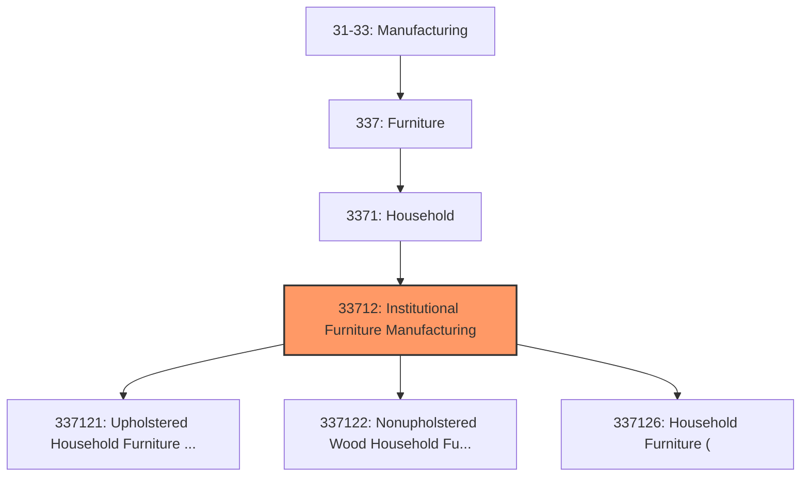
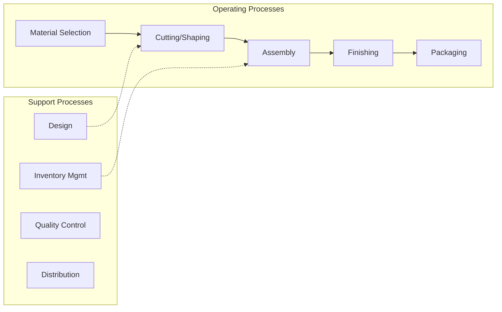

# Institutional Furniture Manufacturing

> This industry comprises establishments primarily engaged in manufacturing household-type and public building furniture (e.

## Overview

Institutional Furniture Manufacturing represents an important category within the U.S. Manufacturing sector (NAICS 31-33). This industry encompasses establishments primarily engaged in institutional furniture manufacturing.

This industry comprises establishments primarily engaged in manufacturing household-type and public building furniture (e.g., library, school, theater, and church furniture). This industry includes establishments that manufacture general purpose hospital, laboratory, and/or dental furniture (e.g., stools, tables, benches). The furniture may be made on a stock or custom basis and may be assembled or unassembled (i.e., knockdown). Cross-References. Establishments primarily engaged in--

## Industry Hierarchy

## Key Statistics

| Metric | Value |
|--------|-------|
| NAICS Code | 33712 |
| Level | Industry |
| Parent | [Household](../) |
| Child Industries | 3 |

## Sub-Industries

| Industry | Code | Description |
|----------|------|-------------|
| [Upholstered Household Furniture Manufacturing](./UpholsteredHouseholdFurnitureManufacturing.mdx) | 337121 | This U |
| [Nonupholstered Wood Household Furniture Manufacturing](./NonupholsteredWoodHouseholdFurnitureManufacturing.mdx) | 337122 | This U |
| [Household Furniture (](./HouseholdFurniture.mdx) | 337126 | This U |

## Related Occupations

- [Industrial Production Managers](/occupations/Management/IndustrialProductionManagers) - Plan and coordinate production activities
- [First-Line Supervisors of Production Workers](/occupations/Production/FirstLineSupervisorsOfProductionAndOperatingWorkers) - Supervise production floor operations
- [Quality Control Inspectors](/occupations/QualityControlInspectors) - Inspect products for defects and compliance

## Core Business Processes

## Industry Value Chain

## Regulatory Environment

Manufacturing operations in this industry are subject to various federal, state, and local regulations:

- **OSHA Regulations**: Workplace safety standards, machine guarding, hazard communication
- **EPA Requirements**: Air emissions, water discharge, hazardous waste management
- **State/Local Requirements**: Zoning, permits, and local environmental regulations

## Technology & Innovation

The institutional furniture manufacturing industry is experiencing significant technological advancement:

- **Industry 4.0**: Connected manufacturing, IoT sensors, and real-time monitoring
- **Automation & Robotics**: Automated production lines and robotic assembly
- **Data Analytics**: Predictive maintenance, quality analytics, and process optimization
- **Sustainability**: Carbon reduction, circular economy, and green manufacturing
- **Digital Twin**: Virtual replicas for simulation and optimization

---

*Source: NAICS 33712 - Institutional Furniture Manufacturing*
