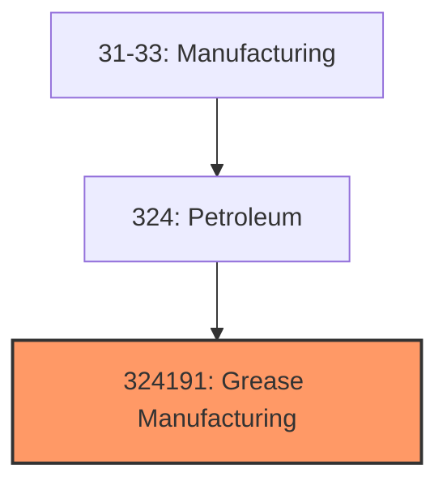
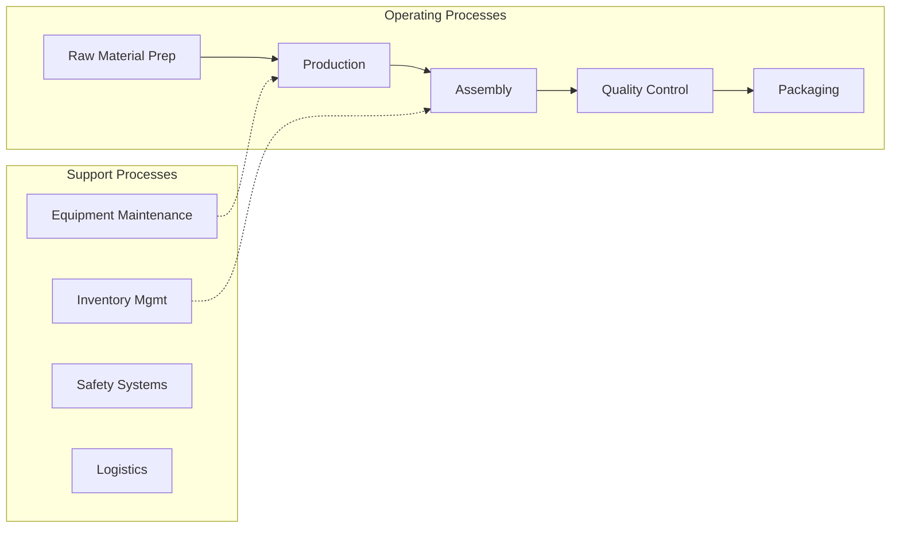

# Grease Manufacturing

> This U.

## Overview

Grease Manufacturing represents a specialized segment within the Manufacturing sector (NAICS 31-33).

This U.S. industry comprises establishments primarily engaged in blending or compounding refined petroleum to make lubricating oils and greases and/or re-refining used petroleum lubricating oils. Cross-References. Establishments primarily engaged in--

## Industry Hierarchy

## Key Statistics

| Metric | Value |
|--------|-------|
| NAICS Code | 324191 |
| Level | National Industry |
| Child Industries | 0 |

## Related Occupations

- [Industrial Production Managers](/occupations/Management/IndustrialProductionManagers) - Oversee daily operations of manufacturing plants
- [Industrial Engineers](/occupations/Architecture/IndustrialEngineers) - Design efficient production systems
- [Machinists](/occupations/MachinistsAndToolAndDieMakers) - Operate machine tools to produce parts
- [Quality Control Analysts](/occupations/Science/QualityControlAnalysts) - Inspect products for quality standards

## Core Business Processes

## Industry Value Chain

## Regulatory Environment

- **OSHA** (Occupational Safety and Health Administration) - Enforces workplace safety in factories
- **EPA** (Environmental Protection Agency) - Regulates manufacturing emissions and waste
- **FDA** (Food and Drug Administration) - Oversees food and pharmaceutical manufacturing
- **CPSC** (Consumer Product Safety Commission) - Ensures product safety standards

## Technology & Innovation

- **Industry 4.0** - IoT-connected factories, digital twins, and smart manufacturing systems
- **Additive Manufacturing** - 3D printing for rapid prototyping and custom production
- **Robotics and Automation** - Collaborative robots, automated assembly, and AI quality inspection
- **Sustainable Manufacturing** - Circular economy practices, waste reduction, and green chemistry

## Industry Outlook

The manufacturing sector is experiencing a resurgence driven by reshoring initiatives, supply chain diversification, and advanced automation. Industry 4.0 technologies including IoT, AI, and robotics are transforming production efficiency. Sustainability requirements are driving innovation in materials, processes, and circular economy practices, while workforce development programs address the skilled labor gap.

## Market Context

Manufacturing transforms raw materials into finished goods, with Industry 4.0 driving automation, digitalization, and smart factory implementations.

| Aspect | Details |
|--------|---------|
| Industry Sector | Manufacturing |
| NAICS/SIC Code | 324191 |
| Market Segment | Grease Manufacturing |

## Key Business Processes

- Production planning
- Manufacturing operations
- Quality assurance
- Inventory management
- Distribution and logistics

## Common Occupations

- [Industrial Production Managers](/occupations/Management/IndustrialProductionManagers)
- [Production Workers](/occupations/Production/ProductionWorkers)
- [Quality Control Inspectors](/occupations/Production/QualityControlInspectors)
- [Industrial Engineers](/occupations/Engineering/IndustrialEngineers)

## Regulations and Standards

- OSHA Manufacturing Standards
- EPA Environmental Regulations
- FDA regulations (where applicable)
- ISO quality standards
- Industry-specific certifications

## Technology and Tools

- Industrial automation and robotics
- Enterprise Resource Planning (ERP)
- Quality management systems
- Predictive maintenance
- IoT and smart manufacturing

## Industry Trends

- Digital transformation and automation adoption
- Sustainability and environmental compliance focus
- Workforce development and skills training
- Supply chain resilience and optimization
- Customer experience enhancement

---

*Source: NAICS 324191 - Grease Manufacturing*
