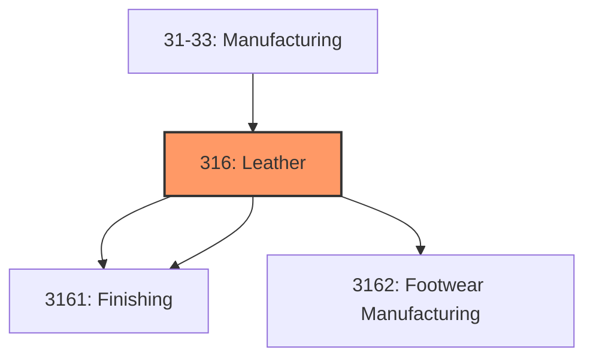
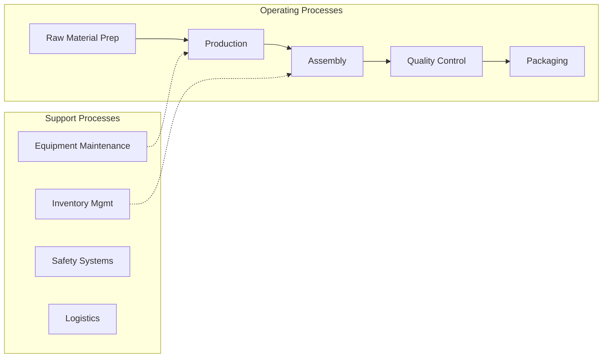

# Leather

> Establishments in the Leather and Allied Product Manufacturing subsector transform hides into leather by tanning or curing and fabricating the leather into products for final consumption.

## Overview

Leather represents an important category within the U.S. Manufacturing sector (NAICS 31-33). This subsector encompasses establishments primarily engaged in leather.

Establishments in the Leather and Allied Product Manufacturing subsector transform hides into leather by tanning or curing and fabricating the leather into products for final consumption. This subsector also includes the manufacture of similar products from other materials, including products (except apparel) made from "leather substitutes," such as rubber, plastics, or textiles. Rubber footwear, textile luggage, and plastics purses or wallets are examples of "leather substitute" products included in this subsector. The products made from leather substitutes are included in this subsector because they are made in similar ways leather products are made (e.g., luggage). They are made in the same establishments, so it is not practical to separate them. The inclusion of leather and hide tanning and finishing in this subsector is partly because it is a relatively small industry that has few close neighbors as a production process, partly because leather is an input to some of the other products classified in this subsector, and partly for historical reasons.

## Industry Hierarchy

## Key Statistics

| Metric | Value |
|--------|-------|
| NAICS Code | 316 |
| Level | Subsector |
| Child Industries | 3 |

## Sub-Industries

| Industry | Code | Description |
|----------|------|-------------|
| [Hide Tanning](./HideTanning/) | 3161 | Hide Tanning |
| [Finishing](./Finishing/) | 3161 | Finishing |
| [Footwear Manufacturing](./FootwearManufacturing/) | 3162 | Footwear Manufacturing |

## Related Occupations

- [Industrial Production Managers](/occupations/IndustrialProductionManagers) - Plan and coordinate production activities
- [First-Line Supervisors of Production Workers](/occupations/FirstLineSupervisorsOfProductionAndOperatingWorkers) - Supervise production floor operations
- [Quality Control Inspectors](/occupations/QualityControlInspectors) - Inspect products for defects and compliance

## Core Business Processes

## Industry Value Chain

```mermaid
graph LR
    subgraph Inputs["Inputs"]
        I1["Raw Materials"]
        I2["Components"]
        I3["Equipment"]
    end

    subgraph Primary["Primary Activities"]
        A1["Inbound Logistics"]
        A2["Manufacturing Operations"]
        A3["Quality Assurance"]
        A4["Outbound Logistics"]
    end

    subgraph Outputs["Products"]
        O1["Finished Products"]
        O2["Components"]
        O3["Assemblies"]
    end

    subgraph Customers["Markets"]
        C1["Industrial Buyers"]
        C2["Retailers"]
        C3["Distributors"]
        C4["End Users"]
    end

    Inputs --> Primary --> Outputs --> Customers
```

## Regulatory Environment

Manufacturing operations in this industry are subject to various federal, state, and local regulations:

- **OSHA Regulations**: Workplace safety standards, machine guarding, hazard communication
- **EPA Requirements**: Air emissions, water discharge, hazardous waste management
- **State/Local Requirements**: Zoning, permits, and local environmental regulations

## Technology & Innovation

The leather industry is experiencing significant technological advancement:

- **Industry 4.0**: Connected manufacturing, IoT sensors, and real-time monitoring
- **Automation & Robotics**: Automated production lines and robotic assembly
- **Data Analytics**: Predictive maintenance, quality analytics, and process optimization
- **Sustainability**: Carbon reduction, circular economy, and green manufacturing
- **Digital Twin**: Virtual replicas for simulation and optimization

---

*Source: NAICS 316 - Leather*
