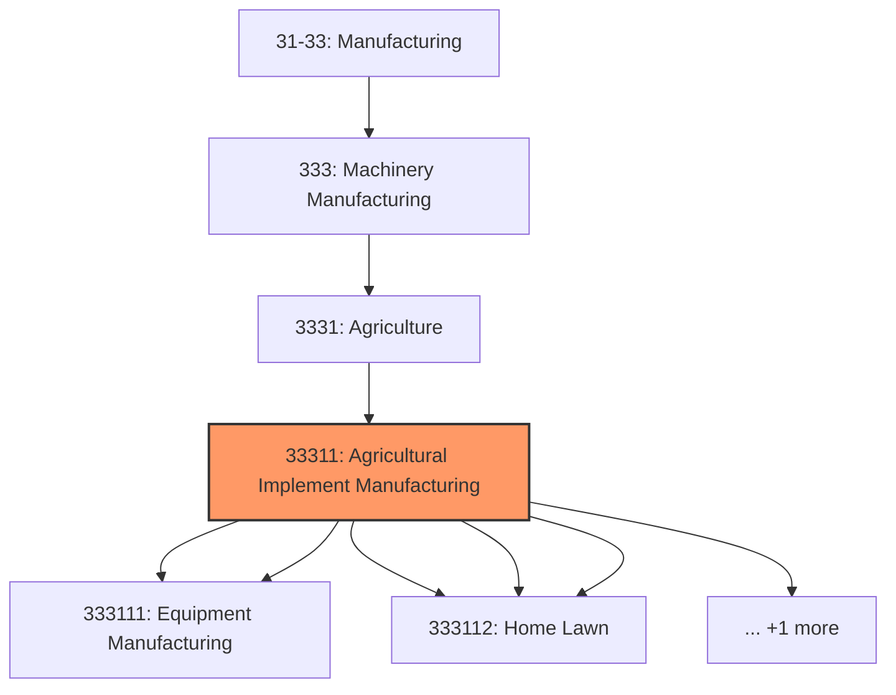
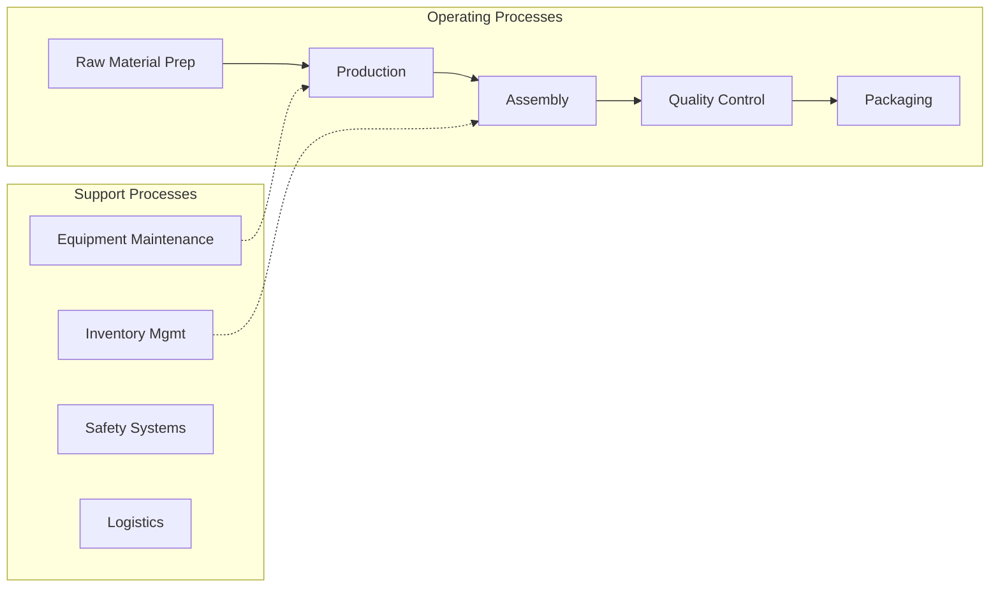

# Agricultural Implement Manufacturing

> This industry comprises establishments primarily engaged in manufacturing farm machinery and equipment, powered mowing equipment, and other powered home lawn and garden equipment.

## Overview

Agricultural Implement Manufacturing represents an important category within the U.S. Manufacturing sector (NAICS 31-33). This industry encompasses establishments primarily engaged in agricultural implement manufacturing.

This industry comprises establishments primarily engaged in manufacturing farm machinery and equipment, powered mowing equipment, and other powered home lawn and garden equipment. Illustrative Examples: Combines (i.e., harvester-threshers) manufacturing Cotton ginning machinery manufacturing Fertilizing machinery, farm-type, manufacturing Haying machines manufacturing Milking machines manufacturing Planting machines, farm-type, manufacturing Plows, farm-type, manufacturing Powered lawnmowers manufacturing Poultry brooders, feeders, and waterers manufacturing Snowblowers and throwers, residential-type, manufacturing Tractors and attachments, lawn and garden-type and farm-type, manufacturing Cross-References. Establishments primarily engaged in--

## Industry Hierarchy

## Key Statistics

| Metric | Value |
|--------|-------|
| NAICS Code | 33311 |
| Level | Industry |
| Parent | [Agriculture](../) |
| Child Industries | 6 |

## Sub-Industries

| Industry | Code | Description |
|----------|------|-------------|
| [Farm Machinery](./FarmMachinery.mdx) | 333111 | This U |
| [Equipment Manufacturing](./EquipmentManufacturing.mdx) | 333111 | This U |
| [Lawn](./Lawn.mdx) | 333112 | This U |
| [Garden Tractor](./GardenTractor.mdx) | 333112 | This U |
| [Home Lawn](./HomeLawn.mdx) | 333112 | This U |
| [Garden Equipment Manufacturing](./GardenEquipmentManufacturing.mdx) | 333112 | This U |

## Related Occupations

- [Industrial Production Managers](/occupations/Management/IndustrialProductionManagers) - Plan and coordinate production activities
- [First-Line Supervisors of Production Workers](/occupations/Production/FirstLineSupervisorsOfProductionAndOperatingWorkers) - Supervise production floor operations
- [Quality Control Inspectors](/occupations/QualityControlInspectors) - Inspect products for defects and compliance

## Core Business Processes

## Industry Value Chain

## Regulatory Environment

Manufacturing operations in this industry are subject to various federal, state, and local regulations:

- **OSHA Regulations**: Workplace safety standards, machine guarding, hazard communication
- **EPA Requirements**: Air emissions, water discharge, hazardous waste management
- **State/Local Requirements**: Zoning, permits, and local environmental regulations

## Technology & Innovation

The agricultural implement manufacturing industry is experiencing significant technological advancement:

- **Industry 4.0**: Connected manufacturing, IoT sensors, and real-time monitoring
- **Automation & Robotics**: Automated production lines and robotic assembly
- **Data Analytics**: Predictive maintenance, quality analytics, and process optimization
- **Sustainability**: Carbon reduction, circular economy, and green manufacturing
- **Digital Twin**: Virtual replicas for simulation and optimization

---

*Source: NAICS 33311 - Agricultural Implement Manufacturing*
