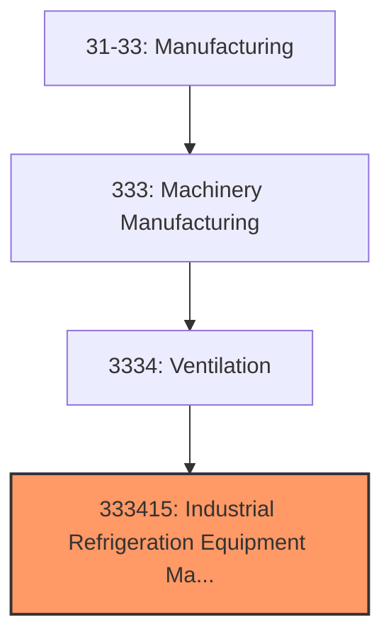
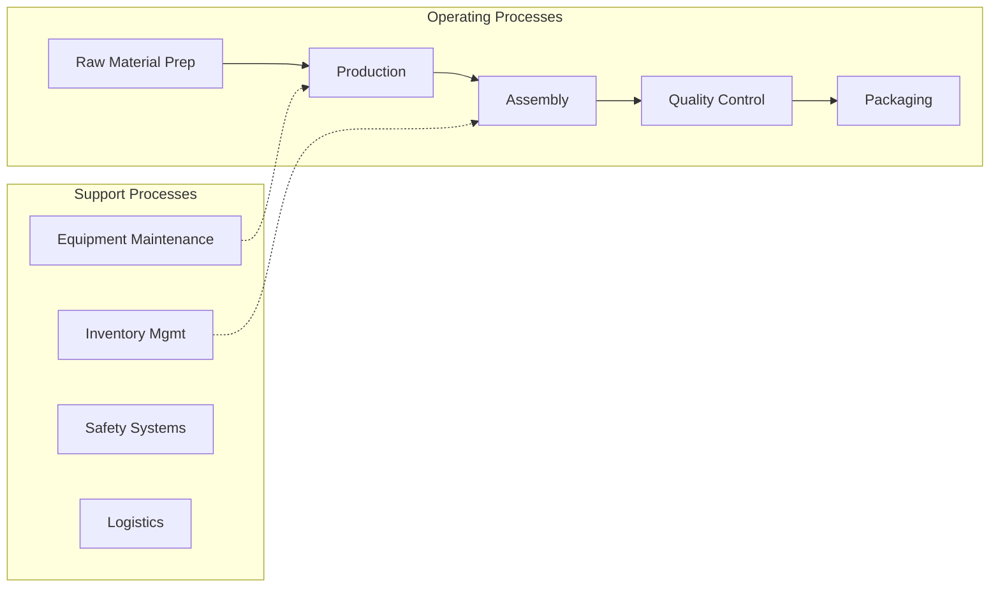

# Industrial Refrigeration Equipment Manufacturing

> This U.

## Overview

Industrial Refrigeration Equipment Manufacturing represents a specialized segment within the Manufacturing sector (NAICS 31-33).

This U.S. industry comprises establishments primarily engaged in (1) manufacturing air-conditioning (except motor vehicle) and warm air furnace equipment and/or (2) manufacturing commercial and industrial refrigeration and freezer equipment. Illustrative Examples: Air-conditioning and warm air heating combination units manufacturing Air-conditioning compressors (except motor vehicle) manufacturing Air-conditioning condensers and condensing units manufacturing Dehumidifiers (except portable electric) manufacturing Heat pumps manufacturing Humidifying equipment (except portable) manufacturing Refrigerated counter and display cases manufacturing Refrigerated drinking fountains manufacturing Snow making machinery manufacturing Soda fountain cooling and dispensing equipment manufacturing Cross-References. Establishments primarily engaged in--

## Industry Hierarchy

## Key Statistics

| Metric | Value |
|--------|-------|
| NAICS Code | 333415 |
| Level | National Industry |
| Child Industries | 0 |

## Related Occupations

See the [occupations directory](/occupations) for roles commonly found in this industry.

## Core Business Processes

## Industry Value Chain

```mermaid
graph LR
    subgraph Inputs["Inputs"]
        I1["Raw Materials"]
        I2["Components"]
        I3["Equipment"]
    end

    subgraph Primary["Primary Activities"]
        A1["Inbound Logistics"]
        A2["Core Operations"]
        A3["Quality Assurance"]
        A4["Outbound/Delivery"]
    end

    subgraph Outputs["Products/Services"]
        O1["Finished Products"]
        O2["Components"]
        O3["Assemblies"]
    end

    subgraph Customers["Markets"]
        C1["Industrial Buyers"]
        C2["Retailers"]
        C3["Distributors"]
        C4["End Users"]
    end

    Inputs --> Primary --> Outputs --> Customers
```

---

*Source: NAICS 333415 - Industrial Refrigeration Equipment Manufacturing*
