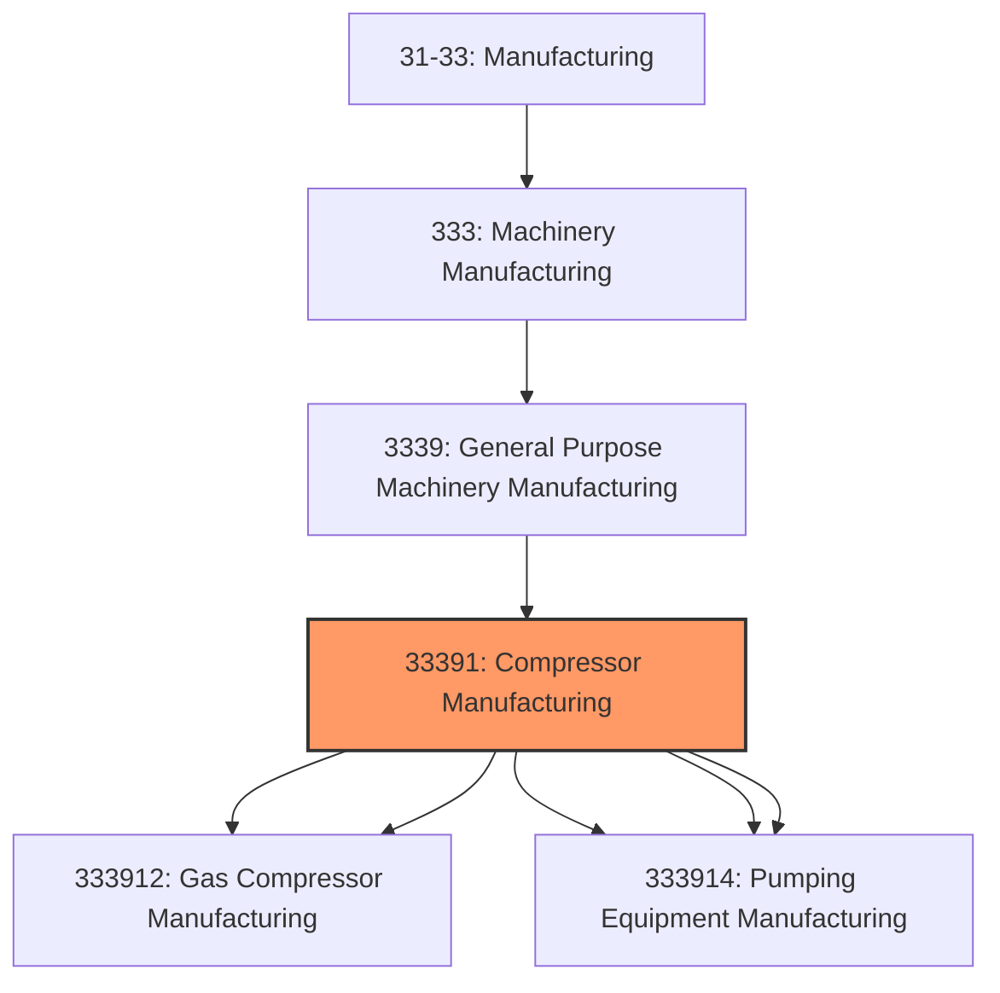
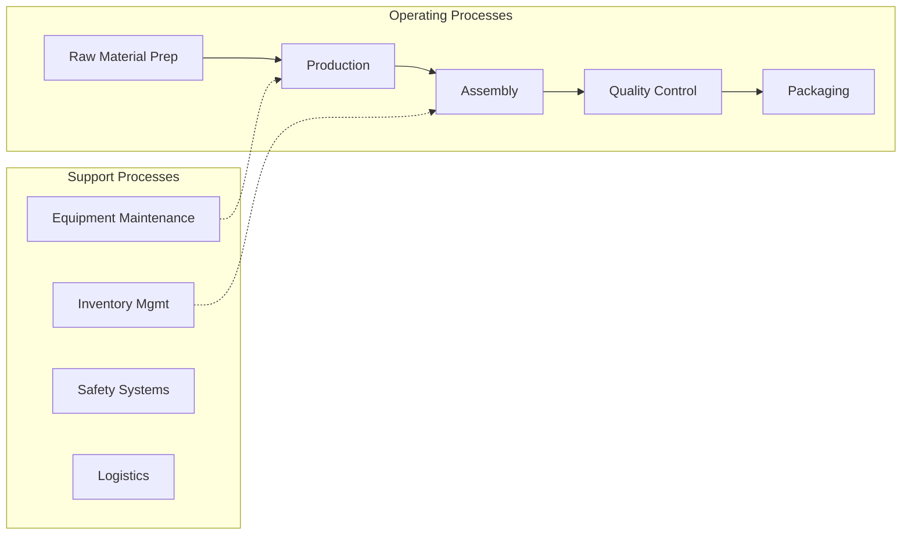

# Compressor Manufacturing

> This industry comprises establishments primarily engaged in manufacturing pumps and compressors, such as general purpose air and gas compressors, nonagricultural spraying and dusting equipment, general purpose pumps and pumping equipment (except fluid power pumps and motors), and measuring and dispensing pumps.

## Overview

Compressor Manufacturing represents an important category within the U.S. Manufacturing sector (NAICS 31-33). This industry encompasses establishments primarily engaged in compressor manufacturing.

This industry comprises establishments primarily engaged in manufacturing pumps and compressors, such as general purpose air and gas compressors, nonagricultural spraying and dusting equipment, general purpose pumps and pumping equipment (except fluid power pumps and motors), and measuring and dispensing pumps. Cross-References. Establishments primarily engaged in--

## Industry Hierarchy

## Key Statistics

| Metric | Value |
|--------|-------|
| NAICS Code | 33391 |
| Level | Industry |
| Parent | [General Purpose Machinery Manufacturing](../) |
| Child Industries | 5 |

## Sub-Industries

| Industry | Code | Description |
|----------|------|-------------|
| [Air](./Air.mdx) | 333912 | This U |
| [Gas Compressor Manufacturing](./GasCompressorManufacturing.mdx) | 333912 | This U |
| [Measuring](./Measuring.mdx) | 333914 | This U |
| [Dispensing](./Dispensing.mdx) | 333914 | This U |
| [Pumping Equipment Manufacturing](./PumpingEquipmentManufacturing.mdx) | 333914 | This U |

## Related Occupations

- [Industrial Production Managers](/occupations/Management/IndustrialProductionManagers) - Plan and coordinate production activities
- [First-Line Supervisors of Production Workers](/occupations/Production/FirstLineSupervisorsOfProductionAndOperatingWorkers) - Supervise production floor operations
- [Quality Control Inspectors](/occupations/QualityControlInspectors) - Inspect products for defects and compliance

## Core Business Processes

## Industry Value Chain

## Regulatory Environment

Manufacturing operations in this industry are subject to various federal, state, and local regulations:

- **OSHA Regulations**: Workplace safety standards, machine guarding, hazard communication
- **EPA Requirements**: Air emissions, water discharge, hazardous waste management
- **State/Local Requirements**: Zoning, permits, and local environmental regulations

## Technology & Innovation

The compressor manufacturing industry is experiencing significant technological advancement:

- **Industry 4.0**: Connected manufacturing, IoT sensors, and real-time monitoring
- **Automation & Robotics**: Automated production lines and robotic assembly
- **Data Analytics**: Predictive maintenance, quality analytics, and process optimization
- **Sustainability**: Carbon reduction, circular economy, and green manufacturing
- **Digital Twin**: Virtual replicas for simulation and optimization

---

*Source: NAICS 33391 - Compressor Manufacturing*
