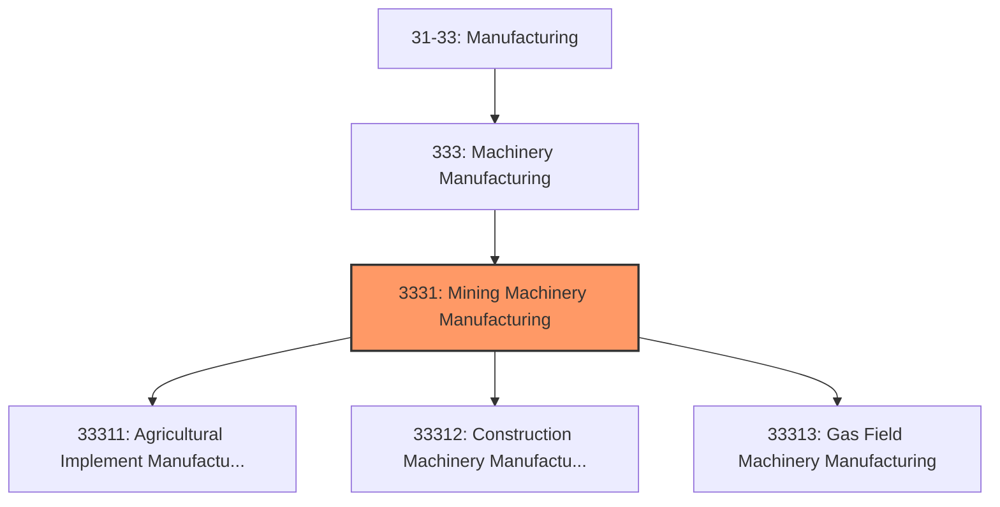
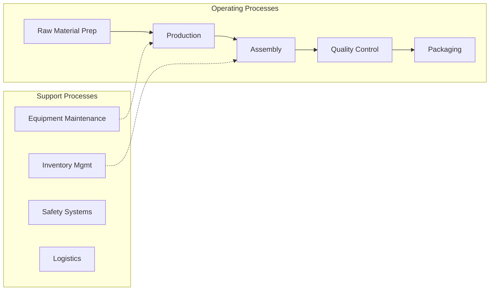

# Mining Machinery Manufacturing

> This industry group comprises establishments primarily engaged in manufacturing one or more of the following: (1) farm machinery and equipment, power mowing equipment, and other powered home lawn and garden equipment; (2) construction machinery, surface mining machinery, and logging equipment; and (3) oil and gas field and underground mining machinery and equipment.

## Overview

Mining Machinery Manufacturing represents an important category within the U.S. Manufacturing sector (NAICS 31-33). This industry group encompasses establishments primarily engaged in mining machinery manufacturing.

This industry group comprises establishments primarily engaged in manufacturing one or more of the following: (1) farm machinery and equipment, power mowing equipment, and other powered home lawn and garden equipment; (2) construction machinery, surface mining machinery, and logging equipment; and (3) oil and gas field and underground mining machinery and equipment.

## Industry Hierarchy

## Key Statistics

| Metric | Value |
|--------|-------|
| NAICS Code | 3331 |
| Level | Industry Group |
| Parent | [Machinery Manufacturing](../) |
| Child Industries | 3 |

## Sub-Industries

| Industry | Code | Description |
|----------|------|-------------|
| [Agricultural Implement Manufacturing](./AgriculturalImplementManufacturing/) | 33311 | This industry comprises establishments primarily engaged in manufacturing farm m |
| [Construction Machinery Manufacturing](./ConstructionMachineryManufacturing/) | 33312 | See industry description for 333120 |
| [Gas Field Machinery Manufacturing](./GasFieldMachineryManufacturing/) | 33313 | This industry comprises establishments primarily engaged in manufacturing oil an |

## Related Occupations

- [Industrial Production Managers](/occupations/IndustrialProductionManagers) - Plan and coordinate production activities
- [First-Line Supervisors of Production Workers](/occupations/FirstLineSupervisorsOfProductionAndOperatingWorkers) - Supervise production floor operations
- [Quality Control Inspectors](/occupations/QualityControlInspectors) - Inspect products for defects and compliance
- [Machinists](/occupations/Machinists) - Set up and operate machine tools
- [CNC Machine Tool Programmers](/occupations/ComputerNumericallyControlledMachineToolProgrammers) - Program CNC machines

## Core Business Processes

## Industry Value Chain

## Regulatory Environment

Manufacturing operations in this industry are subject to various federal, state, and local regulations:

- **OSHA Regulations**: Workplace safety standards, machine guarding, hazard communication
- **EPA Requirements**: Air emissions, water discharge, hazardous waste management
- **State/Local Requirements**: Zoning, permits, and local environmental regulations

## Technology & Innovation

The mining machinery manufacturing industry is experiencing significant technological advancement:

- **Industry 4.0**: Connected manufacturing, IoT sensors, and real-time monitoring
- **Automation & Robotics**: Automated production lines and robotic assembly
- **Data Analytics**: Predictive maintenance, quality analytics, and process optimization
- **Sustainability**: Carbon reduction, circular economy, and green manufacturing
- **Digital Twin**: Virtual replicas for simulation and optimization

---

*Source: NAICS 3331 - Mining Machinery Manufacturing*
