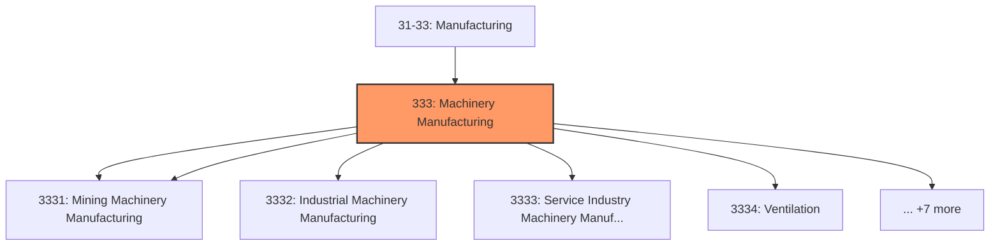
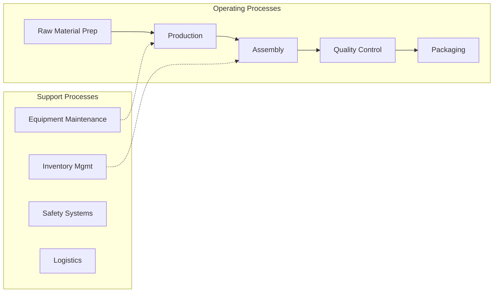

# Machinery Manufacturing

> Industries in the Machinery Manufacturing subsector create end products that apply mechanical force, for example, the application of gears and levers, to perform work.

## Overview

Machinery Manufacturing represents an important category within the U.S. Manufacturing sector (NAICS 31-33). This subsector encompasses establishments primarily engaged in machinery manufacturing.

Industries in the Machinery Manufacturing subsector create end products that apply mechanical force, for example, the application of gears and levers, to perform work. Some important processes for the manufacture of machinery are forging, stamping, bending, forming, and machining that are used to shape individual pieces of metal. Processes, such as welding and assembling are used to join separate parts together. Although these processes are similar to those used in metal fabricating establishments, machinery manufacturing is different because it typically employs multiple metal forming processes in manufacturing the various parts of the machine. Moreover, complex assembly operations are an inherent part of the production process. In general, design considerations are very important in machinery production. Establishments specialize in making machinery designed for particular applications. Thus, design is considered to be part of the production process for the purpose of implementing NAICS. The NAICS structure reflects this by defining industries and industry groups that make machinery for different applications. A broad distinction exists between machinery that is generally used in a variety of industrial applications (i.e., general purpose machinery) and machinery that is designed to be used in a particular industry (i.e., special purpose machinery). Three industry groups consist of special purpose machinery--Agriculture, Construction, and Mining Machinery Manufacturing; Industrial Machinery Manufacturing; and Commercial and Service Industry Machinery Manufacturing. The other industry groups make general purpose machinery: Ventilation, Heating, Air-Conditioning, and Commercial Refrigeration Equipment Manufacturing; Metalworking Machinery Manufacturing; Engine, Turbine, and Power Transmission Equipment Manufacturing; and Other General Purpose Machinery Manufacturing.

## Industry Hierarchy

## Key Statistics

| Metric | Value |
|--------|-------|
| NAICS Code | 333 |
| Level | Subsector |
| Child Industries | 12 |

## Sub-Industries

| Industry | Code | Description |
|----------|------|-------------|
| [Agriculture](./Agriculture/) | 3331 | This industry group comprises establishments primarily engaged in manufacturing  |
| [Mining Machinery Manufacturing](./MiningMachineryManufacturing/) | 3331 | This industry group comprises establishments primarily engaged in manufacturing  |
| [Industrial Machinery Manufacturing](./IndustrialMachineryManufacturing/) | 3332 | Industrial Machinery Manufacturing |
| [Service Industry Machinery Manufacturing](./ServiceIndustryMachineryManufacturing/) | 3333 | Service Industry Machinery Manufacturing |
| [Ventilation](./Ventilation/) | 3334 | Ventilation |
| [Air-Conditioning](./Airconditioning/) | 3334 | Air-Conditioning |
| [Commercial Refrigeration Equipment Manufacturing](./CommercialRefrigerationEquipmentManufacturing/) | 3334 | Commercial Refrigeration Equipment Manufacturing |
| [Metalworking Machinery Manufacturing](./MetalworkingMachineryManufacturing/) | 3335 | Metalworking Machinery Manufacturing |
| [Engine](./Engine/) | 3336 | Engine |
| [Turbine](./Turbine/) | 3336 | Turbine |
| [Power Transmission Equipment Manufacturing](./PowerTransmissionEquipmentManufacturing/) | 3336 | Power Transmission Equipment Manufacturing |
| [General Purpose Machinery Manufacturing](./GeneralPurposeMachineryManufacturing/) | 3339 | This industry group comprises establishments primarily engaged in manufacturing  |

## Related Occupations

- [Industrial Production Managers](/occupations/Management/IndustrialProductionManagers) - Plan and coordinate production activities
- [First-Line Supervisors of Production Workers](/occupations/Production/FirstLineSupervisorsOfProductionAndOperatingWorkers) - Supervise production floor operations
- [Quality Control Inspectors](/occupations/QualityControlInspectors) - Inspect products for defects and compliance
- [Machinists](/occupations/Production/Machinists) - Set up and operate machine tools
- [CNC Machine Tool Programmers](/occupations/ComputerNumericallyControlledMachineToolProgrammers) - Program CNC machines

## Core Business Processes

## Industry Value Chain

## Regulatory Environment

Manufacturing operations in this industry are subject to various federal, state, and local regulations:

- **OSHA Regulations**: Workplace safety standards, machine guarding, hazard communication
- **EPA Requirements**: Air emissions, water discharge, hazardous waste management
- **State/Local Requirements**: Zoning, permits, and local environmental regulations

## Technology & Innovation

The machinery manufacturing industry is experiencing significant technological advancement:

- **Industry 4.0**: Connected manufacturing, IoT sensors, and real-time monitoring
- **Automation & Robotics**: Automated production lines and robotic assembly
- **Data Analytics**: Predictive maintenance, quality analytics, and process optimization
- **Sustainability**: Carbon reduction, circular economy, and green manufacturing
- **Digital Twin**: Virtual replicas for simulation and optimization

---

*Source: NAICS 333 - Machinery Manufacturing*
