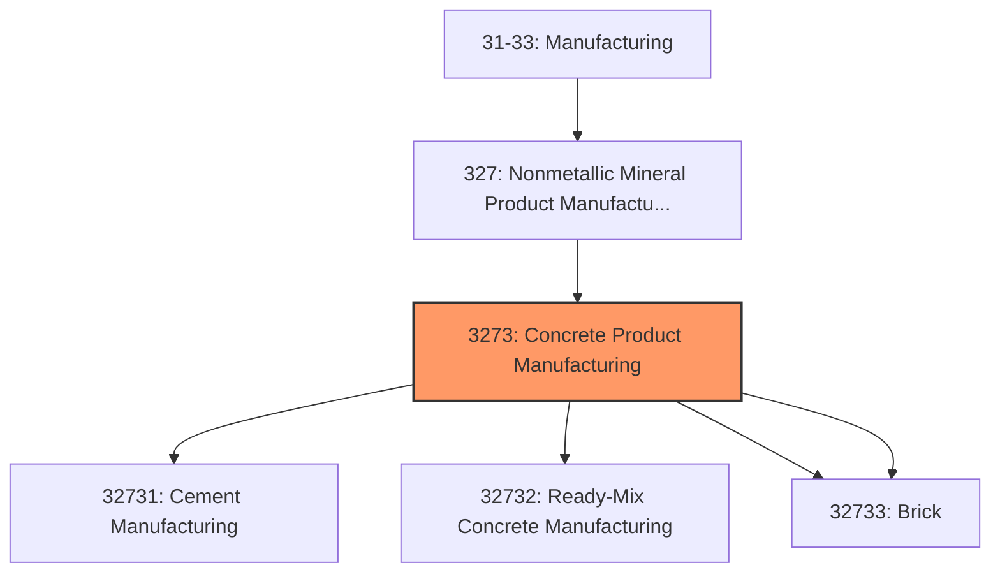
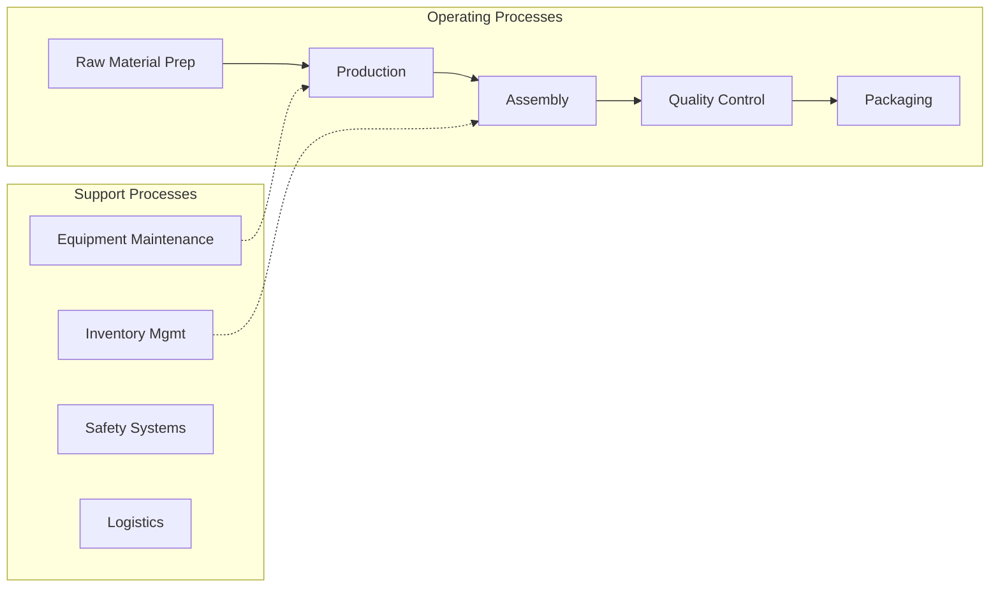

# Concrete Product Manufacturing

> This industry group comprises establishments primarily engaged in one of the following: (1) manufacturing Portland, natural, masonry, pozzolanic, and other hydraulic cements; (2) acting as batch or mixing plants, manufacturing concrete delivered to a purchaser in a plastic and unhardened state; (3) manufacturing concrete pipe, brick, and block; or (4) manufacturing other concrete products (except block, brick, and pipe).

## Overview

Concrete Product Manufacturing represents an important category within the U.S. Manufacturing sector (NAICS 31-33). This industry group encompasses establishments primarily engaged in concrete product manufacturing.

This industry group comprises establishments primarily engaged in one of the following: (1) manufacturing Portland, natural, masonry, pozzolanic, and other hydraulic cements; (2) acting as batch or mixing plants, manufacturing concrete delivered to a purchaser in a plastic and unhardened state; (3) manufacturing concrete pipe, brick, and block; or (4) manufacturing other concrete products (except block, brick, and pipe).

## Industry Hierarchy

## Key Statistics

| Metric | Value |
|--------|-------|
| NAICS Code | 3273 |
| Level | Industry Group |
| Parent | [Nonmetallic Mineral Product Manufacturing](../) |
| Child Industries | 4 |

## Sub-Industries

| Industry | Code | Description |
|----------|------|-------------|
| [Cement Manufacturing](./CementManufacturing/) | 32731 | See industry description for 327310 |
| [Ready-Mix Concrete Manufacturing](./ReadymixConcreteManufacturing/) | 32732 | See industry description for 327320 |
| [Concrete Pipe](./ConcretePipe/) | 32733 | This industry comprises establishments primarily engaged in manufacturing concre |
| [Brick](./Brick/) | 32733 | This industry comprises establishments primarily engaged in manufacturing concre |

## Related Occupations

- [Industrial Production Managers](/occupations/IndustrialProductionManagers) - Plan and coordinate production activities
- [First-Line Supervisors of Production Workers](/occupations/FirstLineSupervisorsOfProductionAndOperatingWorkers) - Supervise production floor operations
- [Quality Control Inspectors](/occupations/QualityControlInspectors) - Inspect products for defects and compliance

## Core Business Processes

## Industry Value Chain

```mermaid
graph LR
    subgraph Inputs["Inputs"]
        I1["Raw Materials"]
        I2["Components"]
        I3["Equipment"]
    end

    subgraph Primary["Primary Activities"]
        A1["Inbound Logistics"]
        A2["Manufacturing Operations"]
        A3["Quality Assurance"]
        A4["Outbound Logistics"]
    end

    subgraph Outputs["Products"]
        O1["Finished Products"]
        O2["Components"]
        O3["Assemblies"]
    end

    subgraph Customers["Markets"]
        C1["Industrial Buyers"]
        C2["Retailers"]
        C3["Distributors"]
        C4["End Users"]
    end

    Inputs --> Primary --> Outputs --> Customers
```

## Regulatory Environment

Manufacturing operations in this industry are subject to various federal, state, and local regulations:

- **OSHA Regulations**: Workplace safety standards, machine guarding, hazard communication
- **EPA Requirements**: Air emissions, water discharge, hazardous waste management
- **State/Local Requirements**: Zoning, permits, and local environmental regulations

## Technology & Innovation

The concrete product manufacturing industry is experiencing significant technological advancement:

- **Industry 4.0**: Connected manufacturing, IoT sensors, and real-time monitoring
- **Automation & Robotics**: Automated production lines and robotic assembly
- **Data Analytics**: Predictive maintenance, quality analytics, and process optimization
- **Sustainability**: Carbon reduction, circular economy, and green manufacturing
- **Digital Twin**: Virtual replicas for simulation and optimization

---

*Source: NAICS 3273 - Concrete Product Manufacturing*
