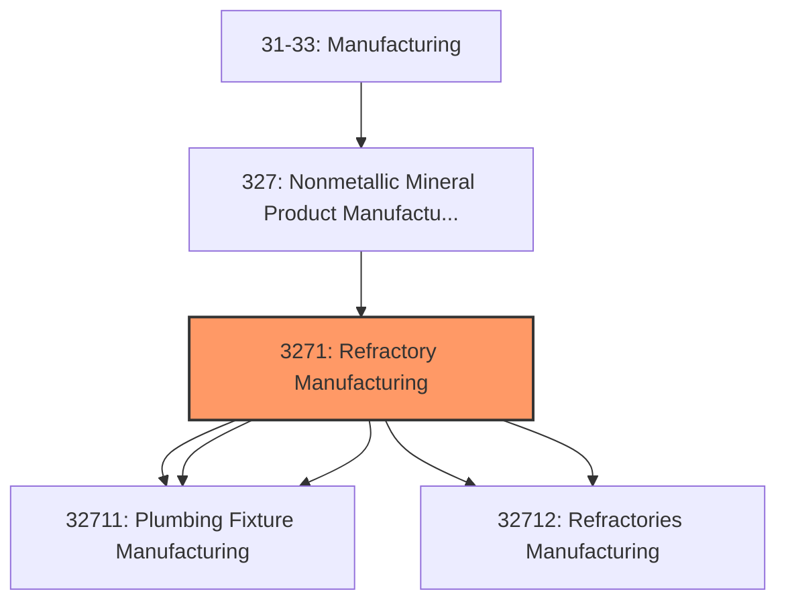
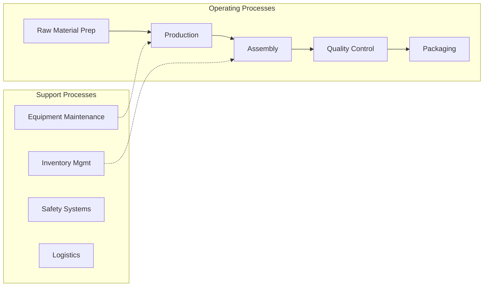

# Refractory Manufacturing

> This industry group comprises establishments primarily engaged in (1) shaping, molding, glazing, and firing pottery, ceramics, and plumbing fixtures, and electrical supplies made entirely or partly of clay or other ceramic materials or (2) shaping, molding, baking, burning, or hardening clay refractories, nonclay refractories, ceramic tile, structural clay tile, brick, and other structural clay building materials.

## Overview

Refractory Manufacturing represents an important category within the U.S. Manufacturing sector (NAICS 31-33). This industry group encompasses establishments primarily engaged in refractory manufacturing.

This industry group comprises establishments primarily engaged in (1) shaping, molding, glazing, and firing pottery, ceramics, and plumbing fixtures, and electrical supplies made entirely or partly of clay or other ceramic materials or (2) shaping, molding, baking, burning, or hardening clay refractories, nonclay refractories, ceramic tile, structural clay tile, brick, and other structural clay building materials.

## Industry Hierarchy

## Key Statistics

| Metric | Value |
|--------|-------|
| NAICS Code | 3271 |
| Level | Industry Group |
| Parent | [Nonmetallic Mineral Product Manufacturing](../) |
| Child Industries | 5 |

## Sub-Industries

| Industry | Code | Description |
|----------|------|-------------|
| [Pottery](./Pottery/) | 32711 | See industry description for 327110 |
| [Ceramics](./Ceramics/) | 32711 | See industry description for 327110 |
| [Plumbing Fixture Manufacturing](./PlumbingFixtureManufacturing/) | 32711 | See industry description for 327110 |
| [Clay Building Material](./ClayBuildingMaterial/) | 32712 | See industry description for 327120 |
| [Refractories Manufacturing](./RefractoriesManufacturing/) | 32712 | See industry description for 327120 |

## Related Occupations

- [Industrial Production Managers](/occupations/IndustrialProductionManagers) - Plan and coordinate production activities
- [First-Line Supervisors of Production Workers](/occupations/FirstLineSupervisorsOfProductionAndOperatingWorkers) - Supervise production floor operations
- [Quality Control Inspectors](/occupations/QualityControlInspectors) - Inspect products for defects and compliance

## Core Business Processes

## Industry Value Chain

## Regulatory Environment

Manufacturing operations in this industry are subject to various federal, state, and local regulations:

- **OSHA Regulations**: Workplace safety standards, machine guarding, hazard communication
- **EPA Requirements**: Air emissions, water discharge, hazardous waste management
- **State/Local Requirements**: Zoning, permits, and local environmental regulations

## Technology & Innovation

The refractory manufacturing industry is experiencing significant technological advancement:

- **Industry 4.0**: Connected manufacturing, IoT sensors, and real-time monitoring
- **Automation & Robotics**: Automated production lines and robotic assembly
- **Data Analytics**: Predictive maintenance, quality analytics, and process optimization
- **Sustainability**: Carbon reduction, circular economy, and green manufacturing
- **Digital Twin**: Virtual replicas for simulation and optimization

---

*Source: NAICS 3271 - Refractory Manufacturing*
