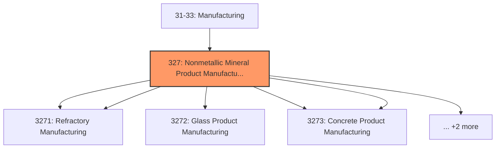
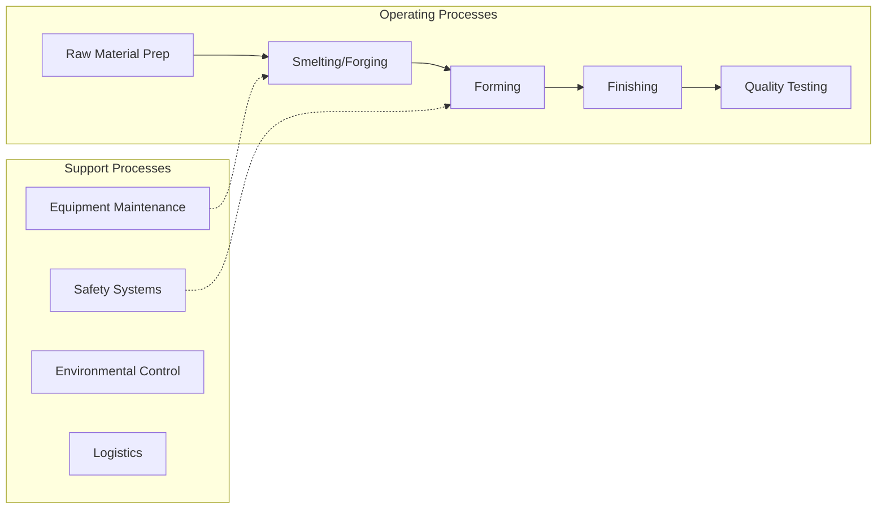

# Nonmetallic Mineral Product Manufacturing

> The Nonmetallic Mineral Product Manufacturing subsector is based on the transformation of mined or quarried nonmetallic minerals, such as sand, gravel, stone, clay, and refractory materials, into products for intermediate or final consumption.

## Overview

Nonmetallic Mineral Product Manufacturing represents an important category within the U.S. Manufacturing sector (NAICS 31-33). This subsector encompasses establishments primarily engaged in nonmetallic mineral product manufacturing.

The Nonmetallic Mineral Product Manufacturing subsector is based on the transformation of mined or quarried nonmetallic minerals, such as sand, gravel, stone, clay, and refractory materials, into products for intermediate or final consumption. Processes used include grinding, mixing, cutting, shaping, and honing. Heat often is used in the process and chemicals are frequently mixed to change the composition, purity, and chemical properties for the intended product. For example, glass is produced by heating silica sand to the melting point (sometimes combined with cullet or recycled glass) and then drawn, floated, or blow molded to the desired shape or thickness. Refractory materials are heated and then formed into bricks or other shapes for use in industrial applications. The Nonmetallic Mineral Product Manufacturing subsector includes establishments that manufacture bricks, refractories, ceramic products, and glass and glass products, such as plate glass and containers. Also included are cement and concrete products, lime, gypsum, and other nonmetallic mineral products including abrasive products, ceramic plumbing fixtures, statuary, cut stone products, and mineral wool. The products are used in a wide range of activities from construction and heavy and light manufacturing to articles for personal use. Mining, beneficiating, and manufacturing activities often occur in a single location. Separate receipts will be collected for these activities whenever possible. When receipts cannot be broken out between mining and manufacturing, establishments that mine or quarry nonmetallic minerals, beneficiate the nonmetallic minerals, and further process the nonmetallic minerals into a more finished manufactured product are classified based on the primary activity of the establishment. A mine that manufactures a small amount of finished products is classified in Sector 21, Mining, Quarrying, and Oil and Gas Extraction. An establishment that mines whose primary output is a more finished manufactured product is classified in the Manufacturing sector. Excluded from the Nonmetallic Mineral Product Manufacturing subsector are establishments that primarily beneficiate mined nonmetallic minerals. Beneficiation is the process whereby the extracted material is reduced to particles that can be separated into mineral and waste, the former suitable for further processing or direct use. Beneficiation establishments are included in Sector 21, Mining, Quarrying, and Oil and Gas Extraction.

## Industry Hierarchy

## Key Statistics

| Metric | Value |
|--------|-------|
| NAICS Code | 327 |
| Level | Subsector |
| Child Industries | 7 |

## Sub-Industries

| Industry | Code | Description |
|----------|------|-------------|
| [Clay Product](./ClayProduct/) | 3271 | This industry group comprises establishments primarily engaged in (1) shaping, m |
| [Refractory Manufacturing](./RefractoryManufacturing/) | 3271 | This industry group comprises establishments primarily engaged in (1) shaping, m |
| [Glass Product Manufacturing](./GlassProductManufacturing/) | 3272 | Glass Product Manufacturing |
| [Cement](./Cement/) | 3273 | This industry group comprises establishments primarily engaged in one of the fol |
| [Concrete Product Manufacturing](./ConcreteProductManufacturing/) | 3273 | This industry group comprises establishments primarily engaged in one of the fol |
| [Lime](./Lime/) | 3274 | This industry group comprises establishments primarily engaged in (1) manufactur |
| [Gypsum Product Manufacturing](./GypsumProductManufacturing/) | 3274 | This industry group comprises establishments primarily engaged in (1) manufactur |

## Related Occupations

- [Industrial Production Managers](/occupations/IndustrialProductionManagers) - Plan and coordinate production activities
- [First-Line Supervisors of Production Workers](/occupations/FirstLineSupervisorsOfProductionAndOperatingWorkers) - Supervise production floor operations
- [Quality Control Inspectors](/occupations/QualityControlInspectors) - Inspect products for defects and compliance
- [Metal Workers and Plastic Workers](/occupations/MetalAndPlasticWorkers) - Shape and form metal products
- [Welders, Cutters, Solderers](/occupations/WeldersCuttersSolderersAndBrazers) - Join metal parts

## Core Business Processes

## Industry Value Chain

## Regulatory Environment

Manufacturing operations in this industry are subject to various federal, state, and local regulations:

- **OSHA Regulations**: Workplace safety standards, machine guarding, hazard communication
- **EPA Requirements**: Air emissions, water discharge, hazardous waste management
- **State/Local Requirements**: Zoning, permits, and local environmental regulations

## Technology & Innovation

The nonmetallic mineral product manufacturing industry is experiencing significant technological advancement:

- **Industry 4.0**: Connected manufacturing, IoT sensors, and real-time monitoring
- **Automation & Robotics**: Automated production lines and robotic assembly
- **Data Analytics**: Predictive maintenance, quality analytics, and process optimization
- **Additive Manufacturing**: 3D printing and metal additive production
- **Advanced Materials**: High-performance alloys and composites
- **Sustainability**: Carbon reduction, circular economy, and green manufacturing
- **Digital Twin**: Virtual replicas for simulation and optimization

---

*Source: NAICS 327 - Nonmetallic Mineral Product Manufacturing*
