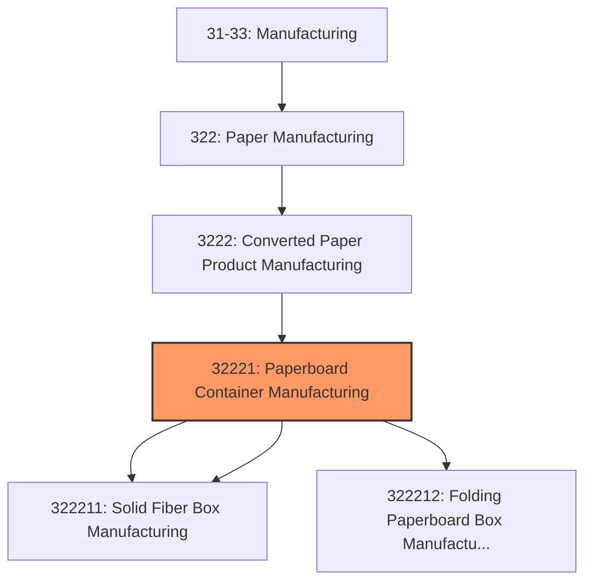
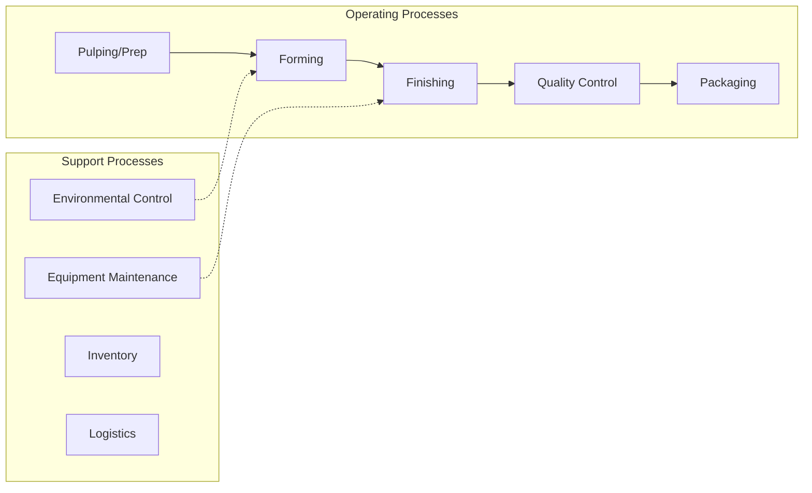

# Paperboard Container Manufacturing

> This industry comprises establishments primarily engaged in converting paperboard into containers without manufacturing paperboard.

## Overview

Paperboard Container Manufacturing represents an important category within the U.S. Manufacturing sector (NAICS 31-33). This industry encompasses establishments primarily engaged in paperboard container manufacturing.

This industry comprises establishments primarily engaged in converting paperboard into containers without manufacturing paperboard. These establishments use corrugating, cutting, and shaping machinery to form paperboard into containers. Products made by these establishments include boxes, corrugated sheets, pads, pallets, paper dishes, and fiber drums and reels. Cross-References. Establishments primarily engaged in--

## Industry Hierarchy

## Key Statistics

| Metric | Value |
|--------|-------|
| NAICS Code | 32221 |
| Level | Industry |
| Parent | [Converted Paper Product Manufacturing](../) |
| Child Industries | 3 |

## Sub-Industries

| Industry | Code | Description |
|----------|------|-------------|
| [Corrugated](./Corrugated.mdx) | 322211 | This U |
| [Solid Fiber Box Manufacturing](./SolidFiberBoxManufacturing.mdx) | 322211 | This U |
| [Folding Paperboard Box Manufacturing](./FoldingPaperboardBoxManufacturing.mdx) | 322212 | This U |

## Related Occupations

- [Industrial Production Managers](/occupations/IndustrialProductionManagers) - Plan and coordinate production activities
- [First-Line Supervisors of Production Workers](/occupations/FirstLineSupervisorsOfProductionAndOperatingWorkers) - Supervise production floor operations
- [Quality Control Inspectors](/occupations/QualityControlInspectors) - Inspect products for defects and compliance

## Core Business Processes

## Industry Value Chain

## Regulatory Environment

Manufacturing operations in this industry are subject to various federal, state, and local regulations:

- **OSHA Regulations**: Workplace safety standards, machine guarding, hazard communication
- **EPA Requirements**: Air emissions, water discharge, hazardous waste management
- **State/Local Requirements**: Zoning, permits, and local environmental regulations

## Technology & Innovation

The paperboard container manufacturing industry is experiencing significant technological advancement:

- **Industry 4.0**: Connected manufacturing, IoT sensors, and real-time monitoring
- **Automation & Robotics**: Automated production lines and robotic assembly
- **Data Analytics**: Predictive maintenance, quality analytics, and process optimization
- **Sustainability**: Carbon reduction, circular economy, and green manufacturing
- **Digital Twin**: Virtual replicas for simulation and optimization

---

*Source: NAICS 32221 - Paperboard Container Manufacturing*
