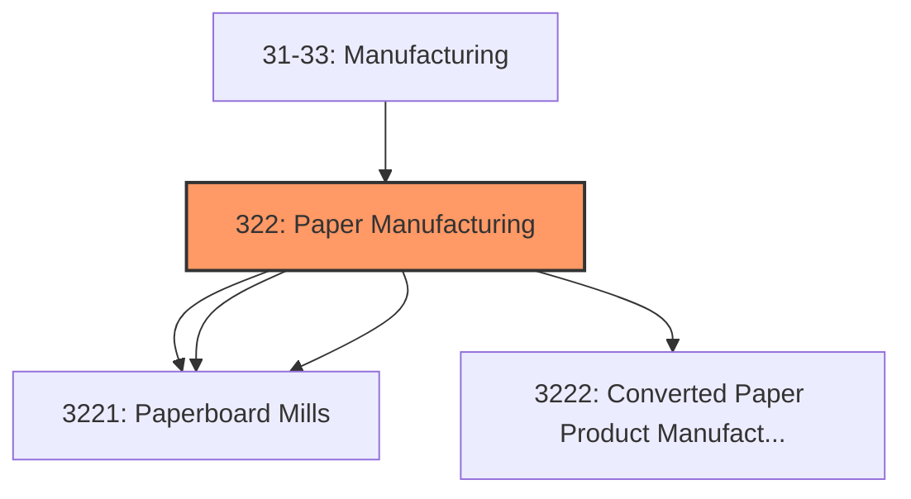
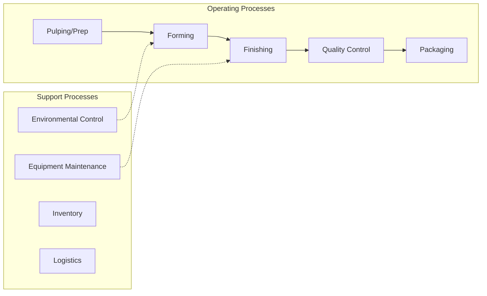

# Paper Manufacturing

> Industries in the Paper Manufacturing subsector make pulp, paper, or converted paper products.

## Overview

Paper Manufacturing represents an important category within the U.S. Manufacturing sector (NAICS 31-33). This subsector encompasses establishments primarily engaged in paper manufacturing.

Industries in the Paper Manufacturing subsector make pulp, paper, or converted paper products. The manufacturing of these products is grouped together because they constitute a series of vertically connected processes. More than one is often carried out in a single establishment. There are essentially three activities. The manufacturing of pulp involves separating the cellulose fibers from other impurities in wood or used paper. The manufacturing of paper involves matting these fibers into a sheet. The manufacturing of converted paper products involves converting paper and other materials by various cutting and shaping techniques and includes coating and laminating activities. The Paper Manufacturing subsector is subdivided into two industry groups, the first for the manufacturing of pulp and paper and the second for the manufacturing of converted paper products. Paper making is treated as the core activity of the subsector. Therefore, any establishment that makes paper (including paperboard), either alone or in combination with pulp manufacturing or paper converting, is classified as a paper or paperboard mill. Establishments that make pulp without making paper are classified as pulp mills. Pulp mills, paper mills, and paperboard mills comprise the first industry group. Establishments that make products from purchased paper and other materials make up the second industry group, Converted Paper Product Manufacturing. This general activity is then subdivided based, for the most part, on process distinctions. Paperboard container manufacturing uses corrugating, cutting, and shaping machinery to form paperboard into containers. Paper bag and coated and treated paper manufacturing establishments cut and coat paper and foil. Stationery product manufacturing establishments make a variety of paper products used for writing, filing, and similar applications. Other converted paper product manufacturing includes, in particular, the conversion of sanitary paper stock into such things as tissue paper and disposable diapers. An important process used in the Paper Bag and Coated and Treated Paper Manufacturing industry is lamination, often combined with coating. Lamination and coating make a composite material with improved properties of strength, impermeability, and so on. The laminated materials may be paper, metal foil, or plastics film. While paper is often one of the components, it is not always. Lamination of plastics film to plastics film is classified in Subsector 326, Plastics and Rubber Products Manufacturing, because establishments that do this often first make the film. The same situation holds with respect to bags. The manufacturing of bags from plastics only, whether or not laminated, is classified in Subsector 326, Plastics and Rubber Products Manufacturing. Excluded from this subsector are photosensitive papers. These papers are chemically treated and are classified in Industry 32599, All Other Chemical Product and Preparation Manufacturing.

## Industry Hierarchy

## Key Statistics

| Metric | Value |
|--------|-------|
| NAICS Code | 322 |
| Level | Subsector |
| Child Industries | 4 |

## Sub-Industries

| Industry | Code | Description |
|----------|------|-------------|
| [Pulp](./Pulp/) | 3221 | This industry group comprises establishments primarily engaged in manufacturing  |
| [Paper](./Paper/) | 3221 | This industry group comprises establishments primarily engaged in manufacturing  |
| [Paperboard Mills](./PaperboardMills/) | 3221 | This industry group comprises establishments primarily engaged in manufacturing  |
| [Converted Paper Product Manufacturing](./ConvertedPaperProductManufacturing/) | 3222 | This industry group comprises establishments primarily engaged in converting pap |

## Related Occupations

- [Industrial Production Managers](/occupations/IndustrialProductionManagers) - Plan and coordinate production activities
- [First-Line Supervisors of Production Workers](/occupations/FirstLineSupervisorsOfProductionAndOperatingWorkers) - Supervise production floor operations
- [Quality Control Inspectors](/occupations/QualityControlInspectors) - Inspect products for defects and compliance

## Core Business Processes

## Industry Value Chain

## Regulatory Environment

Manufacturing operations in this industry are subject to various federal, state, and local regulations:

- **OSHA Regulations**: Workplace safety standards, machine guarding, hazard communication
- **EPA Requirements**: Air emissions, water discharge, hazardous waste management
- **State/Local Requirements**: Zoning, permits, and local environmental regulations

## Technology & Innovation

The paper manufacturing industry is experiencing significant technological advancement:

- **Industry 4.0**: Connected manufacturing, IoT sensors, and real-time monitoring
- **Automation & Robotics**: Automated production lines and robotic assembly
- **Data Analytics**: Predictive maintenance, quality analytics, and process optimization
- **Sustainability**: Carbon reduction, circular economy, and green manufacturing
- **Digital Twin**: Virtual replicas for simulation and optimization

---

*Source: NAICS 322 - Paper Manufacturing*
