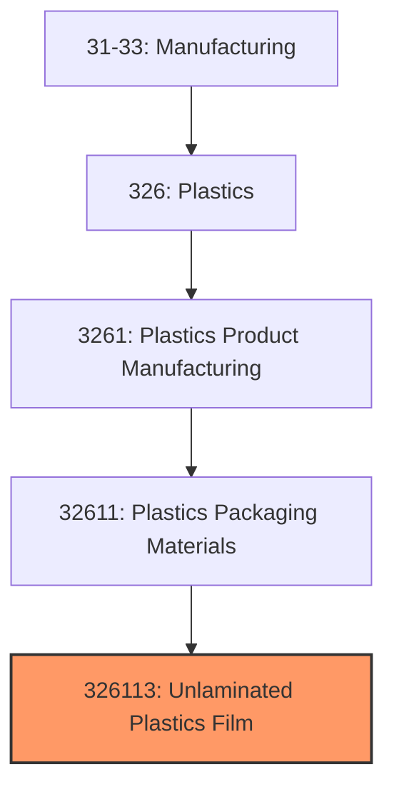
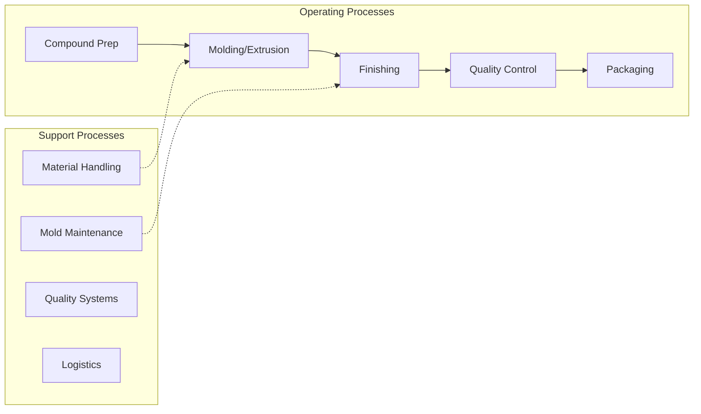

# Unlaminated Plastics Film

> This U.S. industry comprises establishments primarily engaged in converting plastics resins into plastics film and unlaminated sheet (except packaging).  Cross-References.
## Overview

Unlaminated Plastics Film represents a specialized segment within the U.S. Manufacturing sector (NAICS 31-33). This national industry encompasses establishments primarily engaged in unlaminated plastics film.

This U.S. industry comprises establishments primarily engaged in converting plastics resins into plastics film and unlaminated sheet (except packaging). Cross-References. Establishments primarily engaged in--

## Industry Hierarchy

## Key Statistics

| Metric | Value |
|--------|-------|
| NAICS Code | 326113 |
| Level | National Industry |
| Parent | [Plastics Packaging Materials](../) |
| Child Industries | 0 |

## Related Occupations

- [Industrial Production Managers](/occupations/Management/IndustrialProductionManagers) - Plan and coordinate production activities
- [First-Line Supervisors of Production Workers](/occupations/Production/FirstLineSupervisorsOfProductionAndOperatingWorkers) - Supervise production floor operations
- [Quality Control Inspectors](/occupations/QualityControlInspectors) - Inspect products for defects and compliance

## Core Business Processes

## Industry Value Chain

## Regulatory Environment

Manufacturing operations in this industry are subject to various federal, state, and local regulations:

- **OSHA Regulations**: Workplace safety standards, machine guarding, hazard communication
- **EPA Requirements**: Air emissions, water discharge, hazardous waste management
- **State/Local Requirements**: Zoning, permits, and local environmental regulations

## Technology & Innovation

The unlaminated plastics film industry is experiencing significant technological advancement:

- **Industry 4.0**: Connected manufacturing, IoT sensors, and real-time monitoring
- **Automation & Robotics**: Automated production lines and robotic assembly
- **Data Analytics**: Predictive maintenance, quality analytics, and process optimization
- **Sustainability**: Carbon reduction, circular economy, and green manufacturing
- **Digital Twin**: Virtual replicas for simulation and optimization

---

*Source: NAICS 326113 - Unlaminated Plastics Film*
