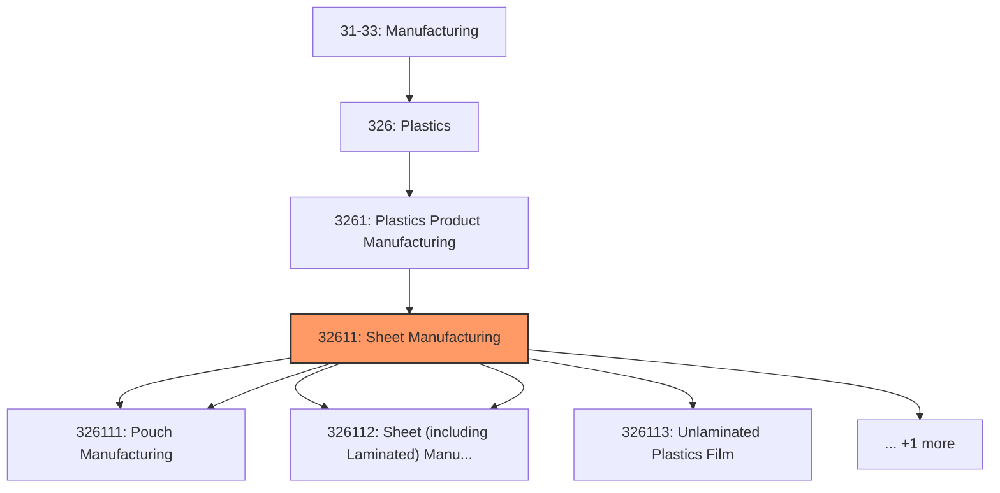
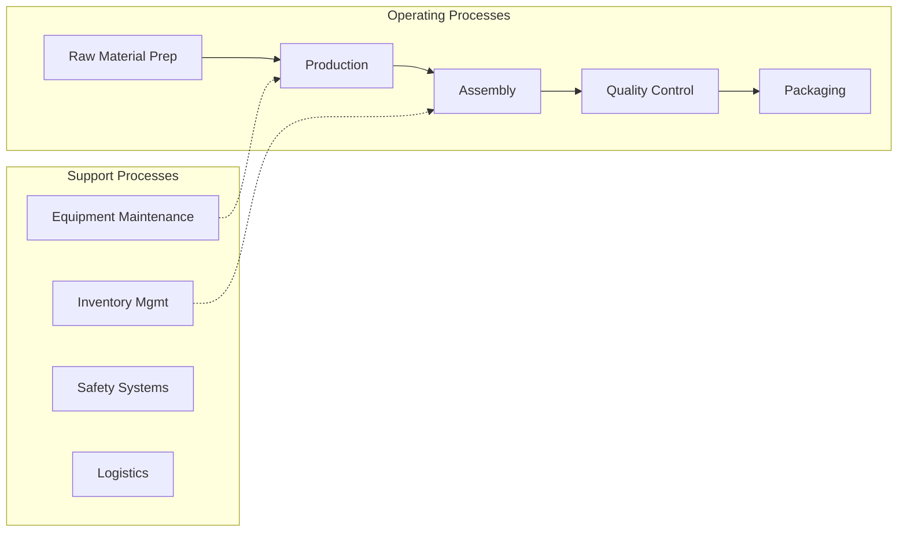

# Sheet Manufacturing

> This industry comprises establishments primarily engaged in (1) converting plastics resins into unsupported plastics film and sheet and/or (2) forming, coating, or laminating plastics film and sheet into plastics bags.

## Overview

Sheet Manufacturing represents an important category within the U.S. Manufacturing sector (NAICS 31-33). This industry encompasses establishments primarily engaged in sheet manufacturing.

This industry comprises establishments primarily engaged in (1) converting plastics resins into unsupported plastics film and sheet and/or (2) forming, coating, or laminating plastics film and sheet into plastics bags. Cross-References. Establishments primarily engaged in--

## Industry Hierarchy

## Key Statistics

| Metric | Value |
|--------|-------|
| NAICS Code | 32611 |
| Level | Industry |
| Parent | [Plastics Product Manufacturing](../) |
| Child Industries | 6 |

## Sub-Industries

| Industry | Code | Description |
|----------|------|-------------|
| [Plastics Bag](./PlasticsBag.mdx) | 326111 | This U |
| [Pouch Manufacturing](./PouchManufacturing.mdx) | 326111 | This U |
| [Plastics Packaging Film](./PlasticsPackagingFilm.mdx) | 326112 | This U |
| [Sheet (including Laminated) Manufacturing](./SheetIncludingLaminatedManufacturing.mdx) | 326112 | This U |
| [Unlaminated Plastics Film](./UnlaminatedPlasticsFilm.mdx) | 326113 | This U |
| [Sheet (](./Sheet.mdx) | 326113 | This U |

## Related Occupations

- [Industrial Production Managers](/occupations/IndustrialProductionManagers) - Plan and coordinate production activities
- [First-Line Supervisors of Production Workers](/occupations/FirstLineSupervisorsOfProductionAndOperatingWorkers) - Supervise production floor operations
- [Quality Control Inspectors](/occupations/QualityControlInspectors) - Inspect products for defects and compliance

## Core Business Processes

## Industry Value Chain

## Regulatory Environment

Manufacturing operations in this industry are subject to various federal, state, and local regulations:

- **OSHA Regulations**: Workplace safety standards, machine guarding, hazard communication
- **EPA Requirements**: Air emissions, water discharge, hazardous waste management
- **State/Local Requirements**: Zoning, permits, and local environmental regulations

## Technology & Innovation

The sheet manufacturing industry is experiencing significant technological advancement:

- **Industry 4.0**: Connected manufacturing, IoT sensors, and real-time monitoring
- **Automation & Robotics**: Automated production lines and robotic assembly
- **Data Analytics**: Predictive maintenance, quality analytics, and process optimization
- **Sustainability**: Carbon reduction, circular economy, and green manufacturing
- **Digital Twin**: Virtual replicas for simulation and optimization

---

*Source: NAICS 32611 - Sheet Manufacturing*
