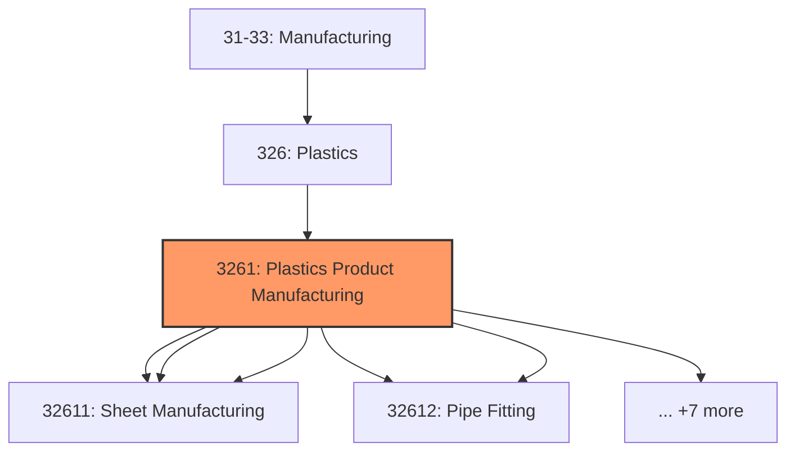
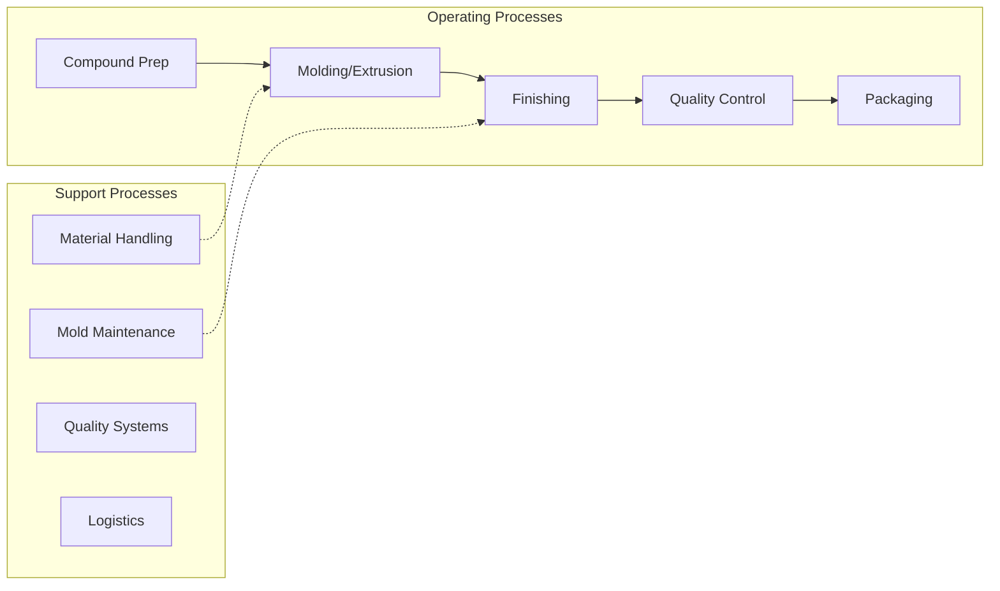

# Plastics Product Manufacturing

> This industry group comprises establishments primarily engaged in processing new or spent (i.

## Overview

Plastics Product Manufacturing represents an important category within the U.S. Manufacturing sector (NAICS 31-33). This industry group encompasses establishments primarily engaged in plastics product manufacturing.

This industry group comprises establishments primarily engaged in processing new or spent (i.e., recycled) plastics resins into intermediate or final products, using such processes as compression molding; extrusion molding; injection molding; blow molding; and casting. Within most of these industries, the production process is such that a wide variety of products can be made.

## Industry Hierarchy

## Key Statistics

| Metric | Value |
|--------|-------|
| NAICS Code | 3261 |
| Level | Industry Group |
| Parent | [Plastics](../) |
| Child Industries | 12 |

## Sub-Industries

| Industry | Code | Description |
|----------|------|-------------|
| [Plastics Packaging Materials](./PlasticsPackagingMaterials/) | 32611 | This industry comprises establishments primarily engaged in (1) converting plast |
| [Unlaminated Film](./UnlaminatedFilm/) | 32611 | This industry comprises establishments primarily engaged in (1) converting plast |
| [Sheet Manufacturing](./SheetManufacturing/) | 32611 | This industry comprises establishments primarily engaged in (1) converting plast |
| [Plastics Pipe](./PlasticsPipe/) | 32612 | This industry comprises establishments primarily engaged in manufacturing plasti |
| [Pipe Fitting](./PipeFitting/) | 32612 | This industry comprises establishments primarily engaged in manufacturing plasti |
| [Unlaminated Profile Shape Manufacturing](./UnlaminatedProfileShapeManufacturing/) | 32612 | This industry comprises establishments primarily engaged in manufacturing plasti |
| [Laminated Plastics Plate](./LaminatedPlasticsPlate/) | 32613 | See industry description for 326130 |
| [Shape Manufacturing](./ShapeManufacturing/) | 32613 | See industry description for 326130 |
| [Polystyrene Foam Product Manufacturing](./PolystyreneFoamProductManufacturing/) | 32614 | See industry description for 326140 |
| [Urethane](./Urethane/) | 32615 | See industry description for 326150 |
| [Foam Product (](./FoamProduct/) | 32615 | See industry description for 326150 |
| [Plastics Bottle Manufacturing](./PlasticsBottleManufacturing/) | 32616 | See industry description for 326160 |

## Related Occupations

- [Industrial Production Managers](/occupations/IndustrialProductionManagers) - Plan and coordinate production activities
- [First-Line Supervisors of Production Workers](/occupations/FirstLineSupervisorsOfProductionAndOperatingWorkers) - Supervise production floor operations
- [Quality Control Inspectors](/occupations/QualityControlInspectors) - Inspect products for defects and compliance

## Core Business Processes

## Industry Value Chain

## Regulatory Environment

Manufacturing operations in this industry are subject to various federal, state, and local regulations:

- **OSHA Regulations**: Workplace safety standards, machine guarding, hazard communication
- **EPA Requirements**: Air emissions, water discharge, hazardous waste management
- **State/Local Requirements**: Zoning, permits, and local environmental regulations

## Technology & Innovation

The plastics product manufacturing industry is experiencing significant technological advancement:

- **Industry 4.0**: Connected manufacturing, IoT sensors, and real-time monitoring
- **Automation & Robotics**: Automated production lines and robotic assembly
- **Data Analytics**: Predictive maintenance, quality analytics, and process optimization
- **Sustainability**: Carbon reduction, circular economy, and green manufacturing
- **Digital Twin**: Virtual replicas for simulation and optimization

---

*Source: NAICS 3261 - Plastics Product Manufacturing*
