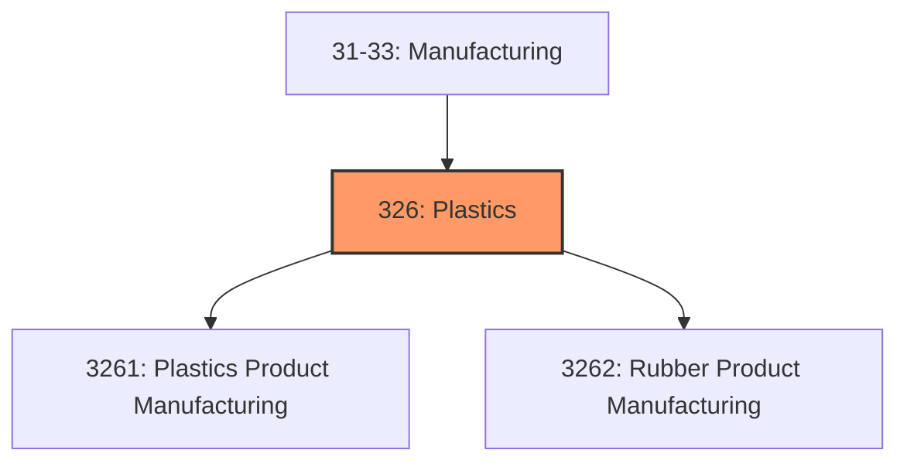
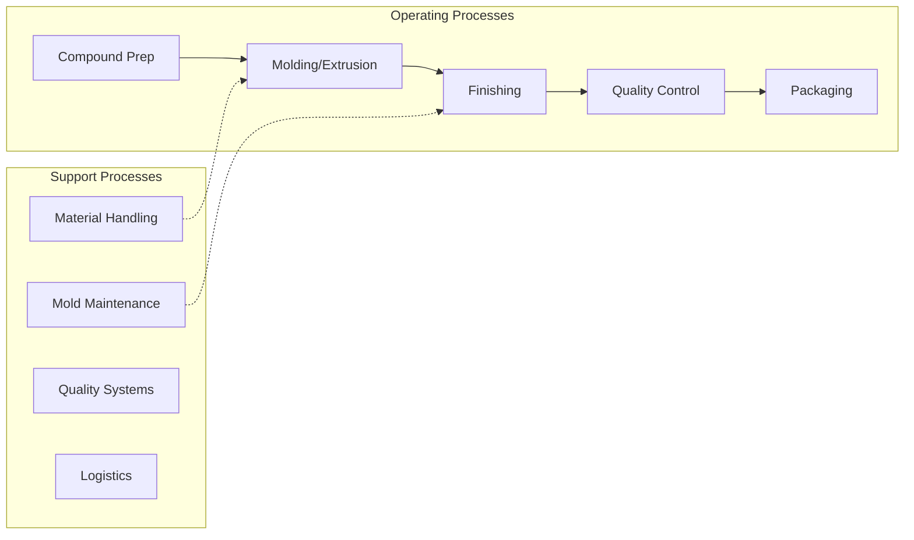

# Plastics

> Industries in the Plastics and Rubber Products Manufacturing subsector make goods by processing plastics materials and raw rubber.

## Overview

Plastics represents an important category within the U.S. Manufacturing sector (NAICS 31-33). This subsector encompasses establishments primarily engaged in plastics.

Industries in the Plastics and Rubber Products Manufacturing subsector make goods by processing plastics materials and raw rubber. The core technology employed by establishments in this subsector is that of plastics or rubber product production. Plastics and rubber are combined in the same subsector because plastics are increasingly being used as a substitute for rubber; however, the subsector is generally restricted to the production of products made of just one material, either solely plastics or rubber. Many manufacturing activities use plastics or rubber, for example the manufacture of footwear or furniture. Typically, the production process of these products involves more than one material. In these cases, technologies that allow disparate materials to be formed and combined are of central importance in describing the manufacturing activity. In NAICS, such activities (footwear and furniture manufacturing) are not classified in the Plastics and Rubber Products Manufacturing subsector because the core technologies for these activities are diverse and involve multiple materials. Within the Plastics and Rubber Products Manufacturing subsector, a distinction is made between plastics and rubber products at the industry group level, although it is not a rigid distinction, as can be seen from the definition of Industry 32622, Rubber and Plastics Hoses and Belting Manufacturing. In the case of hoses and belting, plastics are used as a substitute for rubber, and the distinction in materials is not useful as a basis for establishment classification. In keeping with the core technology focus of plastics, lamination of plastics film to plastics film as well as the production of bags from plastics only is classified in this subsector. Lamination and bag production involving plastics and materials other than plastics are classified in Subsector 322, Paper Manufacturing.

## Industry Hierarchy

## Key Statistics

| Metric | Value |
|--------|-------|
| NAICS Code | 326 |
| Level | Subsector |
| Child Industries | 2 |

## Sub-Industries

| Industry | Code | Description |
|----------|------|-------------|
| [Plastics Product Manufacturing](./PlasticsProductManufacturing/) | 3261 | This industry group comprises establishments primarily engaged in processing new |
| [Rubber Product Manufacturing](./RubberProductManufacturing/) | 3262 | This industry group comprises establishments primarily engaged in processing nat |

## Related Occupations

- [Industrial Production Managers](/occupations/IndustrialProductionManagers) - Plan and coordinate production activities
- [First-Line Supervisors of Production Workers](/occupations/FirstLineSupervisorsOfProductionAndOperatingWorkers) - Supervise production floor operations
- [Quality Control Inspectors](/occupations/QualityControlInspectors) - Inspect products for defects and compliance

## Core Business Processes

## Industry Value Chain

## Regulatory Environment

Manufacturing operations in this industry are subject to various federal, state, and local regulations:

- **OSHA Regulations**: Workplace safety standards, machine guarding, hazard communication
- **EPA Requirements**: Air emissions, water discharge, hazardous waste management
- **State/Local Requirements**: Zoning, permits, and local environmental regulations

## Technology & Innovation

The plastics industry is experiencing significant technological advancement:

- **Industry 4.0**: Connected manufacturing, IoT sensors, and real-time monitoring
- **Automation & Robotics**: Automated production lines and robotic assembly
- **Data Analytics**: Predictive maintenance, quality analytics, and process optimization
- **Sustainability**: Carbon reduction, circular economy, and green manufacturing
- **Digital Twin**: Virtual replicas for simulation and optimization

---

*Source: NAICS 326 - Plastics*
