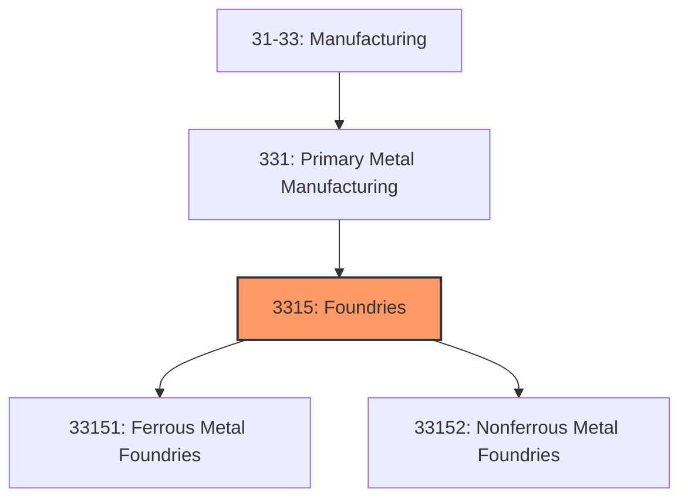
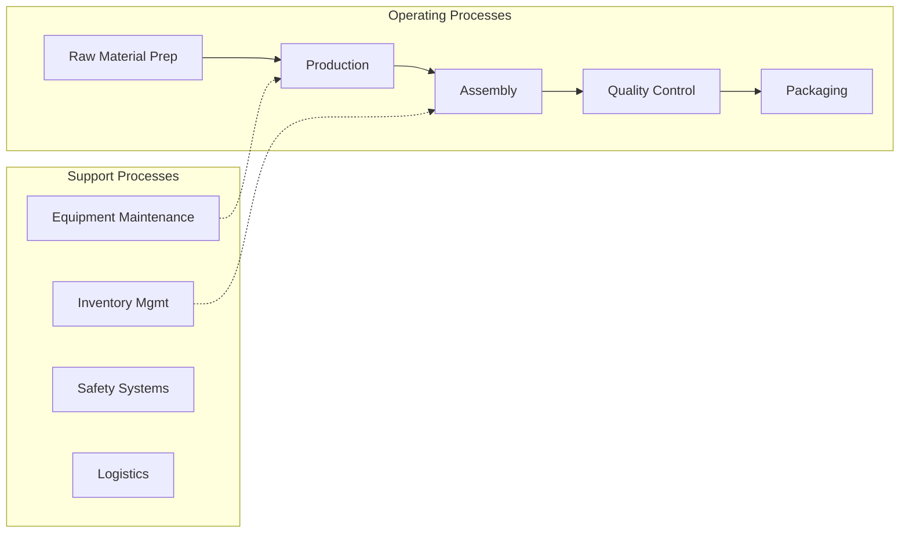

# Foundries

> This industry group comprises establishments primarily engaged in pouring molten metal into molds or dies to form castings.

## Overview

Foundries represents an important category within the U.S. Manufacturing sector (NAICS 31-33). This industry group encompasses establishments primarily engaged in foundries.

This industry group comprises establishments primarily engaged in pouring molten metal into molds or dies to form castings. Establishments making castings and further manufacturing, such as machining or assembling, a specific manufactured product are classified in the industry of the finished product. Foundries may perform operations, such as cleaning and deburring, on the castings they manufacture. More involved processes, such as tapping, threading, milling, or machining to tight tolerances, that transform castings into more finished products are classified elsewhere in the Manufacturing sector based on the product made. Establishments in this industry group make castings from purchased metals or in integrated secondary smelting and casting facilities. When the production of primary metals is combined with making castings, the establishment is classified in Subsector 331, Primary Metal Manufacturing, with the primary metal made.

## Industry Hierarchy

## Key Statistics

| Metric | Value |
|--------|-------|
| NAICS Code | 3315 |
| Level | Industry Group |
| Parent | [Primary Metal Manufacturing](../) |
| Child Industries | 2 |

## Sub-Industries

| Industry | Code | Description |
|----------|------|-------------|
| [Ferrous Metal Foundries](./FerrousMetalFoundries/) | 33151 | This industry comprises establishments primarily engaged in pouring molten iron  |
| [Nonferrous Metal Foundries](./NonferrousMetalFoundries/) | 33152 | This industry comprises establishments primarily engaged in pouring and/or intro |

## Related Occupations

- [Industrial Production Managers](/occupations/Management/IndustrialProductionManagers) - Plan and coordinate production activities
- [First-Line Supervisors of Production Workers](/occupations/Production/FirstLineSupervisorsOfProductionAndOperatingWorkers) - Supervise production floor operations
- [Quality Control Inspectors](/occupations/QualityControlInspectors) - Inspect products for defects and compliance

## Core Business Processes

## Industry Value Chain

## Regulatory Environment

Manufacturing operations in this industry are subject to various federal, state, and local regulations:

- **OSHA Regulations**: Workplace safety standards, machine guarding, hazard communication
- **EPA Requirements**: Air emissions, water discharge, hazardous waste management
- **State/Local Requirements**: Zoning, permits, and local environmental regulations

## Technology & Innovation

The foundries industry is experiencing significant technological advancement:

- **Industry 4.0**: Connected manufacturing, IoT sensors, and real-time monitoring
- **Automation & Robotics**: Automated production lines and robotic assembly
- **Data Analytics**: Predictive maintenance, quality analytics, and process optimization
- **Sustainability**: Carbon reduction, circular economy, and green manufacturing
- **Digital Twin**: Virtual replicas for simulation and optimization

---

*Source: NAICS 3315 - Foundries*
