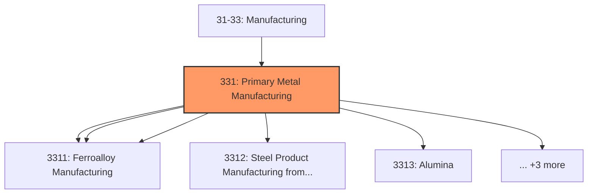
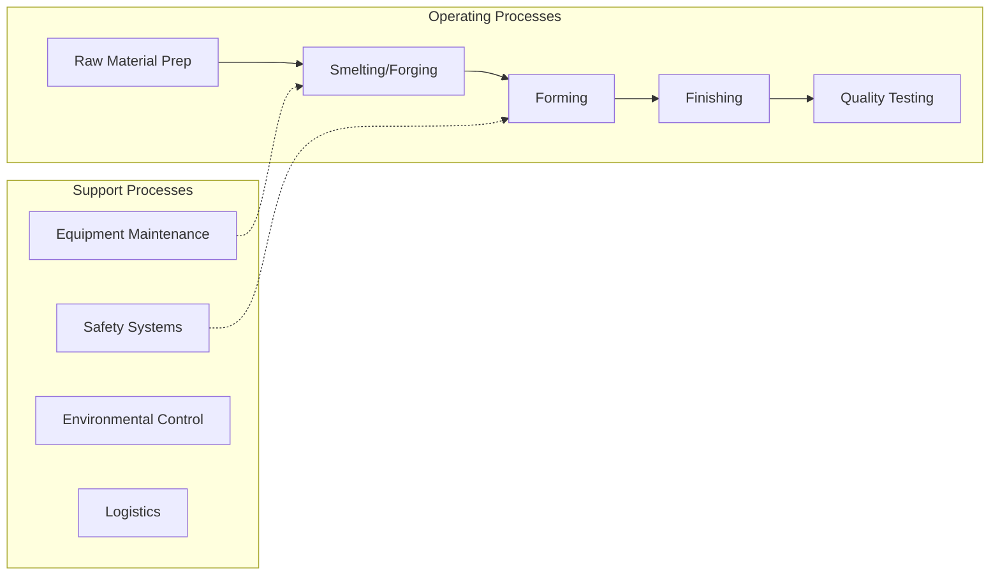

# Primary Metal Manufacturing

> Industries in the Primary Metal Manufacturing subsector smelt and/or refine ferrous and nonferrous metals from ore, pig, or scrap, using electrometallurgical and other process metallurgical techniques.

## Overview

Primary Metal Manufacturing represents an important category within the U.S. Manufacturing sector (NAICS 31-33). This subsector encompasses establishments primarily engaged in primary metal manufacturing.

Industries in the Primary Metal Manufacturing subsector smelt and/or refine ferrous and nonferrous metals from ore, pig, or scrap, using electrometallurgical and other process metallurgical techniques. Establishments in this subsector also manufacture metal alloys and superalloys by introducing other chemical elements to pure metals. The output of smelting and refining, usually in ingot form, is used in rolling, drawing, and extruding operations to make sheet, strip, bar, rod, or wire, and in molten form to make castings and other basic metal products. Primary manufacturing of ferrous and nonferrous metals begins with ore or concentrate as the primary input. Establishments manufacturing primary metals from ore and/or concentrate remain classified in the primary smelting, primary refining, or iron and steel mill industries regardless of the form of their output. Establishments primarily engaged in secondary smelting and/or secondary refining recover ferrous and nonferrous metals from scrap and/or dross. The output of the secondary smelting and/or secondary refining industries is limited to shapes such as ingot or billet that will be further processed. Recovery of metals from scrap often occurs in establishments that are primarily engaged in activities, such as rolling, drawing, extruding, or similar processes. Excluded from the Primary Metal Manufacturing subsector are establishments primarily engaged in manufacturing ferrous and nonferrous forgings (except ferrous forgings made in steel mills) and stampings. Although forging, stamping, and casting are all methods used to make metal shapes, forging and stamping do not use molten metals and are included in Subsector 332, Fabricated Metal Product Manufacturing. Establishments primarily engaged in operating coke ovens are classified in Industry 32419, Other Petroleum and Coal Products Manufacturing.

## Industry Hierarchy

## Key Statistics

| Metric | Value |
|--------|-------|
| NAICS Code | 331 |
| Level | Subsector |
| Child Industries | 8 |

## Sub-Industries

| Industry | Code | Description |
|----------|------|-------------|
| [Iron](./Iron/) | 3311 | Iron |
| [Steel Mills](./SteelMills/) | 3311 | Steel Mills |
| [Ferroalloy Manufacturing](./FerroalloyManufacturing/) | 3311 | Ferroalloy Manufacturing |
| [Steel Product Manufacturing from Purchased Steel](./SteelProductManufacturingFromPurchasedSteel/) | 3312 | This industry group comprises establishments primarily engaged in manufacturing  |
| [Alumina](./Alumina/) | 3313 | Alumina |
| [Aluminum Production](./AluminumProduction/) | 3313 | Aluminum Production |
| [Nonferrous Metal (](./NonferrousMetal/) | 3314 | This industry group comprises establishments primarily engaged in nonferrous met |
| [Foundries](./Foundries/) | 3315 | This industry group comprises establishments primarily engaged in pouring molten |

## Related Occupations

- [Industrial Production Managers](/occupations/Management/IndustrialProductionManagers) - Plan and coordinate production activities
- [First-Line Supervisors of Production Workers](/occupations/Production/FirstLineSupervisorsOfProductionAndOperatingWorkers) - Supervise production floor operations
- [Quality Control Inspectors](/occupations/QualityControlInspectors) - Inspect products for defects and compliance
- [Metal Workers and Plastic Workers](/occupations/MetalAndPlasticWorkers) - Shape and form metal products
- [Welders, Cutters, Solderers](/occupations/Production/WeldersCuttersSolderersAndBrazers) - Join metal parts

## Core Business Processes

## Industry Value Chain

## Regulatory Environment

Manufacturing operations in this industry are subject to various federal, state, and local regulations:

- **OSHA Regulations**: Workplace safety standards, machine guarding, hazard communication
- **EPA Requirements**: Air emissions, water discharge, hazardous waste management
- **State/Local Requirements**: Zoning, permits, and local environmental regulations

## Technology & Innovation

The primary metal manufacturing industry is experiencing significant technological advancement:

- **Industry 4.0**: Connected manufacturing, IoT sensors, and real-time monitoring
- **Automation & Robotics**: Automated production lines and robotic assembly
- **Data Analytics**: Predictive maintenance, quality analytics, and process optimization
- **Additive Manufacturing**: 3D printing and metal additive production
- **Advanced Materials**: High-performance alloys and composites
- **Sustainability**: Carbon reduction, circular economy, and green manufacturing
- **Digital Twin**: Virtual replicas for simulation and optimization

---

*Source: NAICS 331 - Primary Metal Manufacturing*
