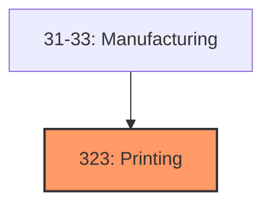
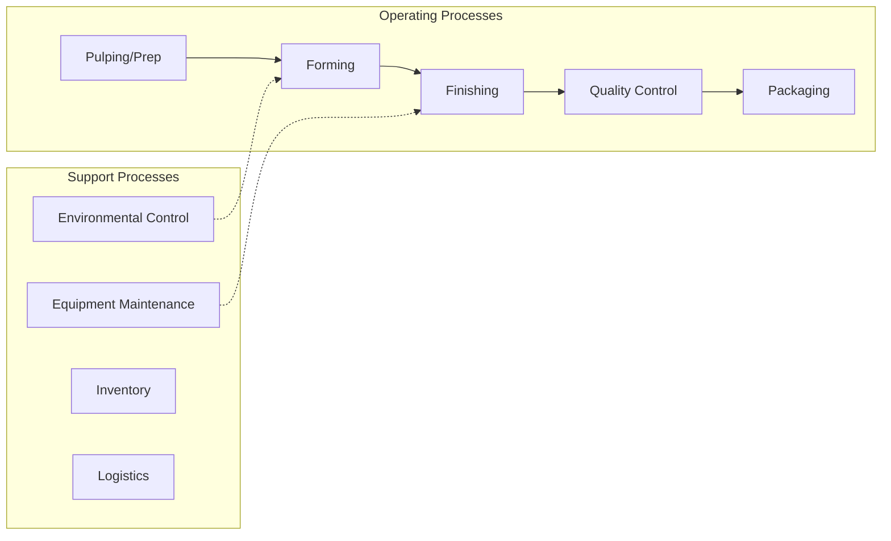

# Printing

> Industries in the Printing and Related Support Activities subsector print products, such as newspapers, books, labels, business cards, stationery, business forms, and other materials, and perform support activities, such as data imaging, platemaking services, and bookbinding.

## Overview

Printing represents an important category within the U.S. Manufacturing sector (NAICS 31-33). This subsector encompasses establishments primarily engaged in printing.

Industries in the Printing and Related Support Activities subsector print products, such as newspapers, books, labels, business cards, stationery, business forms, and other materials, and perform support activities, such as data imaging, platemaking services, and bookbinding. The support activities included here are an integral part of the printing industry, and a product (a printing plate, a bound book, or a computer disk or file) that is an integral part of the printing industry is almost always provided by these operations. Processes used in printing include a variety of methods used to transfer an image from a plate, screen, film, or computer file to some medium, such as paper, plastics, metal, textile articles, or wood. The printing processes employed include, but are not limited to, lithographic, gravure, screen, flexographic, digital, and letterpress. In contrast to many other classification systems that locate publishing of printed materials in manufacturing, NAICS classifies the publishing of printed products in Subsector 513, Publishing Industries. Though printing and publishing are often carried out by the same enterprise, it is less and less the case that these distinct activities are carried out in the same establishment. When publishing and printing are done in the same establishment, the establishment is classified in Subsector 513, Publishing Industries, in the appropriate NAICS industry even if the receipts for printing exceed those for publishing. This subsector includes printing on clothing because the production process for that activity is printing, not clothing manufacturing. For instance, the printing of T-shirts is included in this subsector. In contrast, printing on fabric (or grey goods) is not included. This activity is part of the process of finishing the fabric and is included in Industry 31331, Textile and Fabric Finishing Mills. Excluded from this subsector are establishment primarily engaged in manufacturing bare printed circuit boards. These establishments print, perforate, plate, screen, etch, or photoprint interconnecting pathways for electric current on laminates and are classified in Industry 33441, Semiconductor and Other Electronic Component Manufacturing. Establishments primarily providing printing brokerage services are classified in Industry 56199, All Other Support Services.

## Industry Hierarchy

## Key Statistics

| Metric | Value |
|--------|-------|
| NAICS Code | 323 |
| Level | Subsector |
| Child Industries | 0 |

## Related Occupations

- [Industrial Production Managers](/occupations/IndustrialProductionManagers) - Plan and coordinate production activities
- [First-Line Supervisors of Production Workers](/occupations/FirstLineSupervisorsOfProductionAndOperatingWorkers) - Supervise production floor operations
- [Quality Control Inspectors](/occupations/QualityControlInspectors) - Inspect products for defects and compliance

## Core Business Processes

## Industry Value Chain

## Regulatory Environment

Manufacturing operations in this industry are subject to various federal, state, and local regulations:

- **OSHA Regulations**: Workplace safety standards, machine guarding, hazard communication
- **EPA Requirements**: Air emissions, water discharge, hazardous waste management
- **State/Local Requirements**: Zoning, permits, and local environmental regulations

## Technology & Innovation

The printing industry is experiencing significant technological advancement:

- **Industry 4.0**: Connected manufacturing, IoT sensors, and real-time monitoring
- **Automation & Robotics**: Automated production lines and robotic assembly
- **Data Analytics**: Predictive maintenance, quality analytics, and process optimization
- **Sustainability**: Carbon reduction, circular economy, and green manufacturing
- **Digital Twin**: Virtual replicas for simulation and optimization

---

*Source: NAICS 323 - Printing*
