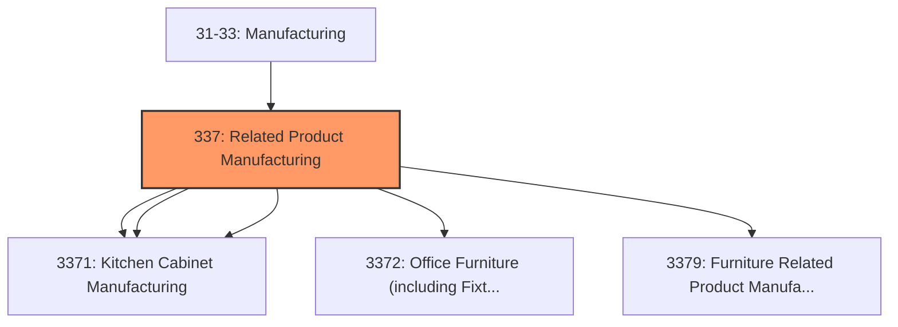
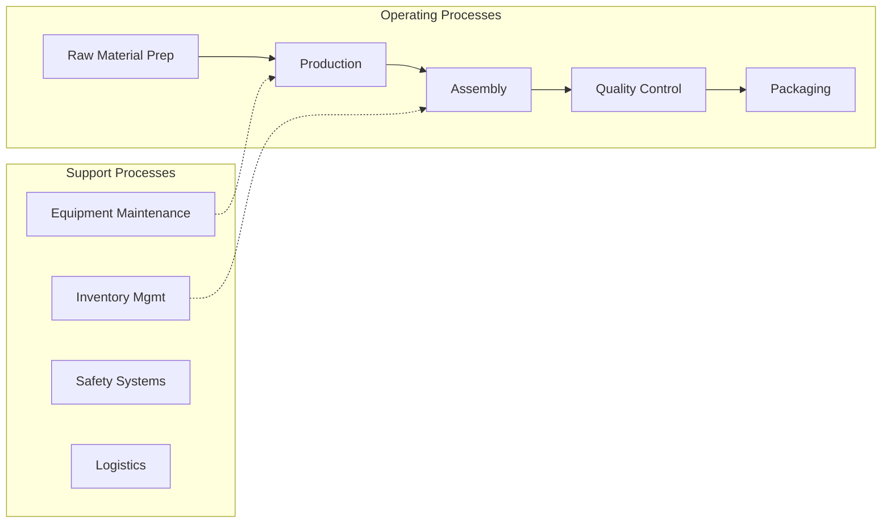

# Related Product Manufacturing

> Industries in the Furniture and Related Product Manufacturing subsector make furniture and related articles, such as mattresses, window blinds, cabinets, and fixtures.

## Overview

Related Product Manufacturing represents an important category within the U.S. Manufacturing sector (NAICS 31-33). This subsector encompasses establishments primarily engaged in related product manufacturing.

Industries in the Furniture and Related Product Manufacturing subsector make furniture and related articles, such as mattresses, window blinds, cabinets, and fixtures. The processes used in the manufacture of furniture include the cutting, bending, molding, laminating, and assembly of such materials as wood, metal, glass, plastics, and rattan. However, the production process for furniture is not solely bending metal, cutting and shaping wood, or extruding and molding plastics. Design and fashion trends play an important part in the production of furniture. The integrated design of the article for both esthetic and functional qualities is also a major part of the process of manufacturing furniture. Design services may be performed by the furniture establishment's work force or may be purchased from industrial designers. Furniture may be made of any material, but the most common ones used in North America are metal and wood. Furniture manufacturing establishments may specialize in making articles primarily from one material. Some of the equipment required to make a wooden table, for example, is different from that used to make a metal one. However, furniture is usually made from several materials. A wooden table might have metal brackets, and a wooden chair a fabric or plastics seat. Therefore, in NAICS, furniture initially is classified based on the type of furniture (application for which it is designed) rather than the material used. For example, an upholstered sofa is treated as household furniture, although it may also be used in hotels or offices. When classifying furniture according to the component material from which it is made, furniture made from more than one material is classified based on the material used in the frame, or if there is no frame, the predominant component material. Upholstered household furniture (excluding kitchen and dining room chairs with upholstered seats) is classified without regard to the frame material. Kitchen or dining room chairs with upholstered seats are classified according to the frame material. Furniture may be made on a stock or custom basis and may be shipped assembled or unassembled (i.e., knockdown). The manufacture of furniture parts and frames is included in this subsector. Some of the processes used in furniture manufacturing are similar to processes that are used in other segments of manufacturing. For example, cutting and assembly occurs in the production of wood trusses that are classified in Subsector 321, Wood Product Manufacturing. However, the multiple processes that distinguish wood furniture manufacturing from wood product manufacturing warrant inclusion of wooden furniture manufacturing in the Furniture and Related Product Manufacturing subsector. Metal furniture manufacturing uses techniques that are also employed in the manufacturing of roll formed products classified in Subsector 332, Fabricated Metal Product Manufacturing. The molding process for plastics furniture is similar to the molding of other plastics products. However, plastics furniture producing establishments tend to specialize in furniture. NAICS attempts to keep furniture manufacturing together, but there are notable exceptions: concrete, ceramic, or stone furniture; seating for transportation equipment; and specialized hospital furniture (e.g., hospital beds and operating tables). These are classified in Subsector 327, Nonmetallic Mineral Product Manufacturing; Subsector 336, Transportation Equipment Manufacturing; and Subsector 339, Miscellaneous Manufacturing, respectively.

## Industry Hierarchy

## Key Statistics

| Metric | Value |
|--------|-------|
| NAICS Code | 337 |
| Level | Subsector |
| Child Industries | 5 |

## Sub-Industries

| Industry | Code | Description |
|----------|------|-------------|
| [Household](./Household/) | 3371 | This industry group comprises establishments manufacturing household-type furnit |
| [Institutional Furniture](./InstitutionalFurniture/) | 3371 | This industry group comprises establishments manufacturing household-type furnit |
| [Kitchen Cabinet Manufacturing](./KitchenCabinetManufacturing/) | 3371 | This industry group comprises establishments manufacturing household-type furnit |
| [Office Furniture (including Fixtures) Manufacturing](./OfficeFurnitureIncludingFixturesManufacturing/) | 3372 | Office Furniture (including Fixtures) Manufacturing |
| [Furniture Related Product Manufacturing](./FurnitureRelatedProductManufacturing/) | 3379 | This industry group comprises establishments manufacturing furniture related pro |

## Related Occupations

- [Industrial Production Managers](/occupations/Management/IndustrialProductionManagers) - Plan and coordinate production activities
- [First-Line Supervisors of Production Workers](/occupations/Production/FirstLineSupervisorsOfProductionAndOperatingWorkers) - Supervise production floor operations
- [Quality Control Inspectors](/occupations/QualityControlInspectors) - Inspect products for defects and compliance

## Core Business Processes

## Industry Value Chain

## Regulatory Environment

Manufacturing operations in this industry are subject to various federal, state, and local regulations:

- **OSHA Regulations**: Workplace safety standards, machine guarding, hazard communication
- **EPA Requirements**: Air emissions, water discharge, hazardous waste management
- **State/Local Requirements**: Zoning, permits, and local environmental regulations

## Technology & Innovation

The related product manufacturing industry is experiencing significant technological advancement:

- **Industry 4.0**: Connected manufacturing, IoT sensors, and real-time monitoring
- **Automation & Robotics**: Automated production lines and robotic assembly
- **Data Analytics**: Predictive maintenance, quality analytics, and process optimization
- **Sustainability**: Carbon reduction, circular economy, and green manufacturing
- **Digital Twin**: Virtual replicas for simulation and optimization

---

*Source: NAICS 337 - Related Product Manufacturing*
