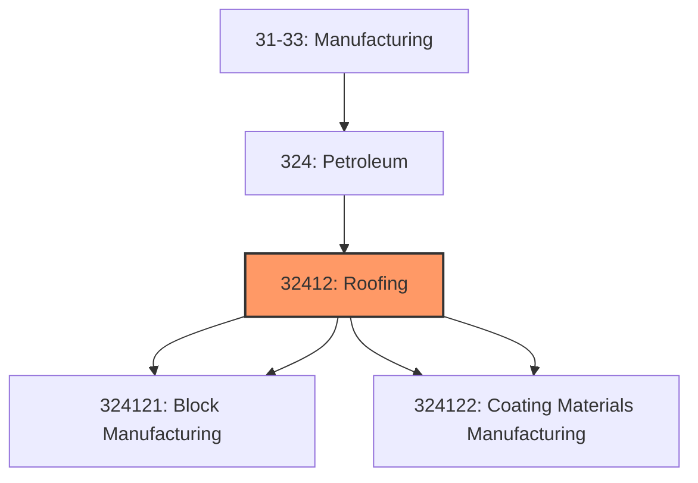
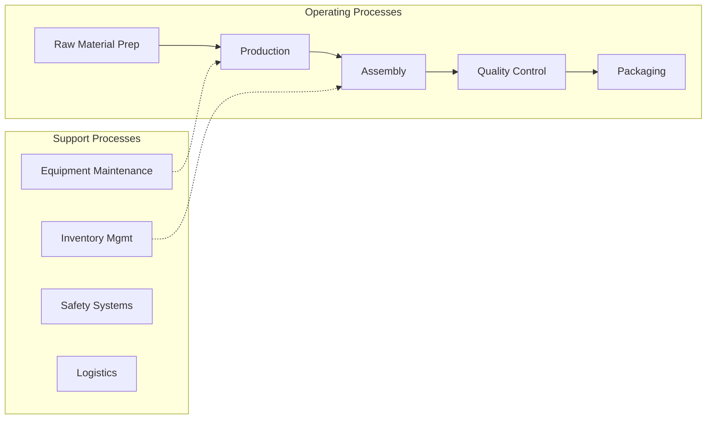

# Roofing

> This industry comprises establishments primarily engaged in (1) manufacturing asphalt and tar paving mixtures and blocks and roofing cements and coatings from purchased asphaltic materials and/or (2) saturating purchased mats and felts with asphalt or tar from purchased asphaltic materials.

## Overview

Roofing represents an important category within the Manufacturing sector (NAICS 31-33).

This industry comprises establishments primarily engaged in (1) manufacturing asphalt and tar paving mixtures and blocks and roofing cements and coatings from purchased asphaltic materials and/or (2) saturating purchased mats and felts with asphalt or tar from purchased asphaltic materials. Cross-References. Establishments primarily engaged in--

## Industry Hierarchy

## Key Statistics

| Metric | Value |
|--------|-------|
| NAICS Code | 32412 |
| Level | Industry |
| Child Industries | 4 |

## Sub-Industries

| Industry | Code | Description |
|----------|------|-------------|
| [Asphalt Paving Mixture](./AsphaltPavingMixture.mdx) | 324121 | This U |
| [Block Manufacturing](./BlockManufacturing.mdx) | 324121 | This U |
| [Asphalt Shingle](./AsphaltShingle.mdx) | 324122 | This U |
| [Coating Materials Manufacturing](./CoatingMaterialsManufacturing.mdx) | 324122 | This U |

## Related Occupations

See the [occupations directory](/occupations) for roles commonly found in this industry.

## Core Business Processes

## Industry Value Chain

```mermaid
graph LR
    subgraph Inputs["Inputs"]
        I1["Raw Materials"]
        I2["Components"]
        I3["Equipment"]
    end

    subgraph Primary["Primary Activities"]
        A1["Inbound Logistics"]
        A2["Core Operations"]
        A3["Quality Assurance"]
        A4["Outbound/Delivery"]
    end

    subgraph Outputs["Products/Services"]
        O1["Finished Products"]
        O2["Components"]
        O3["Assemblies"]
    end

    subgraph Customers["Markets"]
        C1["Industrial Buyers"]
        C2["Retailers"]
        C3["Distributors"]
        C4["End Users"]
    end

    Inputs --> Primary --> Outputs --> Customers
```

---

*Source: NAICS 32412 - Roofing*
