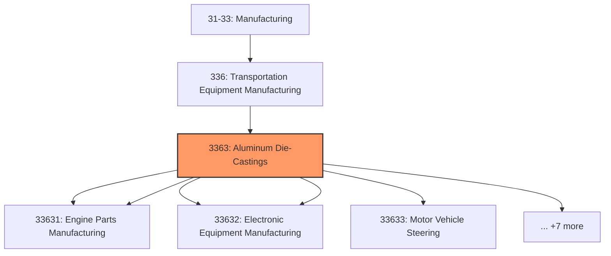
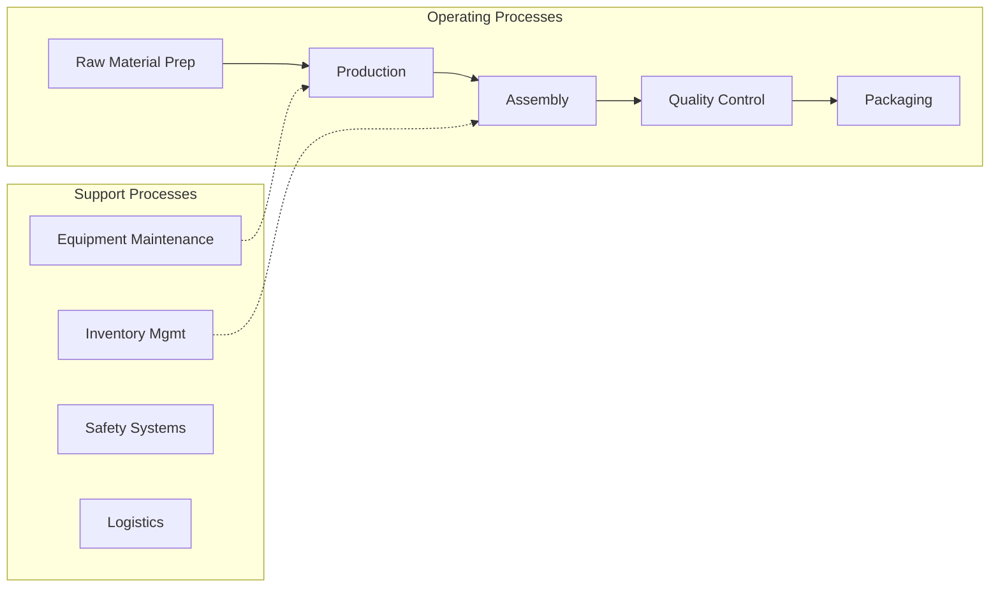

# Aluminum Die-Castings

> Aluminum Die-Castings.

## Overview

Aluminum Die-Castings represents an important category within the Manufacturing sector (SIC 3363).

## Industry Hierarchy

## Key Statistics

| Metric | Value |
|--------|-------|
| SIC Code | 3363 |
| Level | SIC (3363) |
| Child Industries | 0 |

## Related Occupations

- [Industrial Production Managers](/occupations/Management/IndustrialProductionManagers) - Oversee daily operations of manufacturing plants
- [Industrial Engineers](/occupations/Architecture/IndustrialEngineers) - Design efficient production systems
- [Machinists](/occupations/MachinistsAndToolAndDieMakers) - Operate machine tools to produce parts
- [Quality Control Analysts](/occupations/Science/QualityControlAnalysts) - Inspect products for quality standards

## Core Business Processes

## Industry Value Chain

## Regulatory Environment

- **OSHA** (Occupational Safety and Health Administration) - Enforces workplace safety in factories
- **EPA** (Environmental Protection Agency) - Regulates manufacturing emissions and waste
- **FDA** (Food and Drug Administration) - Oversees food and pharmaceutical manufacturing
- **CPSC** (Consumer Product Safety Commission) - Ensures product safety standards

## Technology & Innovation

- **Industry 4.0** - IoT-connected factories, digital twins, and smart manufacturing systems
- **Additive Manufacturing** - 3D printing for rapid prototyping and custom production
- **Robotics and Automation** - Collaborative robots, automated assembly, and AI quality inspection
- **Sustainable Manufacturing** - Circular economy practices, waste reduction, and green chemistry

## Industry Outlook

The manufacturing sector is experiencing a resurgence driven by reshoring initiatives, supply chain diversification, and advanced automation. Industry 4.0 technologies including IoT, AI, and robotics are transforming production efficiency. Sustainability requirements are driving innovation in materials, processes, and circular economy practices, while workforce development programs address the skilled labor gap.

---

*Source: SIC 3363 - Aluminum Die-Castings*
