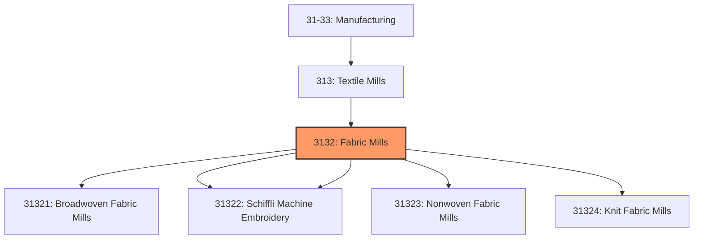
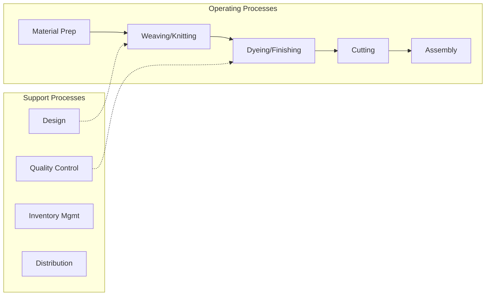

# Fabric Mills

> This industry group comprises establishments primarily engaged in one of the following: (1) weaving broadwoven fabrics and felts (except tire fabrics and rugs); (2) weaving or braiding narrow fabrics; (3) making fabric-covered elastic yarn and thread; (4) manufacturing Schiffli machine embroideries; (5) manufacturing nonwoven fabrics and felts; (6) knitting weft (i.

## Overview

Fabric Mills represents an important category within the U.S. Manufacturing sector (NAICS 31-33). This industry group encompasses establishments primarily engaged in fabric mills.

This industry group comprises establishments primarily engaged in one of the following: (1) weaving broadwoven fabrics and felts (except tire fabrics and rugs); (2) weaving or braiding narrow fabrics; (3) making fabric-covered elastic yarn and thread; (4) manufacturing Schiffli machine embroideries; (5) manufacturing nonwoven fabrics and felts; (6) knitting weft (i.e., circular) and warp (i.e., flat) fabric; (7) knitting and finishing weft and warp fabric; (8) manufacturing lace; or (9) manufacturing, dyeing, and finishing lace and lace goods.

## Industry Hierarchy

## Key Statistics

| Metric | Value |
|--------|-------|
| NAICS Code | 3132 |
| Level | Industry Group |
| Parent | [Textile Mills](../) |
| Child Industries | 5 |

## Sub-Industries

| Industry | Code | Description |
|----------|------|-------------|
| [Broadwoven Fabric Mills](./BroadwovenFabricMills/) | 31321 | See industry description for 313210 |
| [Narrow Fabric Mills](./NarrowFabricMills/) | 31322 | See industry description for 313220 |
| [Schiffli Machine Embroidery](./SchiffliMachineEmbroidery/) | 31322 | See industry description for 313220 |
| [Nonwoven Fabric Mills](./NonwovenFabricMills/) | 31323 | See industry description for 313230 |
| [Knit Fabric Mills](./KnitFabricMills/) | 31324 | See industry description for 313240 |

## Related Occupations

- [Industrial Production Managers](/occupations/Management/IndustrialProductionManagers) - Plan and coordinate production activities
- [First-Line Supervisors of Production Workers](/occupations/Production/FirstLineSupervisorsOfProductionAndOperatingWorkers) - Supervise production floor operations
- [Quality Control Inspectors](/occupations/QualityControlInspectors) - Inspect products for defects and compliance

## Core Business Processes

## Industry Value Chain

## Regulatory Environment

Manufacturing operations in this industry are subject to various federal, state, and local regulations:

- **OSHA Regulations**: Workplace safety standards, machine guarding, hazard communication
- **EPA Requirements**: Air emissions, water discharge, hazardous waste management
- **State/Local Requirements**: Zoning, permits, and local environmental regulations

## Technology & Innovation

The fabric mills industry is experiencing significant technological advancement:

- **Industry 4.0**: Connected manufacturing, IoT sensors, and real-time monitoring
- **Automation & Robotics**: Automated production lines and robotic assembly
- **Data Analytics**: Predictive maintenance, quality analytics, and process optimization
- **Sustainability**: Carbon reduction, circular economy, and green manufacturing
- **Digital Twin**: Virtual replicas for simulation and optimization

---

*Source: NAICS 3132 - Fabric Mills*
