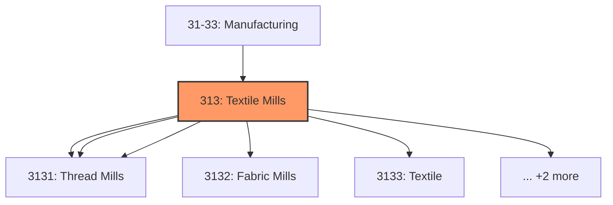
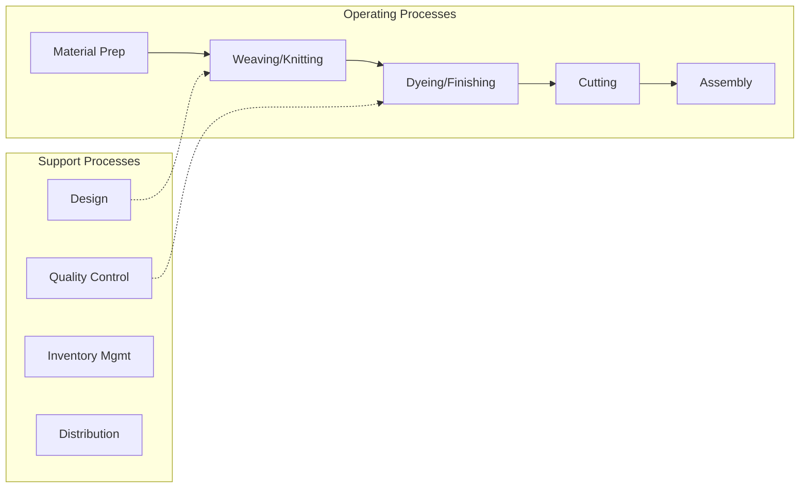

# Textile Mills

> Industries in the Textile Mills subsector group establishments that transform a basic fiber (natural or synthetic) into a product, such as yarn or fabric that is further manufactured into usable items, such as apparel, sheets, towels, and textile bags for individual or industrial consumption.

## Overview

Textile Mills represents an important category within the U.S. Manufacturing sector (NAICS 31-33). This subsector encompasses establishments primarily engaged in textile mills.

Industries in the Textile Mills subsector group establishments that transform a basic fiber (natural or synthetic) into a product, such as yarn or fabric that is further manufactured into usable items, such as apparel, sheets, towels, and textile bags for individual or industrial consumption. The further manufacturing may be performed in the same establishment and classified in this subsector, or it may be performed at a separate establishment and be classified elsewhere in the Manufacturing sector. The main processes in this subsector include preparation and spinning of fiber, knitting or weaving of fabric, and the finishing of the textile. The NAICS structure follows and captures this process flow. Major industries in this flow, such as preparation of fibers, weaving of fabric, knitting of fabric, and fiber and fabric finishing, are uniquely identified. Texturizing, throwing, twisting, and winding of yarn contain aspects of both fiber preparation and fiber finishing and are classified with preparation of fibers rather than with finishing of fibers. NAICS separates the manufacturing of primary textiles and the manufacturing of textile products (except apparel) produced from purchased primary textiles, such as fabric. The manufacturing of textile products (except apparel) from purchased fabric is classified in Subsector 314, Textile Product Mills, and apparel from purchased fabric is classified in Subsector 315, Apparel Manufacturing. Excluded from this subsector are establishments that weave or knit fabric and make garments. These establishments are included in Subsector 315, Apparel Manufacturing.

## Industry Hierarchy

## Key Statistics

| Metric | Value |
|--------|-------|
| NAICS Code | 313 |
| Level | Subsector |
| Child Industries | 7 |

## Sub-Industries

| Industry | Code | Description |
|----------|------|-------------|
| [Fiber](./Fiber/) | 3131 | Fiber |
| [Yarn](./Yarn/) | 3131 | Yarn |
| [Thread Mills](./ThreadMills/) | 3131 | Thread Mills |
| [Fabric Mills](./FabricMills/) | 3132 | This industry group comprises establishments primarily engaged in one of the fol |
| [Textile](./Textile/) | 3133 | This industry group comprises establishments primarily engaged in one of the fol |
| [Fabric Finishing](./FabricFinishing/) | 3133 | This industry group comprises establishments primarily engaged in one of the fol |
| [Fabric Coating Mills](./FabricCoatingMills/) | 3133 | This industry group comprises establishments primarily engaged in one of the fol |

## Related Occupations

- [Industrial Production Managers](/occupations/IndustrialProductionManagers) - Plan and coordinate production activities
- [First-Line Supervisors of Production Workers](/occupations/FirstLineSupervisorsOfProductionAndOperatingWorkers) - Supervise production floor operations
- [Quality Control Inspectors](/occupations/QualityControlInspectors) - Inspect products for defects and compliance

## Core Business Processes

## Industry Value Chain

## Regulatory Environment

Manufacturing operations in this industry are subject to various federal, state, and local regulations:

- **OSHA Regulations**: Workplace safety standards, machine guarding, hazard communication
- **EPA Requirements**: Air emissions, water discharge, hazardous waste management
- **State/Local Requirements**: Zoning, permits, and local environmental regulations

## Technology & Innovation

The textile mills industry is experiencing significant technological advancement:

- **Industry 4.0**: Connected manufacturing, IoT sensors, and real-time monitoring
- **Automation & Robotics**: Automated production lines and robotic assembly
- **Data Analytics**: Predictive maintenance, quality analytics, and process optimization
- **Sustainability**: Carbon reduction, circular economy, and green manufacturing
- **Digital Twin**: Virtual replicas for simulation and optimization

---

*Source: NAICS 313 - Textile Mills*
