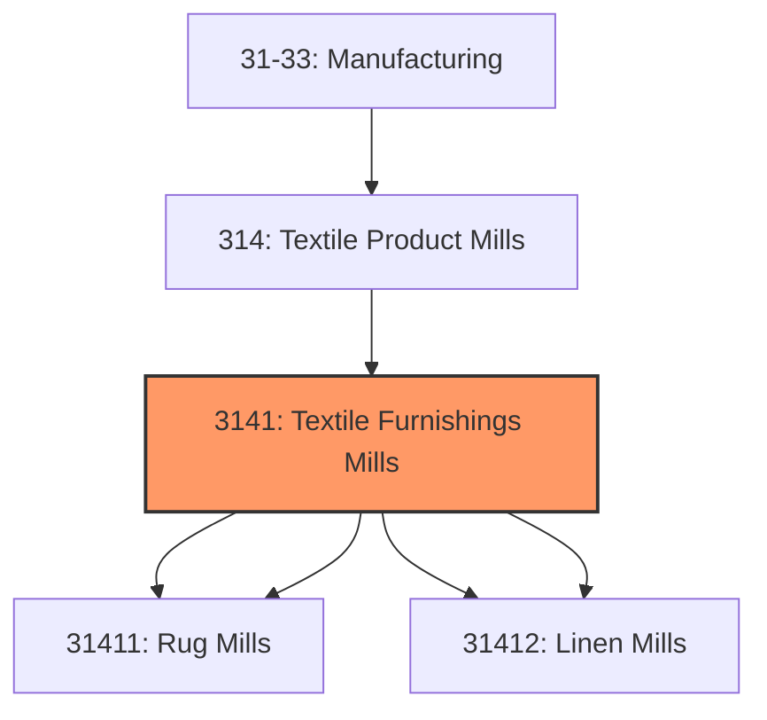
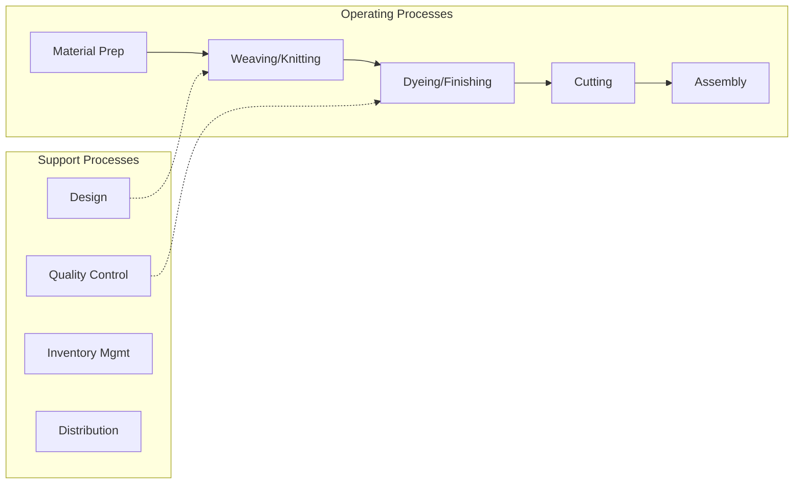

# Textile Furnishings Mills

> This industry group comprises establishments primarily engaged in (1) manufacturing woven, tufted, and other carpets and rugs and (2) manufacturing household textile products from purchased materials.

## Overview

Textile Furnishings Mills represents an important category within the U.S. Manufacturing sector (NAICS 31-33). This industry group encompasses establishments primarily engaged in textile furnishings mills.

This industry group comprises establishments primarily engaged in (1) manufacturing woven, tufted, and other carpets and rugs and (2) manufacturing household textile products from purchased materials. The household textile products may be made on a stock or custom basis for sale to individual retail customers.

## Industry Hierarchy

## Key Statistics

| Metric | Value |
|--------|-------|
| NAICS Code | 3141 |
| Level | Industry Group |
| Parent | [Textile Product Mills](../) |
| Child Industries | 4 |

## Sub-Industries

| Industry | Code | Description |
|----------|------|-------------|
| [Carpet](./Carpet/) | 31411 | See industry description for 314110 |
| [Rug Mills](./RugMills/) | 31411 | See industry description for 314110 |
| [Curtain](./Curtain/) | 31412 | See industry description for 314120 |
| [Linen Mills](./LinenMills/) | 31412 | See industry description for 314120 |

## Related Occupations

- [Industrial Production Managers](/occupations/Management/IndustrialProductionManagers) - Plan and coordinate production activities
- [First-Line Supervisors of Production Workers](/occupations/Production/FirstLineSupervisorsOfProductionAndOperatingWorkers) - Supervise production floor operations
- [Quality Control Inspectors](/occupations/QualityControlInspectors) - Inspect products for defects and compliance

## Core Business Processes

## Industry Value Chain

## Regulatory Environment

Manufacturing operations in this industry are subject to various federal, state, and local regulations:

- **OSHA Regulations**: Workplace safety standards, machine guarding, hazard communication
- **EPA Requirements**: Air emissions, water discharge, hazardous waste management
- **State/Local Requirements**: Zoning, permits, and local environmental regulations

## Technology & Innovation

The textile furnishings mills industry is experiencing significant technological advancement:

- **Industry 4.0**: Connected manufacturing, IoT sensors, and real-time monitoring
- **Automation & Robotics**: Automated production lines and robotic assembly
- **Data Analytics**: Predictive maintenance, quality analytics, and process optimization
- **Sustainability**: Carbon reduction, circular economy, and green manufacturing
- **Digital Twin**: Virtual replicas for simulation and optimization

---

*Source: NAICS 3141 - Textile Furnishings Mills*
