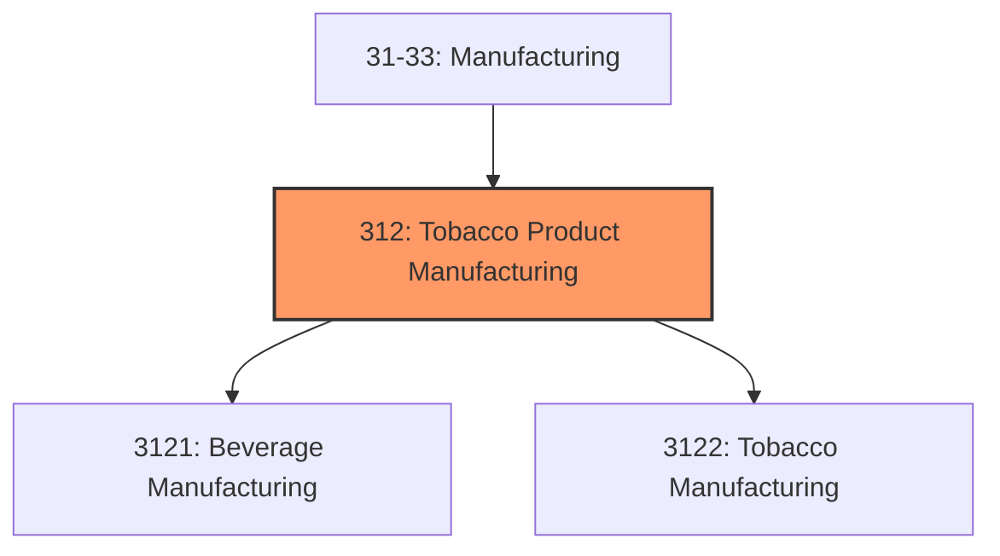
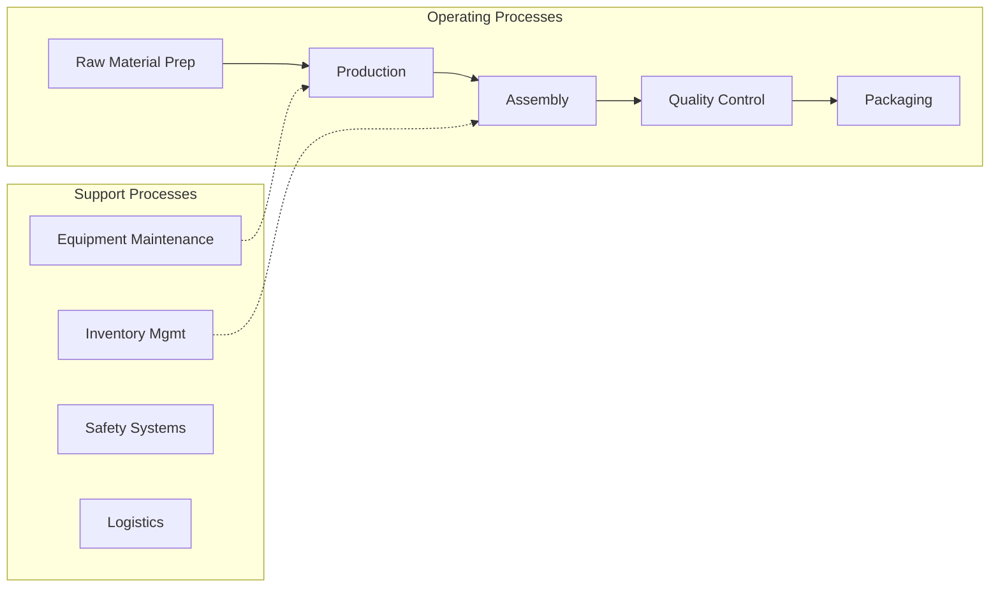

# Tobacco Product Manufacturing

> Industries in the Beverage and Tobacco Product Manufacturing subsector manufacture beverages and tobacco products.

## Overview

Tobacco Product Manufacturing represents an important category within the U.S. Manufacturing sector (NAICS 31-33). This subsector encompasses establishments primarily engaged in tobacco product manufacturing.

Industries in the Beverage and Tobacco Product Manufacturing subsector manufacture beverages and tobacco products. The Beverage Manufacturing industry group includes three types of establishments: (1) those that manufacture nonalcoholic beverages; (2) those that manufacture alcoholic beverages through the fermentation process; and (3) those that produce distilled alcoholic beverages. Ice manufacturing, while not a beverage, is included with nonalcoholic beverage manufacturing because it uses the same production process as water purification. In the case of activities related to the manufacture of beverages, the structure follows the defined production processes. Brandy, a distilled beverage, is not placed under distillery product manufacturing, but rather under winery product manufacturing since the production process used in the manufacturing of alcoholic grape-based beverages produces both wines (fermented beverage) and brandies (distilled beverage). The Tobacco Manufacturing industry group includes two types of establishments: (1) those engaged in redrying and stemming tobacco and (2) those that manufacture tobacco products, such as cigarettes and cigars.

## Industry Hierarchy

## Key Statistics

| Metric | Value |
|--------|-------|
| NAICS Code | 312 |
| Level | Subsector |
| Child Industries | 2 |

## Sub-Industries

| Industry | Code | Description |
|----------|------|-------------|
| [Beverage Manufacturing](./BeverageManufacturing/) | 3121 | This industry group comprises establishments primarily engaged in manufacturing  |
| [Tobacco Manufacturing](./TobaccoManufacturing/) | 3122 | Tobacco Manufacturing |

## Related Occupations

- [Industrial Production Managers](/occupations/IndustrialProductionManagers) - Plan and coordinate production activities
- [First-Line Supervisors of Production Workers](/occupations/FirstLineSupervisorsOfProductionAndOperatingWorkers) - Supervise production floor operations
- [Quality Control Inspectors](/occupations/QualityControlInspectors) - Inspect products for defects and compliance

## Core Business Processes

## Industry Value Chain

## Regulatory Environment

Manufacturing operations in this industry are subject to various federal, state, and local regulations:

- **OSHA Regulations**: Workplace safety standards, machine guarding, hazard communication
- **EPA Requirements**: Air emissions, water discharge, hazardous waste management
- **State/Local Requirements**: Zoning, permits, and local environmental regulations

## Technology & Innovation

The tobacco product manufacturing industry is experiencing significant technological advancement:

- **Industry 4.0**: Connected manufacturing, IoT sensors, and real-time monitoring
- **Automation & Robotics**: Automated production lines and robotic assembly
- **Data Analytics**: Predictive maintenance, quality analytics, and process optimization
- **Sustainability**: Carbon reduction, circular economy, and green manufacturing
- **Digital Twin**: Virtual replicas for simulation and optimization

---

*Source: NAICS 312 - Tobacco Product Manufacturing*
