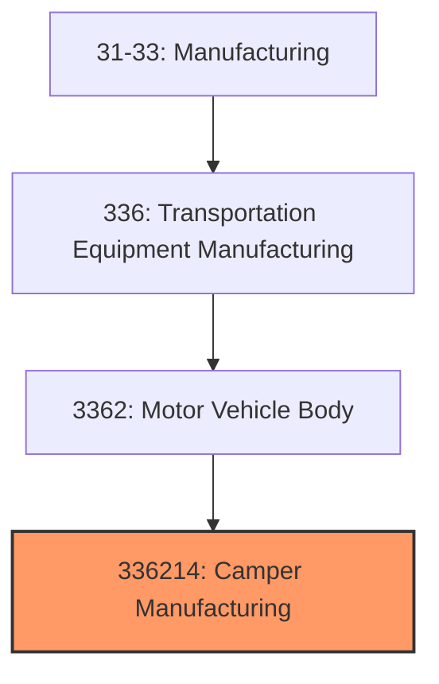
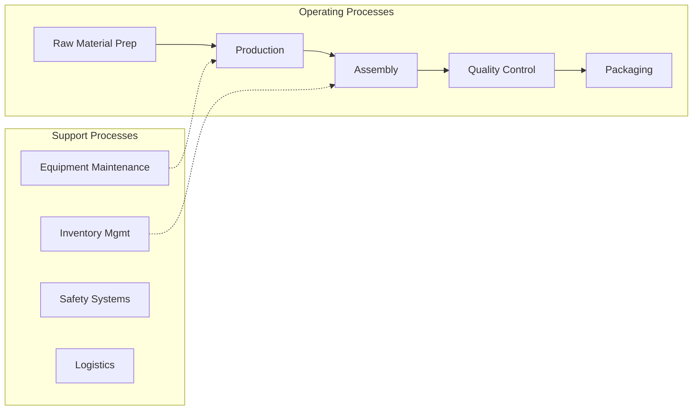

# Camper Manufacturing

> This U.

## Overview

Camper Manufacturing represents a specialized segment within the Manufacturing sector (NAICS 31-33).

This U.S. industry comprises establishments primarily engaged in one or more of the following: (1) manufacturing travel trailers and campers designed to attach to motor vehicles; (2) manufacturing pick-up coaches (i.e., campers) and caps (i.e., covers) for mounting on pick-up trucks; and (3) manufacturing automobile, utility, and light-truck trailers. Travel trailers do not have their own motor but are designed to be towed by a motor unit, such as an automobile or a light truck. Illustrative Examples: Automobile transporter trailers, single car, manufacturing Camper units, slide-in, for pick-up trucks, manufacturing Camping trailers and chassis manufacturing Horse trailers (except fifth-wheel-type) manufacturing Pick-up canopies, caps, or covers manufacturing Travel trailers, recreational, manufacturing Utility trailers manufacturing Cross-References. Establishments primarily engaged in--

## Industry Hierarchy

## Key Statistics

| Metric | Value |
|--------|-------|
| NAICS Code | 336214 |
| Level | National Industry |
| Child Industries | 0 |

## Related Occupations

See the [occupations directory](/occupations) for roles commonly found in this industry.

## Core Business Processes

## Industry Value Chain

```mermaid
graph LR
    subgraph Inputs["Inputs"]
        I1["Raw Materials"]
        I2["Components"]
        I3["Equipment"]
    end

    subgraph Primary["Primary Activities"]
        A1["Inbound Logistics"]
        A2["Core Operations"]
        A3["Quality Assurance"]
        A4["Outbound/Delivery"]
    end

    subgraph Outputs["Products/Services"]
        O1["Finished Products"]
        O2["Components"]
        O3["Assemblies"]
    end

    subgraph Customers["Markets"]
        C1["Industrial Buyers"]
        C2["Retailers"]
        C3["Distributors"]
        C4["End Users"]
    end

    Inputs --> Primary --> Outputs --> Customers
```

---

*Source: NAICS 336214 - Camper Manufacturing*
