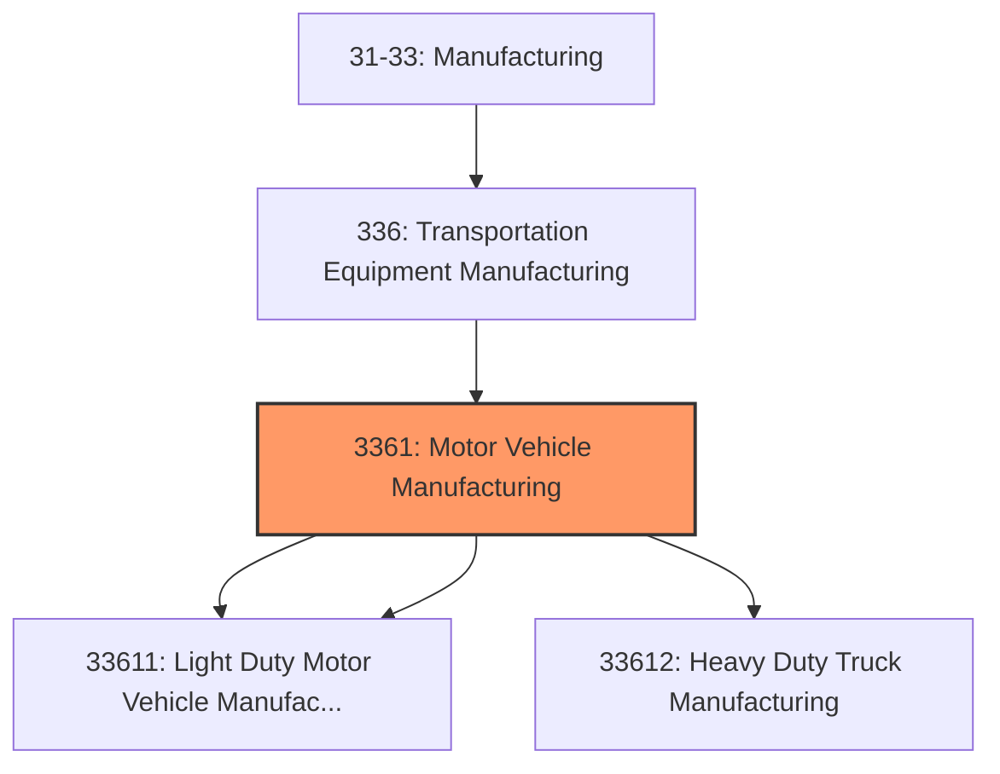
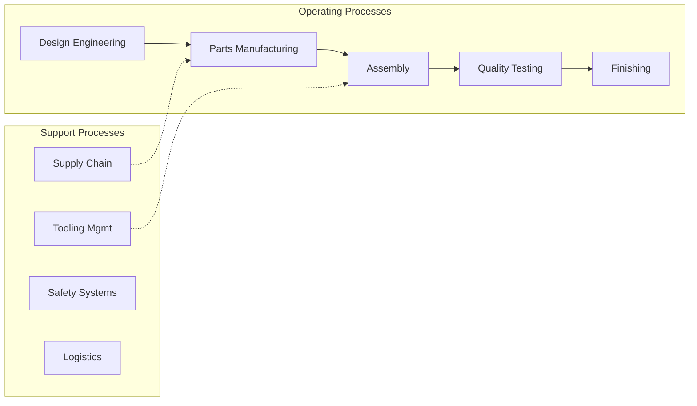

# Motor Vehicle Manufacturing

> This industry group comprises establishments primarily engaged in (1) manufacturing complete automobiles, light duty motor vehicles, and heavy duty trucks (i.

## Overview

Motor Vehicle Manufacturing represents an important category within the U.S. Manufacturing sector (NAICS 31-33). This industry group encompasses establishments primarily engaged in motor vehicle manufacturing.

This industry group comprises establishments primarily engaged in (1) manufacturing complete automobiles, light duty motor vehicles, and heavy duty trucks (i.e., body and chassis or unibody) or (2) manufacturing motor vehicle chassis only.

## Industry Hierarchy

## Key Statistics

| Metric | Value |
|--------|-------|
| NAICS Code | 3361 |
| Level | Industry Group |
| Parent | [Transportation Equipment Manufacturing](../) |
| Child Industries | 3 |

## Sub-Industries

| Industry | Code | Description |
|----------|------|-------------|
| [Automobile](./Automobile/) | 33611 | See industry description for 336110 |
| [Light Duty Motor Vehicle Manufacturing](./LightDutyMotorVehicleManufacturing/) | 33611 | See industry description for 336110 |
| [Heavy Duty Truck Manufacturing](./HeavyDutyTruckManufacturing/) | 33612 | See industry description for 336120 |

## Related Occupations

- [Industrial Production Managers](/occupations/Management/IndustrialProductionManagers) - Plan and coordinate production activities
- [First-Line Supervisors of Production Workers](/occupations/Production/FirstLineSupervisorsOfProductionAndOperatingWorkers) - Supervise production floor operations
- [Quality Control Inspectors](/occupations/QualityControlInspectors) - Inspect products for defects and compliance

## Core Business Processes

## Industry Value Chain

```mermaid
graph LR
    subgraph Inputs["Inputs"]
        I1["Steel"]
        I2["Components"]
        I3["Electronics"]
        I4["Plastics"]
    end

    subgraph Primary["Primary Activities"]
        A1["Inbound Logistics"]
        A2["Manufacturing Operations"]
        A3["Quality Assurance"]
        A4["Outbound Logistics"]
    end

    subgraph Outputs["Products"]
        O1["Vehicles"]
        O2["Parts"]
        O3["Assemblies"]
    end

    subgraph Customers["Markets"]
        C1["Dealers"]
        C2["Fleet Operators"]
        C3["OEMs"]
        C4["Aftermarket"]
    end

    Inputs --> Primary --> Outputs --> Customers
```

## Regulatory Environment

Manufacturing operations in this industry are subject to various federal, state, and local regulations:

- **OSHA Regulations**: Workplace safety standards, machine guarding, hazard communication
- **EPA Requirements**: Air emissions, water discharge, hazardous waste management
- **NHTSA Standards**: Motor vehicle safety standards (FMVSS)
- **EPA Emissions**: Vehicle emissions and fuel economy standards
- **State Regulations**: State-specific vehicle requirements
- **State/Local Requirements**: Zoning, permits, and local environmental regulations

## Technology & Innovation

The motor vehicle manufacturing industry is experiencing significant technological advancement:

- **Industry 4.0**: Connected manufacturing, IoT sensors, and real-time monitoring
- **Automation & Robotics**: Automated production lines and robotic assembly
- **Data Analytics**: Predictive maintenance, quality analytics, and process optimization
- **Electric Vehicle Manufacturing**: Battery production and EV assembly
- **Connected Manufacturing**: Digital twin and smart factory integration
- **Sustainability**: Carbon reduction, circular economy, and green manufacturing
- **Digital Twin**: Virtual replicas for simulation and optimization

---

*Source: NAICS 3361 - Motor Vehicle Manufacturing*
