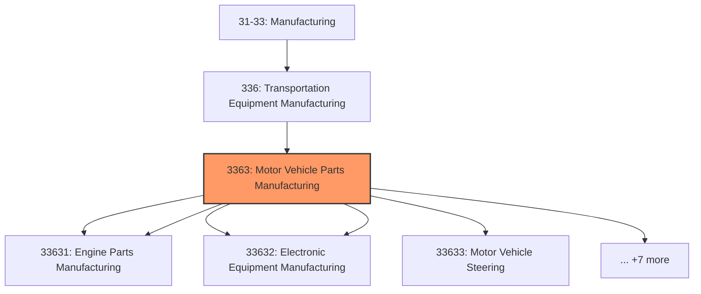
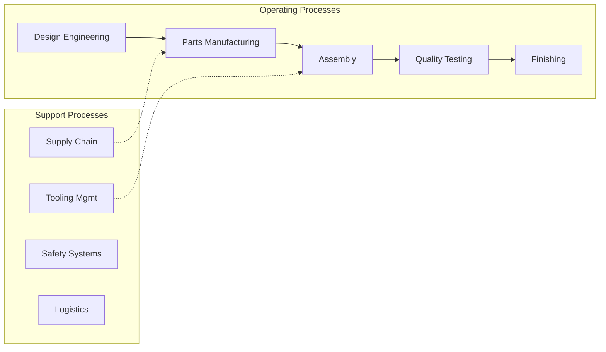

# Motor Vehicle Parts Manufacturing

> This industry group comprises establishments primarily engaged in manufacturing motor vehicle gasoline engines and engine parts, motor vehicle electrical and electronic equipment, motor vehicle steering and suspension components (except springs), motor vehicle brake systems, motor vehicle transmission and power train parts, motor vehicle seating and interior trim, motor vehicle metal stampings, and other motor vehicle parts and accessories.

## Overview

Motor Vehicle Parts Manufacturing represents an important category within the U.S. Manufacturing sector (NAICS 31-33). This industry group encompasses establishments primarily engaged in motor vehicle parts manufacturing.

This industry group comprises establishments primarily engaged in manufacturing motor vehicle gasoline engines and engine parts, motor vehicle electrical and electronic equipment, motor vehicle steering and suspension components (except springs), motor vehicle brake systems, motor vehicle transmission and power train parts, motor vehicle seating and interior trim, motor vehicle metal stampings, and other motor vehicle parts and accessories. This industry group includes establishments that rebuild motor vehicle parts.

## Industry Hierarchy

## Key Statistics

| Metric | Value |
|--------|-------|
| NAICS Code | 3363 |
| Level | Industry Group |
| Parent | [Transportation Equipment Manufacturing](../) |
| Child Industries | 12 |

## Sub-Industries

| Industry | Code | Description |
|----------|------|-------------|
| [Motor Vehicle Gasoline Engine](./MotorVehicleGasolineEngine/) | 33631 | See industry description for 336310 |
| [Engine Parts Manufacturing](./EnginePartsManufacturing/) | 33631 | See industry description for 336310 |
| [Motor Vehicle Electrical](./MotorVehicleElectrical/) | 33632 | See industry description for 336320 |
| [Electronic Equipment Manufacturing](./ElectronicEquipmentManufacturing/) | 33632 | See industry description for 336320 |
| [Motor Vehicle Steering](./MotorVehicleSteering/) | 33633 | See industry description for 336330 |
| [Suspension Components (](./SuspensionComponents/) | 33633 | See industry description for 336330 |
| [Motor Vehicle Brake System Manufacturing](./MotorVehicleBrakeSystemManufacturing/) | 33634 | See industry description for 336340 |
| [Motor Vehicle Transmission](./MotorVehicleTransmission/) | 33635 | See industry description for 336350 |
| [Power Train Parts Manufacturing](./PowerTrainPartsManufacturing/) | 33635 | See industry description for 336350 |
| [Motor Vehicle Seating](./MotorVehicleSeating/) | 33636 | See industry description for 336360 |
| [Interior Trim Manufacturing](./InteriorTrimManufacturing/) | 33636 | See industry description for 336360 |
| [Motor Vehicle Metal Stamping](./MotorVehicleMetalStamping/) | 33637 | See industry description for 336370 |

## Related Occupations

- [Industrial Production Managers](/occupations/IndustrialProductionManagers) - Plan and coordinate production activities
- [First-Line Supervisors of Production Workers](/occupations/FirstLineSupervisorsOfProductionAndOperatingWorkers) - Supervise production floor operations
- [Quality Control Inspectors](/occupations/QualityControlInspectors) - Inspect products for defects and compliance

## Core Business Processes

## Industry Value Chain

```mermaid
graph LR
    subgraph Inputs["Inputs"]
        I1["Steel"]
        I2["Components"]
        I3["Electronics"]
        I4["Plastics"]
    end

    subgraph Primary["Primary Activities"]
        A1["Inbound Logistics"]
        A2["Manufacturing Operations"]
        A3["Quality Assurance"]
        A4["Outbound Logistics"]
    end

    subgraph Outputs["Products"]
        O1["Vehicles"]
        O2["Parts"]
        O3["Assemblies"]
    end

    subgraph Customers["Markets"]
        C1["Dealers"]
        C2["Fleet Operators"]
        C3["OEMs"]
        C4["Aftermarket"]
    end

    Inputs --> Primary --> Outputs --> Customers
```

## Regulatory Environment

Manufacturing operations in this industry are subject to various federal, state, and local regulations:

- **OSHA Regulations**: Workplace safety standards, machine guarding, hazard communication
- **EPA Requirements**: Air emissions, water discharge, hazardous waste management
- **NHTSA Standards**: Motor vehicle safety standards (FMVSS)
- **EPA Emissions**: Vehicle emissions and fuel economy standards
- **State Regulations**: State-specific vehicle requirements
- **State/Local Requirements**: Zoning, permits, and local environmental regulations

## Technology & Innovation

The motor vehicle parts manufacturing industry is experiencing significant technological advancement:

- **Industry 4.0**: Connected manufacturing, IoT sensors, and real-time monitoring
- **Automation & Robotics**: Automated production lines and robotic assembly
- **Data Analytics**: Predictive maintenance, quality analytics, and process optimization
- **Electric Vehicle Manufacturing**: Battery production and EV assembly
- **Connected Manufacturing**: Digital twin and smart factory integration
- **Sustainability**: Carbon reduction, circular economy, and green manufacturing
- **Digital Twin**: Virtual replicas for simulation and optimization

---

*Source: NAICS 3363 - Motor Vehicle Parts Manufacturing*
