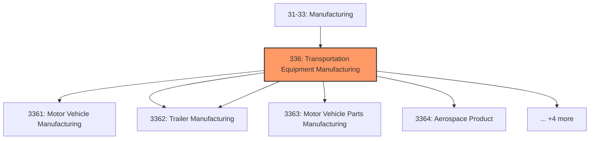
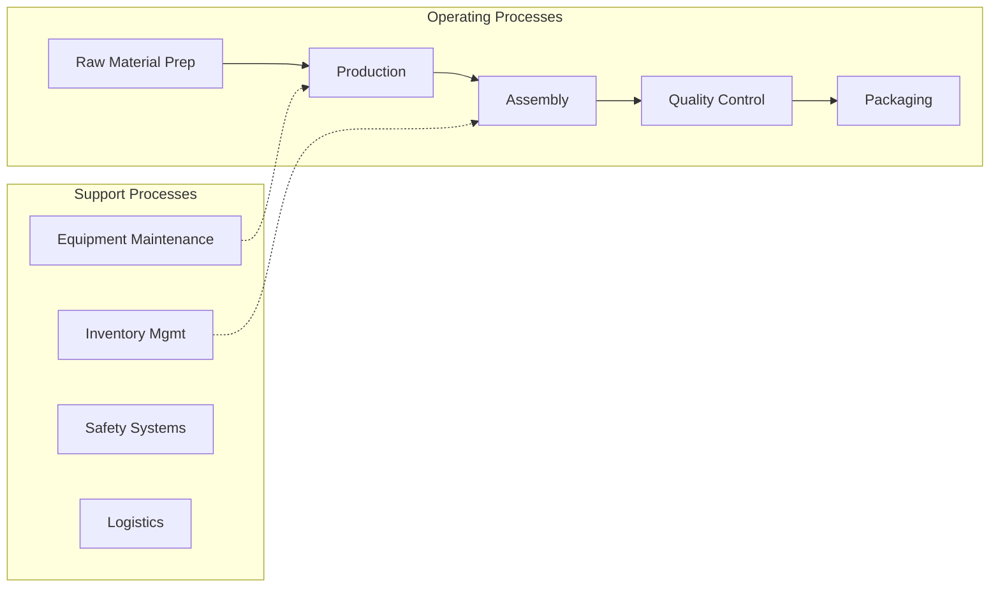

# Transportation Equipment Manufacturing

> Industries in the Transportation Equipment Manufacturing subsector produce equipment for transporting people and goods.

## Overview

Transportation Equipment Manufacturing represents an important category within the U.S. Manufacturing sector (NAICS 31-33). This subsector encompasses establishments primarily engaged in transportation equipment manufacturing.

Industries in the Transportation Equipment Manufacturing subsector produce equipment for transporting people and goods. Transportation equipment is a type of machinery. An entire subsector is devoted to this activity because of the significance of its economic size in all three North American countries. Establishments in this subsector utilize production processes similar to those of other machinery manufacturing establishments—bending, forming, welding, machining, and assembling metal or plastic parts into components and finished products. However, the assembly of components and subassemblies and their further assembly into finished vehicles tends to be a more common production process in this subsector than in the Machinery Manufacturing subsector. NAICS has industry groups for the manufacture of equipment for each mode of transport—road, rail, air, and water. Parts for motor vehicles warrant a separate industry group because of their importance and because they require less assembly than complete vehicles. Land use motor vehicle equipment not designed for highway operation (e.g., agricultural equipment, construction equipment, and material handling equipment) is classified in the appropriate NAICS subsector based on the type and use of the equipment.

## Industry Hierarchy

## Key Statistics

| Metric | Value |
|--------|-------|
| NAICS Code | 336 |
| Level | Subsector |
| Child Industries | 9 |

## Sub-Industries

| Industry | Code | Description |
|----------|------|-------------|
| [Motor Vehicle Manufacturing](./MotorVehicleManufacturing/) | 3361 | This industry group comprises establishments primarily engaged in (1) manufactur |
| [Motor Vehicle Body](./MotorVehicleBody/) | 3362 | Motor Vehicle Body |
| [Trailer Manufacturing](./TrailerManufacturing/) | 3362 | Trailer Manufacturing |
| [Motor Vehicle Parts Manufacturing](./MotorVehiclePartsManufacturing/) | 3363 | This industry group comprises establishments primarily engaged in manufacturing  |
| [Aerospace Product](./AerospaceProduct/) | 3364 | Aerospace Product |
| [Parts Manufacturing](./PartsManufacturing/) | 3364 | Parts Manufacturing |
| [Railroad Rolling Stock Manufacturing](./RailroadRollingStockManufacturing/) | 3365 | Railroad Rolling Stock Manufacturing |
| [Ship](./Ship/) | 3366 | Ship |
| [Boat Building](./BoatBuilding/) | 3366 | Boat Building |

## Related Occupations

- [Industrial Production Managers](/occupations/Management/IndustrialProductionManagers) - Plan and coordinate production activities
- [First-Line Supervisors of Production Workers](/occupations/Production/FirstLineSupervisorsOfProductionAndOperatingWorkers) - Supervise production floor operations
- [Quality Control Inspectors](/occupations/QualityControlInspectors) - Inspect products for defects and compliance

## Core Business Processes

## Industry Value Chain

## Regulatory Environment

Manufacturing operations in this industry are subject to various federal, state, and local regulations:

- **OSHA Regulations**: Workplace safety standards, machine guarding, hazard communication
- **EPA Requirements**: Air emissions, water discharge, hazardous waste management
- **State/Local Requirements**: Zoning, permits, and local environmental regulations

## Technology & Innovation

The transportation equipment manufacturing industry is experiencing significant technological advancement:

- **Industry 4.0**: Connected manufacturing, IoT sensors, and real-time monitoring
- **Automation & Robotics**: Automated production lines and robotic assembly
- **Data Analytics**: Predictive maintenance, quality analytics, and process optimization
- **Sustainability**: Carbon reduction, circular economy, and green manufacturing
- **Digital Twin**: Virtual replicas for simulation and optimization

---

*Source: NAICS 336 - Transportation Equipment Manufacturing*
