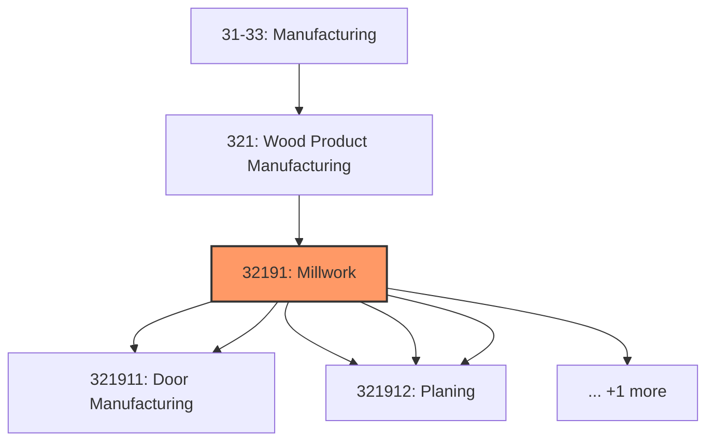
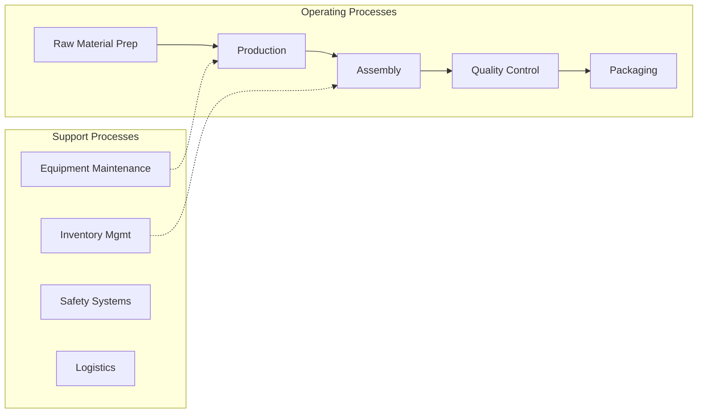

# Millwork

> This industry comprises establishments primarily engaged in manufacturing hardwood and softwood cut stock and dimension stock (i.

## Overview

Millwork represents an important category within the Manufacturing sector (NAICS 31-33).

This industry comprises establishments primarily engaged in manufacturing hardwood and softwood cut stock and dimension stock (i.e., shapes); wood windows and wood doors; and other millwork including wood flooring. Dimension stock or cut stock is defined as lumber and worked wood products cut or shaped to specialized sizes. These establishments generally use woodworking machinery, such as jointers, planers, lathes, and routers to shape wood. Cross-References. Establishments primarily engaged in--

## Industry Hierarchy

## Key Statistics

| Metric | Value |
|--------|-------|
| NAICS Code | 32191 |
| Level | Industry |
| Child Industries | 6 |

## Sub-Industries

| Industry | Code | Description |
|----------|------|-------------|
| [Wood Window](./WoodWindow.mdx) | 321911 | This U |
| [Door Manufacturing](./DoorManufacturing.mdx) | 321911 | This U |
| [Cut Stock](./CutStock.mdx) | 321912 | This U |
| [Resawing Lumber](./ResawingLumber.mdx) | 321912 | This U |
| [Planing](./Planing.mdx) | 321912 | This U |
| [Millwork (including Flooring)](./MillworkIncludingFlooring.mdx) | 321918 | This U |

## Related Occupations

See the [occupations directory](/occupations) for roles commonly found in this industry.

## Core Business Processes

## Industry Value Chain

```mermaid
graph LR
    subgraph Inputs["Inputs"]
        I1["Raw Materials"]
        I2["Components"]
        I3["Equipment"]
    end

    subgraph Primary["Primary Activities"]
        A1["Inbound Logistics"]
        A2["Core Operations"]
        A3["Quality Assurance"]
        A4["Outbound/Delivery"]
    end

    subgraph Outputs["Products/Services"]
        O1["Finished Products"]
        O2["Components"]
        O3["Assemblies"]
    end

    subgraph Customers["Markets"]
        C1["Industrial Buyers"]
        C2["Retailers"]
        C3["Distributors"]
        C4["End Users"]
    end

    Inputs --> Primary --> Outputs --> Customers
```

---

*Source: NAICS 32191 - Millwork*
