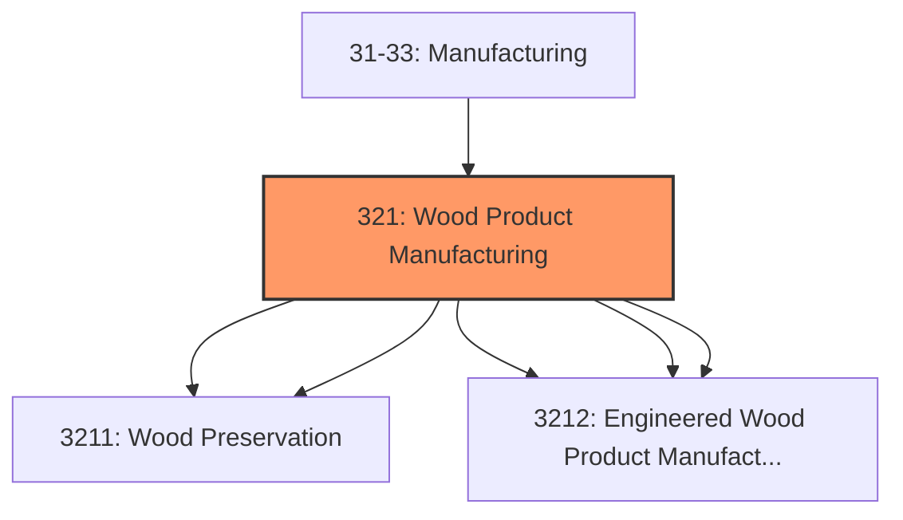
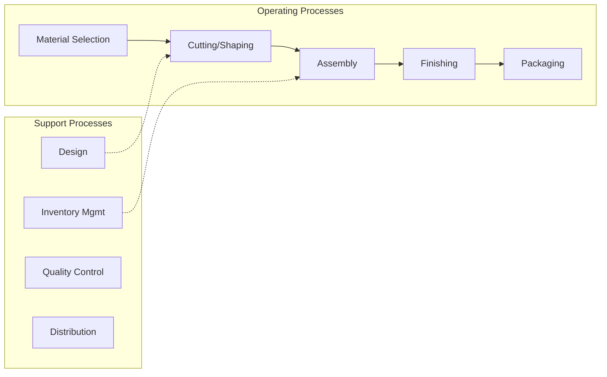

# Wood Product Manufacturing

> Establishments in the Wood Product Manufacturing subsector manufacture wood products, such as lumber, plywood, veneers, wood containers, wood flooring, wood trusses, manufactured homes (i.

## Overview

Wood Product Manufacturing represents an important category within the U.S. Manufacturing sector (NAICS 31-33). This subsector encompasses establishments primarily engaged in wood product manufacturing.

Establishments in the Wood Product Manufacturing subsector manufacture wood products, such as lumber, plywood, veneers, wood containers, wood flooring, wood trusses, manufactured homes (i.e., mobile homes), and prefabricated wood buildings. The production processes of the Wood Product Manufacturing subsector include sawing, planing, shaping, laminating, and assembling wood products starting from logs that are cut into bolts, or lumber that then may be further cut, or shaped by lathes or other shaping tools. The lumber or other transformed wood shapes may also be subsequently planed or smoothed, and assembled into finished products, such as wood containers. The Wood Product Manufacturing subsector includes establishments that make wood products from logs and bolts that are sawed and shaped, and establishments that purchase sawed lumber and make wood products. With the exception of sawmills and wood preservation establishments, the establishments are grouped into industries mainly based on the specific products manufactured.

## Industry Hierarchy

## Key Statistics

| Metric | Value |
|--------|-------|
| NAICS Code | 321 |
| Level | Subsector |
| Child Industries | 5 |

## Sub-Industries

| Industry | Code | Description |
|----------|------|-------------|
| [Sawmills](./Sawmills/) | 3211 | Sawmills |
| [Wood Preservation](./WoodPreservation/) | 3211 | Wood Preservation |
| [Veneer](./Veneer/) | 3212 | Veneer |
| [Plywood](./Plywood/) | 3212 | Plywood |
| [Engineered Wood Product Manufacturing](./EngineeredWoodProductManufacturing/) | 3212 | Engineered Wood Product Manufacturing |

## Related Occupations

- [Industrial Production Managers](/occupations/Management/IndustrialProductionManagers) - Plan and coordinate production activities
- [First-Line Supervisors of Production Workers](/occupations/Production/FirstLineSupervisorsOfProductionAndOperatingWorkers) - Supervise production floor operations
- [Quality Control Inspectors](/occupations/QualityControlInspectors) - Inspect products for defects and compliance

## Core Business Processes

## Industry Value Chain

## Regulatory Environment

Manufacturing operations in this industry are subject to various federal, state, and local regulations:

- **OSHA Regulations**: Workplace safety standards, machine guarding, hazard communication
- **EPA Requirements**: Air emissions, water discharge, hazardous waste management
- **State/Local Requirements**: Zoning, permits, and local environmental regulations

## Technology & Innovation

The wood product manufacturing industry is experiencing significant technological advancement:

- **Industry 4.0**: Connected manufacturing, IoT sensors, and real-time monitoring
- **Automation & Robotics**: Automated production lines and robotic assembly
- **Data Analytics**: Predictive maintenance, quality analytics, and process optimization
- **Sustainability**: Carbon reduction, circular economy, and green manufacturing
- **Digital Twin**: Virtual replicas for simulation and optimization

---

*Source: NAICS 321 - Wood Product Manufacturing*
