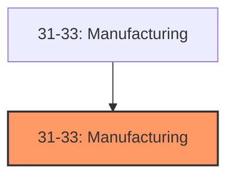
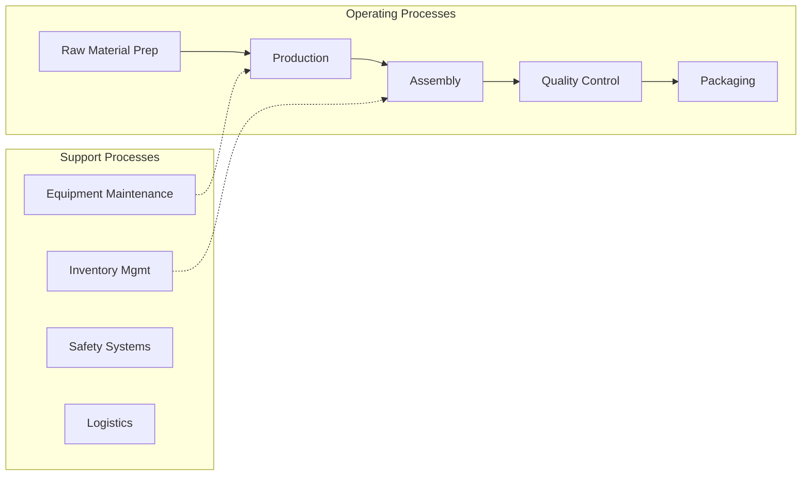

# Manufacturing

> The Manufacturing sector comprises establishments engaged in the mechanical, physical, or chemical transformation of materials, substances, or components into new products.

## Overview

Manufacturing represents an important category within the U.S. Manufacturing sector (NAICS 31-33). This industry encompasses establishments primarily engaged in manufacturing.

The Manufacturing sector comprises establishments engaged in the mechanical, physical, or chemical transformation of materials, substances, or components into new products. Establishments in the Manufacturing sector are often described as plants, factories, or mills and characteristically use power-driven machines and materials-handling equipment. The assembly of component parts of manufactured products is considered manufacturing.

## Industry Hierarchy

## Key Statistics

| Metric | Value |
|--------|-------|
| NAICS Code | 31-33 |
| Level | Industry |
| Child Industries | 28 |

## Sub-Industries

| Industry | Code | Description |
|----------|------|-------------|
| [Food Manufacturing](./FoodManufacturing/) | 311 | Industries in the Food Manufacturing subsector transform livestock and agricultu |
| [Beverage](./Beverage/) | 312 | Industries in the Beverage and Tobacco Product Manufacturing subsector manufactu |
| [Tobacco Product Manufacturing](./TobaccoProductManufacturing/) | 312 | Industries in the Beverage and Tobacco Product Manufacturing subsector manufactu |
| [Textile Mills](./TextileMills/) | 313 | Industries in the Textile Mills subsector group establishments that transform a  |
| [Textile Product Mills](./TextileProductMills/) | 314 | Industries in the Textile Product Mills subsector group establishments that make |
| [Apparel Manufacturing](./ApparelManufacturing/) | 315 | Industries in the Apparel Manufacturing subsector group establishments with two  |
| [Leather](./Leather/) | 316 | Establishments in the Leather and Allied Product Manufacturing subsector transfo |
| [Allied Product Manufacturing](./AlliedProductManufacturing/) | 316 | Establishments in the Leather and Allied Product Manufacturing subsector transfo |
| [Wood Product Manufacturing](./WoodProductManufacturing/) | 321 | Establishments in the Wood Product Manufacturing subsector manufacture wood prod |
| [Paper Manufacturing](./PaperManufacturing/) | 322 | Industries in the Paper Manufacturing subsector make pulp, paper, or converted p |
| [Printing](./Printing/) | 323 | Industries in the Printing and Related Support Activities subsector print produc |
| [Related Support Activities](./RelatedSupportActivities/) | 323 | Industries in the Printing and Related Support Activities subsector print produc |
| [Petroleum](./Petroleum/) | 324 | The Petroleum and Coal Products Manufacturing subsector is based on the transfor |
| [Coal Products Manufacturing](./CoalProductsManufacturing/) | 324 | The Petroleum and Coal Products Manufacturing subsector is based on the transfor |
| [Chemical Manufacturing](./ChemicalManufacturing/) | 325 | The Chemical Manufacturing subsector is based on the transformation of organic a |
| [Plastics](./Plastics/) | 326 | Industries in the Plastics and Rubber Products Manufacturing subsector make good |
| [Rubber Products Manufacturing](./RubberProductsManufacturing/) | 326 | Industries in the Plastics and Rubber Products Manufacturing subsector make good |
| [Nonmetallic Mineral Product Manufacturing](./NonmetallicMineralProductManufacturing/) | 327 | The Nonmetallic Mineral Product Manufacturing subsector is based on the transfor |
| [Primary Metal Manufacturing](./PrimaryMetalManufacturing/) | 331 | Industries in the Primary Metal Manufacturing subsector smelt and/or refine ferr |
| [Fabricated Metal Product Manufacturing](./FabricatedMetalProductManufacturing/) | 332 | Industries in the Fabricated Metal Product Manufacturing subsector transform met |
| [Machinery Manufacturing](./MachineryManufacturing/) | 333 | Industries in the Machinery Manufacturing subsector create end products that app |
| [Computer](./Computer/) | 334 | Industries in the Computer and Electronic Product Manufacturing subsector group  |
| [Electronic Product Manufacturing](./ElectronicProductManufacturing/) | 334 | Industries in the Computer and Electronic Product Manufacturing subsector group  |
| [Electrical Equipment](./ElectricalEquipment/) | 335 | Industries in the Electrical Equipment, Appliance, and Component Manufacturing s |
| [Appliance](./Appliance/) | 335 | Industries in the Electrical Equipment, Appliance, and Component Manufacturing s |
| [Transportation Equipment Manufacturing](./TransportationEquipmentManufacturing/) | 336 | Industries in the Transportation Equipment Manufacturing subsector produce equip |
| [Furniture](./Furniture/) | 337 | Industries in the Furniture and Related Product Manufacturing subsector make fur |
| [Related Product Manufacturing](./RelatedProductManufacturing/) | 337 | Industries in the Furniture and Related Product Manufacturing subsector make fur |

## Related Occupations

- [Industrial Production Managers](/occupations/Management/IndustrialProductionManagers) - Plan and coordinate production activities
- [First-Line Supervisors of Production Workers](/occupations/Production/FirstLineSupervisorsOfProductionAndOperatingWorkers) - Supervise production floor operations
- [Quality Control Inspectors](/occupations/QualityControlInspectors) - Inspect products for defects and compliance

## Core Business Processes

## Industry Value Chain

## Regulatory Environment

Manufacturing operations in this industry are subject to various federal, state, and local regulations:

- **OSHA Regulations**: Workplace safety standards, machine guarding, hazard communication
- **EPA Requirements**: Air emissions, water discharge, hazardous waste management
- **State/Local Requirements**: Zoning, permits, and local environmental regulations

## Technology & Innovation

The manufacturing industry is experiencing significant technological advancement:

- **Industry 4.0**: Connected manufacturing, IoT sensors, and real-time monitoring
- **Automation & Robotics**: Automated production lines and robotic assembly
- **Data Analytics**: Predictive maintenance, quality analytics, and process optimization
- **Sustainability**: Carbon reduction, circular economy, and green manufacturing
- **Digital Twin**: Virtual replicas for simulation and optimization

---

*Source: NAICS 31-33 - Manufacturing*
