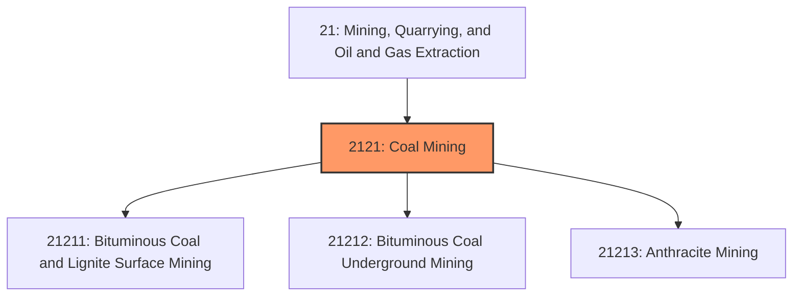
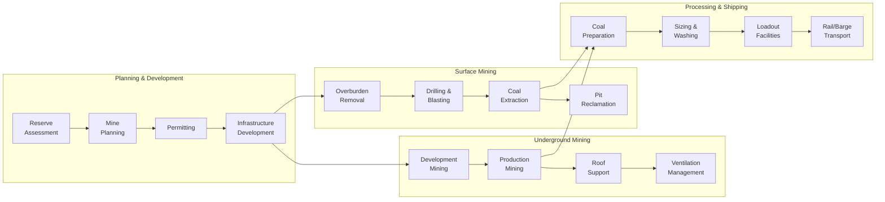

# Coal Mining

> Establishments primarily engaged in mining coal, including bituminous, anthracite, and lignite, through surface and underground mining methods.

## Overview

Coal Mining represents a significant industry group within the Mining, Quarrying, and Oil and Gas Extraction sector (NAICS 21). This industry encompasses establishments engaged in mining coal, developing coal mine sites, and beneficiating coal through cleaning, washing, sizing, and thermal drying operations. The industry includes both surface mining (strip mining, open-pit) and underground mining (longwall, room-and-pillar) operations.

### Industry Scope

Coal mining operations produce various coal types for diverse end markets:
- **Thermal Coal**: Primarily for electricity generation and industrial heat
- **Metallurgical Coal**: Essential for steel production in blast furnaces
- **Anthracite**: High-grade coal for specialized industrial and residential uses

### Market Context

Global coal production exceeds 8 billion tonnes annually, though markets are undergoing significant transition. The U.S. produces approximately 550 million short tons annually, down from peak production of 1.2 billion tons in 2008. While domestic demand for thermal coal has declined sharply due to natural gas and renewable energy competition, metallurgical coal remains essential for steel production with stable export demand.

Key market dynamics include:
- **Energy Transition**: Power generation coal demand declining 5-7% annually in developed markets
- **Metallurgical Coal Strength**: Steel production maintaining coking coal demand globally
- **Export Growth**: U.S. exports increasing to Asia and Europe markets
- **Regulatory Pressure**: Increasing environmental compliance costs and permitting challenges
- **Workforce Transition**: Managing employment decline while supporting affected communities

## Industry Hierarchy

## Key Statistics

| Metric | Value |
|--------|-------|
| NAICS Code | 2121 |
| Level | Industry Group |
| U.S. Production | ~550 million short tons/year |
| U.S. Employment | ~42,000 direct workers |
| Active Mines | ~600 (surface and underground) |
| Major States | Wyoming, West Virginia, Pennsylvania, Illinois, Kentucky |
| Export Volume | ~75 million short tons/year |

## Sub-Industries

| Industry | Code | Description |
|----------|------|-------------|
| [Surface Coal Mining](./SurfaceCoalMining.mdx) | 21211 | Strip mining, open-pit, and mountaintop removal operations |
| [Underground Coal Mining](./UndergroundCoalMining.mdx) | 21212 | Longwall and room-and-pillar underground operations |

## Related Occupations

| Occupation | Role | Employment |
|------------|------|------------|
| [Mining and Geological Engineers](/occupations/Architecture/MiningAndGeologicalEngineers) | Design mine plans and extraction systems | 1,800 |
| [Continuous Mining Machine Operators](/occupations/Construction/ContinuousMiningMachineOperators) | Operate underground cutting machines | 4,200 |
| [Roof Bolters](/occupations/Construction/RoofBoltersMining) | Install roof support systems | 2,800 |
| [Mine Shuttle Car Operators](/occupations/Construction/MineShuttleCarOperators) | Transport coal underground | 1,900 |
| [Excavating Machine Operators](/occupations/Construction/ExcavatingAndLoadingMachineAndDraglineOperators) | Operate surface mining equipment | 5,600 |
| [First-Line Supervisors](/occupations/Production/FirstLineSupervisorsOfExtractionWorkers) | Supervise mining crews | 4,100 |
| [Heavy Equipment Mechanics](/occupations/Installation/MobileHeavyEquipmentMechanics) | Maintain mining equipment | 3,400 |
| [Geological Technicians](/occupations/Science/GeologicalTechniciansExceptHydrologicTechnicians) | Assist with exploration and quality control | 1,200 |
| [Occupational Health and Safety Specialists](/occupations/Healthcare/OccupationalHealthAndSafetySpecialists) | Ensure mine safety compliance | 850 |

## Core Business Processes

### Key Operating Processes

**Surface Mining Operations**
- Topsoil and overburden removal and stockpiling
- Drill and blast rock overburden
- Dragline or shovel/truck coal extraction
- Backfilling and contemporaneous reclamation
- Haul road construction and maintenance

**Underground Mining Operations**
- Development of entries, crosscuts, and bleeder systems
- Continuous miner or longwall coal extraction
- Roof bolting and ground control
- Ventilation system management
- Conveyor and haulage systems

**Coal Preparation (Beneficiation)**
- Raw coal crushing and sizing
- Heavy media separation and washing
- Thermal drying for moisture reduction
- Quality testing and blending
- Refuse disposal and water treatment

## Industry Value Chain

```mermaid
graph LR
    subgraph Inputs["Inputs & Resources"]
        I1["Coal Reserves<br/>& Leases"]
        I2["Mining<br/>Equipment"]
        I3["Skilled<br/>Workforce"]
        I4["Energy &<br/>Supplies"]
        I5["Transportation<br/>Infrastructure"]
    end

    subgraph Primary["Primary Activities"]
        A1["Mine<br/>Development"]
        A2["Coal<br/>Extraction"]
        A3["Preparation<br/>& Processing"]
        A4["Quality Control<br/>& Logistics"]
    end

    subgraph Outputs["Products"]
        O1["Thermal<br/>Coal"]
        O2["Metallurgical<br/>Coal"]
        O3["Industrial<br/>Coal"]
        O4["Anthracite"]
    end

    subgraph Customers["Markets"]
        C1["Electric<br/>Utilities"]
        C2["Steel<br/>Mills"]
        C3["Industrial<br/>Users"]
        C4["Export<br/>Markets"]
    end

    Inputs --> Primary --> Outputs --> Customers
```

## Regulatory Environment

### Federal Regulations

| Agency | Regulation | Scope |
|--------|------------|-------|
| **MSHA** | Mine Safety and Health Act | Comprehensive mine safety standards, inspections, training requirements |
| **OSMRE** | Surface Mining Control and Reclamation Act (SMCRA) | Surface mining permits, reclamation bonding, abandoned mine lands |
| **EPA** | Clean Water Act | Discharge permits (NPDES), stream protection, selenium limits |
| **EPA** | Clean Air Act | Fugitive dust, thermal dryer emissions, coal preparation plant emissions |
| **OSHA** | Respiratory Protection | Black lung prevention for coal miners |
| **DOL** | Black Lung Benefits Act | Compensation for occupational pneumoconiosis |

### State Requirements
- State mining permits and reclamation plans
- Coal severance taxes (varies 2-5% by state)
- Blasting regulations and setback requirements
- Bond release and liability transfer procedures
- Water discharge permit requirements

### Key Compliance Areas
- Coal mine safety and roof control plans
- Dust monitoring and black lung prevention
- Methane monitoring and ventilation requirements
- Stream buffer zone compliance
- Reclamation contemporaneous with mining
- Post-mining land use and long-term treatment

## Technology & Innovation

### Current Technologies

| Technology | Application | Benefits |
|------------|-------------|----------|
| **Longwall Mining** | High-productivity underground extraction | 5-10x productivity vs. room-and-pillar |
| **Proximity Detection** | Collision avoidance for underground equipment | Significant injury reduction |
| **Continuous Monitoring** | Real-time methane and dust detection | Enhanced safety response |
| **GPS-guided Dozers** | Precision surface mining and reclamation | Reduced survey costs, improved accuracy |
| **Belt Conveyor Systems** | Efficient coal transport | Lower operating costs vs. truck haulage |
| **Coal Preparation Technology** | Advanced washing and sizing | Higher quality, better pricing |

### Emerging Innovations

- **Remote and Autonomous Operations**: Longwall automation and remote control rooms
- **Coal-to-Products**: Coal conversion to chemicals, carbon fiber, and building materials
- **Carbon Capture Utilization**: Capturing CO2 from coal combustion for industrial use
- **Methane Capture**: Pre-mining and gob gas drainage for emissions reduction and energy
- **Reclamation Technologies**: Accelerated revegetation and post-mining land development
- **Digital Twin Mining**: Virtual mine models for planning and safety optimization

## Market Size and Trends

### U.S. Coal Production by Region

| Region | Production | Share | Primary Coal Type |
|--------|------------|-------|-------------------|
| Powder River Basin (WY/MT) | 230 Mt | 42% | Sub-bituminous thermal |
| Appalachian (WV/PA/KY/VA) | 180 Mt | 33% | Bituminous (thermal/met) |
| Illinois Basin (IL/IN/KY) | 80 Mt | 15% | Bituminous thermal |
| Other (TX/CO/ND) | 60 Mt | 10% | Lignite, sub-bituminous |

### Industry Trends

1. **Production Decline**: U.S. coal production down 50% from 2008 peak, stabilizing at current levels
2. **Metallurgical Focus**: Shift toward higher-value coking coal as thermal demand declines
3. **Export Orientation**: Growing share of production destined for export markets
4. **Consolidation**: Bankruptcies and mergers creating fewer, larger operators
5. **Productivity Gains**: Output per miner hour continuing to increase
6. **Just Transition**: Community economic development in coal-dependent regions
7. **Regulatory Evolution**: Changing requirements for reclamation and water treatment

### Employment and Community Impact

| Metric | Value |
|--------|-------|
| Direct Employment | ~42,000 |
| Indirect/Induced Jobs | ~100,000 |
| Average Miner Salary | $75,000-95,000 |
| Key Counties Dependent | ~200 (>25% of local GDP) |
| State Severance Tax Revenue | ~$1.5 billion/year |

### Investment Outlook

The coal mining industry faces a challenging investment environment as long-term thermal coal demand declines. Investment is focused on:
- Maintaining existing operations and meeting current contracts
- Metallurgical coal assets with stable or growing demand
- Automation and productivity improvements to reduce costs
- Reclamation liabilities and environmental compliance
- Workforce transition and community support programs
- Alternative uses for coal including carbon materials and chemicals

The industry is expected to decline 2-4% annually through 2030, with metallurgical coal production remaining more stable than thermal coal.

---

*Source: NAICS 2121 - Coal Mining*
