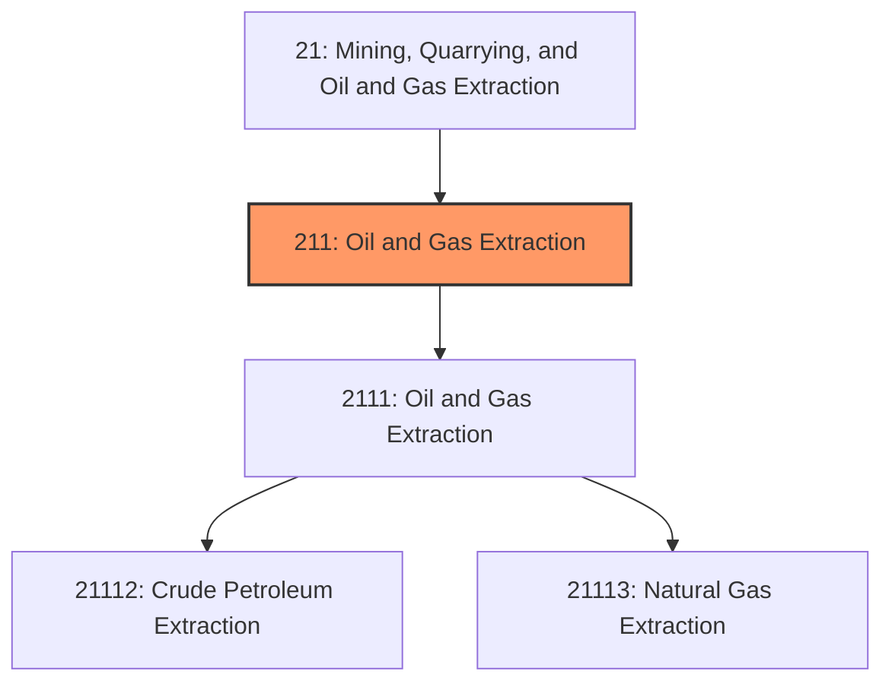
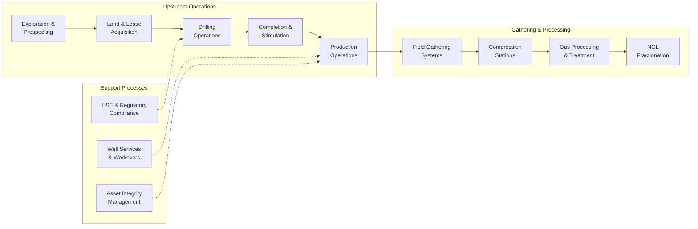

# Gas Extraction

> Industries in the Oil and Gas Extraction subsector operate and/or develop oil and gas field properties, encompassing exploration through production and field operations.

## Overview

Gas Extraction represents a critical subsector within the Mining, Quarrying, and Oil and Gas Extraction sector (NAICS 21). This subsector encompasses establishments primarily engaged in operating and developing oil and gas field properties, including the exploration for crude petroleum and natural gas, drilling and completing wells, operating separators and field gathering lines, and all preparation activities up to the point of shipment from producing properties.

### Industry Scope

Key activities within this subsector include:
- **Exploration**: Geophysical surveying, seismic analysis, and exploratory drilling
- **Drilling Operations**: Well development including rotary and directional drilling
- **Well Completion**: Casing, cementing, perforating, and stimulation
- **Production**: Operating wells and field gathering systems
- **Processing**: Separation, dehydration, and conditioning of natural gas

### Market Context

The global natural gas market exceeds $400 billion annually, with the United States being the world's largest producer. Natural gas has emerged as a critical "bridge fuel" in the energy transition, offering lower carbon emissions than coal while providing baseload power generation and industrial heat. The rise of liquefied natural gas (LNG) has transformed regional gas markets into a global commodity trade.

Key market dynamics include:
- **Energy Transition Role**: Natural gas as a lower-carbon alternative to coal for power generation
- **LNG Expansion**: Growing export capacity transforming U.S. into major global supplier
- **Unconventional Resources**: Shale gas revolution enabled by horizontal drilling and hydraulic fracturing
- **Demand Growth**: Increasing industrial and power generation demand in developing economies
- **Price Volatility**: Regional and seasonal price variations affecting investment decisions

## Industry Hierarchy

## Key Statistics

| Metric | Value |
|--------|-------|
| NAICS Code | 211 |
| Level | Subsector |
| U.S. Production | 103 Bcf/day (2024) |
| U.S. Employment | ~150,000 direct workers |
| Active Gas Wells | ~480,000 |
| Major Basins | Appalachian, Permian, Haynesville, Eagle Ford |

## Related Occupations

| Occupation | Role | Employment |
|------------|------|------------|
| [Petroleum Engineers](/occupations/Architecture/PetroleumEngineers) | Design extraction and production systems | 33,000 |
| [Geoscientists](/occupations/Science/Geoscientists) | Analyze geological formations and locate reserves | 28,000 |
| [Rotary Drill Operators](/occupations/Construction/RotaryDrillOperatorsOilAndGas) | Operate drilling equipment | 18,500 |
| [Derrick Operators](/occupations/Construction/DerrickOperatorsOilAndGas) | Set up and operate derrick equipment | 12,000 |
| [Service Unit Operators](/occupations/Construction/ServiceUnitOperatorsOilGasAndMining) | Operate equipment to service wells | 45,000 |
| [Roustabouts](/occupations/Construction/RoustaboutsOilAndGas) | Perform maintenance and general labor | 52,000 |
| [First-Line Supervisors](/occupations/Production/FirstLineSupervisorsOfExtractionWorkers) | Supervise extraction crews | 22,000 |
| [Wellhead Pumpers](/occupations/Production/WellheadPumpers) | Operate pumps and well equipment | 15,000 |
| [Gas Plant Operators](/occupations/Production/GasPlantOperators) | Operate gas processing facilities | 8,500 |

## Core Business Processes

### Key Operating Processes

**Exploration and Development**
- Seismic acquisition and interpretation
- Prospect generation and resource assessment
- Land acquisition and mineral rights leasing
- Permitting and regulatory approvals
- Pad construction and site preparation

**Drilling and Completion**
- Surface and intermediate casing installation
- Horizontal drilling and geosteering
- Hydraulic fracturing and stimulation
- Flowback and initial production testing
- Production facilities installation

**Production Operations**
- Well monitoring and optimization
- Artificial lift systems management
- Compression and dehydration operations
- Production allocation and measurement
- Workover and recompletion activities

## Industry Value Chain

```mermaid
graph LR
    subgraph Inputs["Inputs & Resources"]
        I1["Mineral Rights<br/>& Leases"]
        I2["Drilling Rigs<br/>& Equipment"]
        I3["Frac Crews<br/>& Services"]
        I4["Skilled Labor<br/>& Engineering"]
        I5["Proppant, Water<br/>& Chemicals"]
    end

    subgraph Primary["Primary Activities"]
        A1["Exploration &<br/>Appraisal"]
        A2["Drilling &<br/>Completion"]
        A3["Production &<br/>Optimization"]
        A4["Gathering &<br/>Processing"]
    end

    subgraph Outputs["Products"]
        O1["Natural Gas<br/>(Pipeline Quality)"]
        O2["Natural Gas<br/>Liquids (NGLs)"]
        O3["Condensate"]
        O4["Associated<br/>Crude Oil"]
    end

    subgraph Customers["Markets"]
        C1["Gas Utilities<br/>& LDCs"]
        C2["Power<br/>Generators"]
        C3["LNG Export<br/>Terminals"]
        C4["Industrial<br/>Users"]
        C5["Petrochemical<br/>Plants"]
    end

    Inputs --> Primary --> Outputs --> Customers
```

## Regulatory Environment

### Federal Regulations

| Agency | Regulation | Scope |
|--------|------------|-------|
| **EPA** | Clean Air Act | Emissions standards, leak detection (LDAR), flaring limits |
| **EPA** | Clean Water Act | Produced water management, discharge permits |
| **EPA** | SDWA/UIC | Underground injection well permitting and monitoring |
| **BLM** | Federal Onshore Oil & Gas | Drilling permits on federal lands, royalty requirements |
| **FERC** | Natural Gas Act | Interstate pipeline and LNG facility regulation |
| **PHMSA** | Pipeline Safety | Gathering line and transmission pipeline standards |
| **OSHA** | General Duty Clause | Workplace safety requirements |

### State Regulations
- **State Oil & Gas Commissions**: Well permitting, spacing, and allowable production
- **Environmental Agencies**: Air permits, water discharge, waste management
- **Railroad Commissions**: Production reporting and conservation requirements
- **Severance Taxes**: Production taxes varying by state (2-8% typical)

### Key Compliance Areas
- Methane emissions monitoring and reduction
- Hydraulic fracturing fluid disclosure
- Produced water disposal and recycling
- Well integrity and casing requirements
- Flaring and venting limitations
- Plugging and abandonment bonding

## Technology & Innovation

### Current Technologies

| Technology | Application | Impact |
|------------|-------------|--------|
| **Horizontal Drilling** | Access unconventional reservoirs | Enabled shale gas revolution |
| **Hydraulic Fracturing** | Stimulate tight formations | 10-100x production increase |
| **3D/4D Seismic** | Reservoir imaging and monitoring | Improved well targeting |
| **Real-time Drilling Analytics** | Optimize drilling parameters | 15-25% drilling time reduction |
| **SCADA Systems** | Remote well monitoring | Reduced field personnel needs |
| **Leak Detection (LDAR)** | Identify and repair methane leaks | 90%+ leak detection |

### Emerging Innovations

- **Continuous Emissions Monitoring**: Satellite and aerial methane detection for basin-wide monitoring
- **Electric Frac Fleets**: Battery and grid-powered fracturing equipment reducing diesel use
- **AI-Driven Completions**: Machine learning optimization of frac designs and spacing
- **Enhanced Recovery**: CO2-EOR and cyclic gas injection for mature fields
- **Digital Oilfield**: Integrated data platforms for production optimization
- **Carbon Capture**: CCUS integration with natural gas operations
- **Produced Water Recycling**: Advanced treatment for reuse in completions

## Market Size and Trends

### U.S. Natural Gas Production

| Region | 2024 Production | Share | Growth Driver |
|--------|-----------------|-------|---------------|
| Appalachian (Marcellus/Utica) | 35 Bcf/day | 34% | Pipeline expansion |
| Permian Basin | 24 Bcf/day | 23% | Associated gas from oil |
| Haynesville | 16 Bcf/day | 16% | LNG export demand |
| Eagle Ford | 7 Bcf/day | 7% | Drilling efficiency |
| Other | 21 Bcf/day | 20% | Various |

### Industry Trends

1. **LNG Export Growth**: U.S. LNG export capacity expanding from 14 Bcf/day to 25 Bcf/day by 2028
2. **Methane Reduction**: Industry-wide efforts to reduce methane intensity by 75% by 2030
3. **ESG Integration**: Operators differentiating on emissions performance for premium pricing
4. **Capital Discipline**: Focus on returns and free cash flow over production growth
5. **Consolidation**: Continued M&A activity creating larger, more efficient operators
6. **Workforce Evolution**: Transition to remote operations and digital skills
7. **Power Generation**: Natural gas maintaining 40%+ share of U.S. electricity generation

### Investment Outlook

Natural gas extraction remains attractive due to sustained demand for power generation, industrial applications, and LNG exports. Investment is shifting toward lower-carbon intensity operations, with increasing focus on certified gas programs and continuous emissions monitoring. The industry is expected to invest $50-60 billion annually in upstream development through 2030.

---

*Source: NAICS 211 - Oil and Gas Extraction*
