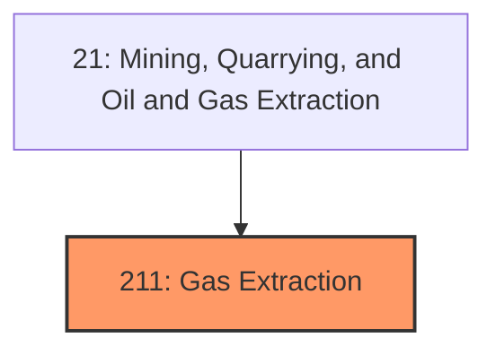
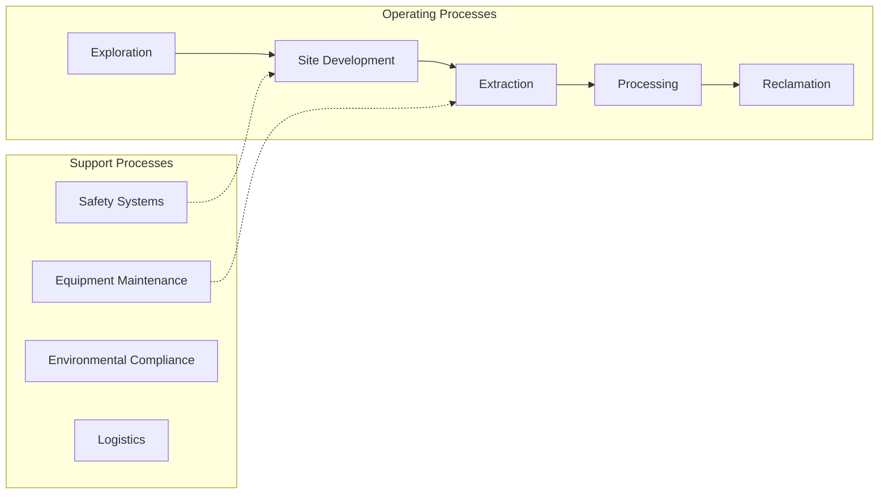

# Gas Extraction

> Industries in the Oil and Gas Extraction subsector operate and/or develop oil and gas field properties.

## Overview

Gas Extraction represents an important category within the Mining, Quarrying, and Oil and Gas Extraction sector (NAICS 21). This subsector encompasses establishments primarily engaged in gas extraction.

Industries in the Oil and Gas Extraction subsector operate and/or develop oil and gas field properties. Operation and development activities include exploration for crude petroleum and natural gas; drilling, completing, and equipping wells; operating separators, emulsion breakers, desilting equipment, and field gathering lines for crude petroleum and natural gas; and all other activities in the preparation of oil and gas up to the point of shipment from the producing property. This subsector includes the production of crude petroleum, the mining and extraction of oil from oil shale and oil sands, the production of natural gas, sulfur recovery from natural gas, and recovery of hydrocarbon liquids. Establishments in this subsector include those that operate oil and gas wells on their own account or for others on a contract or fee basis. Establishments primarily engaged in providing support services, on a contract or fee basis, required for the drilling or operation of oil and gas wells (except geophysical surveying and mapping, mine site preparation, construction of oil/gas pipelines, and transportation activities) are classified in Subsector 213, Support Activities for Mining.

## Industry Hierarchy

## Key Statistics

| Metric | Value |
|--------|-------|
| NAICS Code | 211 |
| Level | Subsector |
| Parent | [Oil and Gas Extraction](../) |
| Child Industries | 0 |

## Core Business Processes

## Industry Value Chain

```mermaid
graph LR
    subgraph Inputs["Inputs"]
        I1["Equipment"]
        I2["Energy"]
        I3["Labor"]
        I4["Permits"]
    end

    subgraph Primary["Primary Activities"]
        A1["Inbound Logistics"]
        A2["Core Operations"]
        A3["Quality Assurance"]
        A4["Outbound/Delivery"]
    end

    subgraph Outputs["Products/Services"]
        O1["Minerals"]
        O2["Oil/Gas"]
        O3["Raw Materials"]
    end

    subgraph Customers["Markets"]
        C1["Refineries"]
        C2["Manufacturers"]
        C3["Utilities"]
        C4["Export Markets"]
    end

    Inputs --> Primary --> Outputs --> Customers
```

---

*Source: NAICS 211 - Gas Extraction*
