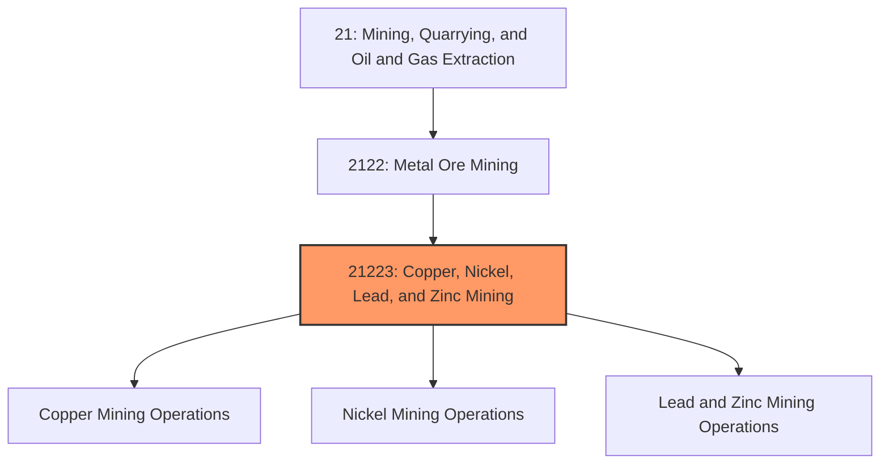
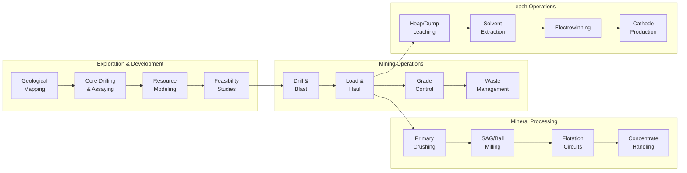

# Copper Mining

> This industry comprises establishments primarily engaged in developing the mine site, mining copper ores, and/or beneficiating copper ores into copper concentrates.

## Overview

Copper Mining represents one of the most strategically important industries within the Metal Ore Mining subsector (NAICS 2122). Copper is a critical industrial metal essential for electrical conductivity, making it fundamental to electrification, renewable energy systems, electric vehicles, and modern infrastructure. The industry encompasses the complete extraction and initial processing lifecycle, from exploration through production of copper concentrates.

### Industry Scope

Copper mining operations include:
- **Open-Pit Mining**: Large-scale surface mining of porphyry copper deposits
- **Underground Mining**: Block caving, room-and-pillar, and cut-and-fill methods for deeper deposits
- **Leaching Operations**: Solvent extraction-electrowinning (SX-EW) for oxide ores
- **Concentrators**: Crushing, grinding, and flotation to produce copper concentrate

### Market Context

Global copper production exceeds 22 million tonnes annually, with a market value of approximately $200 billion. The United States produces about 1.2 million tonnes annually, primarily from mines in Arizona, Utah, New Mexico, Nevada, and Montana. Chile and Peru dominate global production with approximately 40% of world output.

Key market dynamics include:
- **Electrification Demand**: Electric vehicles require 3-4x more copper than conventional vehicles
- **Renewable Energy**: Wind turbines, solar systems, and grid infrastructure are copper-intensive
- **Supply Constraints**: Declining ore grades and limited new large-scale deposits
- **ESG Premiums**: Growing demand for responsibly-produced copper with verified sustainability credentials
- **Recycling Growth**: Secondary copper contributing 30%+ of supply in developed markets

## Industry Hierarchy

## Key Statistics

| Metric | Value |
|--------|-------|
| NAICS Code | 21223 |
| Level | Industry |
| Global Production | 22 million tonnes/year |
| U.S. Production | 1.2 million tonnes/year |
| U.S. Employment | ~12,000 direct workers |
| Average Ore Grade | 0.4-0.6% Cu (declining) |
| Price (2024 avg) | ~$4.00/lb ($8,800/tonne) |
| Copper Intensity | EVs: 80 kg, Wind: 4 tonnes/MW |

## Related Occupations

| Occupation | Role | Employment |
|------------|------|------------|
| [Mining and Geological Engineers](/occupations/Architecture/MiningAndGeologicalEngineers) | Design mine plans and extraction systems | 2,400 |
| [Geological Technicians](/occupations/Science/GeologicalTechniciansExceptHydrologicTechnicians) | Conduct exploration and grade control | 1,800 |
| [Continuous Mining Machine Operators](/occupations/Construction/ContinuousMiningMachineOperators) | Operate underground mining equipment | 1,200 |
| [Excavating Machine Operators](/occupations/Construction/ExcavatingAndLoadingMachineAndDraglineOperators) | Operate shovels and loaders | 3,100 |
| [Rotary Drill Operators](/occupations/Construction/RotaryDrillOperatorsOilAndGas) | Operate blast hole drilling equipment | 1,400 |
| [Crushing/Grinding Machine Operators](/occupations/Production/CrushingGrindingAndPolishingMachineSettersOperatorsAndTenders) | Operate concentrator equipment | 2,200 |
| [First-Line Supervisors](/occupations/Production/FirstLineSupervisorsOfExtractionWorkers) | Supervise mining crews | 1,600 |
| [Industrial Production Managers](/occupations/Management/IndustrialProductionManagers) | Manage mine and mill operations | 450 |
| [Environmental Scientists](/occupations/Science/EnvironmentalScientistsAndSpecialists) | Monitor environmental compliance | 380 |
| [Occupational Health and Safety Specialists](/occupations/Healthcare/OccupationalHealthAndSafetySpecialists) | Ensure mine safety | 320 |

## Core Business Processes

### Key Operating Processes

**Exploration and Resource Development**
- Regional exploration using geophysics and geochemistry
- Diamond core drilling for resource definition
- 3D geological modeling and resource estimation
- Mine planning and economic feasibility analysis
- Environmental baseline studies and permitting

**Open-Pit Mining**
- Drill and blast benches at 12-15m heights
- Loading with large electric rope shovels (40-100 tonnes)
- Haul truck transport (200-400 tonne capacity)
- In-pit crushing and conveying systems
- Waste rock and overburden management

**Underground Mining**
- Block caving for large, deep deposits
- Cut-and-fill and sublevel stoping methods
- Automated LHD and haul truck systems
- Ventilation and ground support systems
- Ore pass and material handling systems

**Mineral Processing (Concentrator)**
- Primary gyratory crushing to 150mm
- SAG and ball mill grinding to 100-200 microns
- Rougher, cleaner, and scavenger flotation circuits
- Concentrate thickening and filtration
- Tailings disposal and water recycling

**Hydrometallurgical Processing (SX-EW)**
- Heap leaching with sulfuric acid solution
- Solvent extraction to concentrate copper
- Electrowinning to produce copper cathode
- Pregnant and barren solution management

## Industry Value Chain

```mermaid
graph LR
    subgraph Inputs["Inputs & Resources"]
        I1["Mineral Rights<br/>& Land Access"]
        I2["Mining Fleet<br/>& Equipment"]
        I3["Processing<br/>Plants"]
        I4["Energy &<br/>Water"]
        I5["Skilled<br/>Workforce"]
    end

    subgraph Primary["Primary Activities"]
        A1["Exploration &<br/>Resource Definition"]
        A2["Mine<br/>Development"]
        A3["Ore<br/>Extraction"]
        A4["Mineral<br/>Processing"]
    end

    subgraph Outputs["Products"]
        O1["Copper<br/>Concentrate"]
        O2["Copper<br/>Cathode"]
        O3["Byproduct<br/>Metals"]
        O4["Molybdenum<br/>Concentrate"]
    end

    subgraph Customers["Markets"]
        C1["Copper<br/>Smelters"]
        C2["Wire &<br/>Cable Mfg"]
        C3["Commodity<br/>Traders"]
        C4["Brass &<br/>Bronze Foundries"]
    end

    Inputs --> Primary --> Outputs --> Customers
```

## Regulatory Environment

### Federal Regulations (United States)

| Agency | Regulation | Scope |
|--------|------------|-------|
| **MSHA** | Mine Safety and Health Act | Comprehensive mine safety standards and enforcement |
| **EPA** | Clean Water Act | Process water discharge, tailings seepage control |
| **EPA** | Clean Air Act | Smelter emissions, dust control, acid mist |
| **EPA** | RCRA | Hazardous waste from processing operations |
| **EPA** | CERCLA (Superfund) | Legacy site remediation, liability management |
| **BLM** | Mining Law of 1872 | Mineral claims on federal lands |
| **USFS** | NEPA | Environmental review for forest lands |
| **USFWS** | Endangered Species Act | Wildlife and habitat protection |

### State Requirements
- Arizona: ADEQ permits, APP (Aquifer Protection), water rights
- Utah: DOGM permits, reclamation bonding
- New Mexico: MMD permits, groundwater discharge permits
- Nevada: NDEP permits, Bureau of Mining Regulation

### International Standards
- **Copper Mark**: Responsible production certification
- **ICMM Performance Expectations**: Industry sustainability commitments
- **Equator Principles**: Project finance environmental/social standards
- **IRMA Standard**: Initiative for Responsible Mining Assurance

## Technology & Innovation

### Current Technologies

| Technology | Application | Benefits |
|------------|-------------|----------|
| **Autonomous Haulage** | Self-driving 400-tonne haul trucks | 15-20% cost reduction, improved safety |
| **Electric Shovels** | Battery and trolley-assist systems | 50%+ energy savings vs. diesel |
| **Automated Drilling** | GPS-guided blast hole drilling | Consistent hole accuracy, fragmentation |
| **Geometallurgy** | Ore characterization for process optimization | 5-10% recovery improvement |
| **Real-time Assaying** | Online analysis for grade control | Faster decisions, reduced dilution |
| **Thickened Tailings** | High-density tailings disposal | Reduced footprint, water recovery |

### Emerging Innovations

- **Coarse Particle Flotation**: Processing coarser material for energy savings
- **In-situ Leaching**: Extracting copper without conventional mining
- **Biomining**: Using bacteria to enhance leaching of sulfide ores
- **Underground Automation**: Fully autonomous underground fleets
- **AI-Driven Optimization**: Machine learning for mill and flotation control
- **Carbon-Free Mining**: Renewable energy, electric equipment, green hydrogen
- **Tailings Reprocessing**: Recovering copper from legacy tailings

## Market Size and Trends

### Global Copper Production by Region

| Region | Production | Share | Key Producers |
|--------|------------|-------|---------------|
| South America | 7.5 Mt | 34% | Chile, Peru |
| Asia | 4.4 Mt | 20% | China, Indonesia |
| North America | 2.4 Mt | 11% | USA, Mexico, Canada |
| Africa | 3.0 Mt | 14% | DRC, Zambia |
| Europe/CIS | 2.9 Mt | 13% | Russia, Poland |
| Oceania | 1.8 Mt | 8% | Australia, PNG |

### Demand Growth Drivers

| Application | Current Demand | 2030 Demand | CAGR |
|-------------|---------------|-------------|------|
| Building Construction | 5.5 Mt | 6.2 Mt | 2.0% |
| Power Infrastructure | 5.0 Mt | 7.5 Mt | 7.0% |
| Electric Vehicles | 0.8 Mt | 3.5 Mt | 28% |
| Consumer Electronics | 2.5 Mt | 2.8 Mt | 1.9% |
| Industrial Equipment | 3.2 Mt | 3.8 Mt | 2.9% |
| Renewable Energy | 1.2 Mt | 2.8 Mt | 15% |

### Industry Trends

1. **Supply Deficit Forecast**: Projected 5-8 million tonne gap by 2030 vs. energy transition demand
2. **Grade Decline**: Average ore grades falling 0.5% per decade, increasing unit costs
3. **Permitting Delays**: New mine development taking 15-20 years from discovery to production
4. **ESG Differentiation**: Premium pricing for certified responsible copper
5. **Recycling Expansion**: Secondary copper to grow from 4 Mt to 6+ Mt by 2030
6. **Consolidation**: Major producers acquiring development-stage projects
7. **Deep Mining Transition**: Surface deposits depleting, shift to underground operations

### Investment Outlook

The copper mining industry requires $100+ billion in new investment over the next decade to meet projected demand. Current exploration spending (~$3 billion annually for copper) is insufficient to replace depleting reserves. Investment is flowing toward:
- Brownfield expansions at existing operations
- Development of stranded deposits with improved economics
- Technology to improve recovery from lower-grade ores
- Automation and electrification to reduce operating costs
- Tailings reprocessing projects
- Recycling and secondary copper capacity

---

*Source: NAICS 21223 - Copper, Nickel, Lead, and Zinc Mining*
