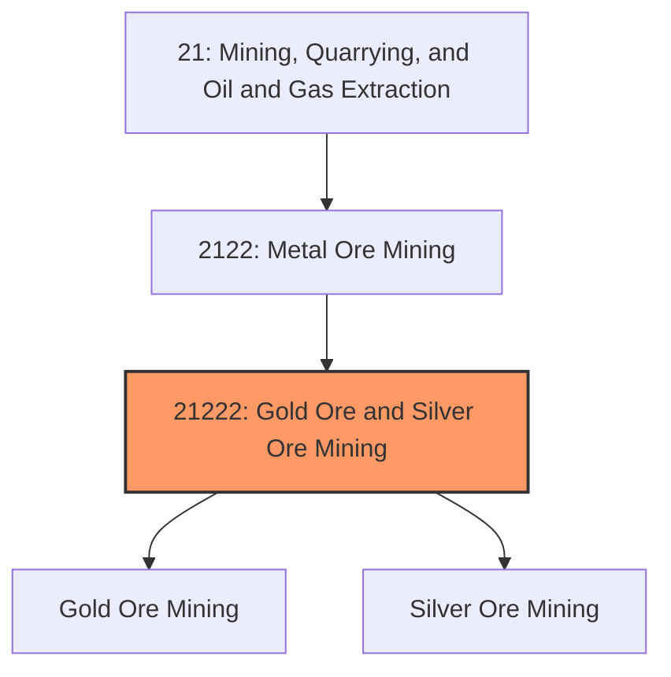

# Gold Ore Mining

> This industry comprises establishments primarily engaged in developing the mine site, mining gold ore, and/or beneficiating gold ore into dore bars or bullion.

## Overview

Gold Ore Mining represents a high-value industry within the Metal Ore Mining subsector (NAICS 2122). Gold has maintained its status as both a monetary asset and industrial metal for millennia, serving as a store of value, investment vehicle, and essential material for jewelry, electronics, and aerospace applications. The industry encompasses exploration, mining, and initial processing of gold-bearing ores into refined gold products.

### Industry Scope

Gold mining operations include diverse extraction and processing methods:
- **Open-Pit Mining**: Large-scale surface operations for near-surface deposits
- **Underground Mining**: Deep mining for high-grade veins and refractory ores
- **Heap Leaching**: Cyanide leaching of low-grade oxide ores on lined pads
- **Carbon-in-Pulp (CIP)**: Processing of higher-grade ores through milling and cyanidation
- **Placer Mining**: Recovery of alluvial gold deposits (limited in modern operations)

### Market Context

Global gold production is approximately 3,000 metric tonnes annually, valued at over $180 billion at current prices. The United States produces about 180 tonnes annually, primarily from Nevada, Alaska, Colorado, and South Dakota. Gold prices are influenced by monetary policy, currency movements, geopolitical uncertainty, and investment demand.

Key market dynamics include:
- **Safe Haven Demand**: Gold investment increases during economic uncertainty
- **Central Bank Buying**: Continued accumulation by central banks diversifying reserves
- **Jewelry Demand**: Largest consumption sector, concentrated in India and China
- **Industrial Applications**: Growing use in electronics, medical devices, and aerospace
- **ESG Focus**: Increasing importance of responsible gold sourcing and certification

## Industry Hierarchy

## Key Statistics

| Metric | Value |
|--------|-------|
| NAICS Code | 21222 |
| Level | Industry |
| Global Production | 3,000 tonnes/year |
| U.S. Production | 180 tonnes/year |
| U.S. Employment | ~15,000 direct workers |
| Average Ore Grade | 1-3 g/t (declining) |
| Gold Price (2024) | ~$2,000/oz ($64,000/kg) |
| Major States | Nevada (70%), Alaska, Colorado, South Dakota |

## Related Occupations

| Occupation | Role | Employment |
|------------|------|------------|
| [Mining and Geological Engineers](/occupations/Architecture/MiningAndGeologicalEngineers) | Design mines and processing facilities | 1,800 |
| [Geological Technicians](/occupations/Science/GeologicalTechniciansExceptHydrologicTechnicians) | Conduct exploration and grade control | 1,400 |
| [Continuous Mining Machine Operators](/occupations/Construction/ContinuousMiningMachineOperators) | Operate underground mining equipment | 800 |
| [Excavating Machine Operators](/occupations/Construction/ExcavatingAndLoadingMachineAndDraglineOperators) | Operate shovels and loaders | 2,600 |
| [Crushing/Grinding Machine Operators](/occupations/Production/CrushingGrindingAndPolishingMachineSettersOperatorsAndTenders) | Operate milling equipment | 1,900 |
| [Chemical Plant Operators](/occupations/Production/ChemicalPlantAndSystemOperators) | Operate leaching and refining circuits | 1,200 |
| [First-Line Supervisors](/occupations/Production/FirstLineSupervisorsOfExtractionWorkers) | Supervise mining operations | 1,400 |
| [Environmental Scientists](/occupations/Science/EnvironmentalScientistsAndSpecialists) | Monitor cyanide management and compliance | 450 |

## Core Business Processes

```mermaid
flowchart LR
    subgraph Exploration["Exploration"]
        E1["Regional<br/>Targeting"]
        E2["Drilling &<br/>Sampling"]
        E3["Resource<br/>Estimation"]
        E4["Feasibility<br/>Study"]
    end

    subgraph Mining["Mining Operations"]
        M1["Drilling &<br/>Blasting"]
        M2["Loading &<br/>Hauling"]
        M3["Grade<br/>Control"]
        M4["Ore/Waste<br/>Segregation"]
    end

    subgraph Processing["Processing"]
        P1["Crushing &<br/>Milling"]
        P2["Leaching<br/>(Heap or CIP)"]
        P3["Gold<br/>Recovery"]
        P4["Refining to<br/>Dore"]
    end

    subgraph Closure["Closure"]
        C1["Cyanide<br/>Detoxification"]
        C2["Facility<br/>Decommissioning"]
        C3["Land<br/>Reclamation"]
        C4["Long-term<br/>Monitoring"]
    end

    E1 --> E2 --> E3 --> E4
    E4 --> M1 --> M2 --> M3 --> M4
    M4 --> P1 --> P2 --> P3 --> P4
    P4 -.-> C1 --> C2 --> C3 --> C4
```

### Key Operating Processes

**Exploration and Development**
- Regional geological mapping and remote sensing
- Diamond core drilling and reverse circulation sampling
- Metallurgical testing for process optimization
- Resource modeling and economic evaluation
- Environmental baseline and permitting

**Mining Operations**
- Open-pit: Drill and blast, shovel/truck haulage
- Underground: Drift and fill, cut and fill, longhole stoping
- Selective mining and ore/waste segregation
- Grade control sampling and reconciliation
- Water management and pit dewatering

**Processing (Milling Operations)**
- Primary crushing and SAG/ball mill grinding
- Gravity concentration for coarse gold recovery
- Cyanide leaching in tanks or heaps
- Carbon adsorption and gold stripping
- Electrowinning and smelting to dore

**Refining and Sales**
- Dore bar production (gold-silver alloy)
- Shipment to external refineries for 99.99% gold
- Responsible gold certification (London Good Delivery)
- Sales to bullion banks and fabricators

## Industry Value Chain

```mermaid
graph LR
    subgraph Inputs["Inputs & Resources"]
        I1["Mineral Rights<br/>& Land"]
        I2["Mining<br/>Equipment"]
        I3["Processing<br/>Facilities"]
        I4["Reagents<br/>(Cyanide, etc.)"]
        I5["Skilled<br/>Workforce"]
    end

    subgraph Primary["Primary Activities"]
        A1["Exploration &<br/>Development"]
        A2["Ore<br/>Extraction"]
        A3["Processing &<br/>Recovery"]
        A4["Refining &<br/>Sales"]
    end

    subgraph Outputs["Products"]
        O1["Gold<br/>Dore Bars"]
        O2["Refined<br/>Gold"]
        O3["Byproduct<br/>Silver"]
        O4["Other<br/>Byproducts"]
    end

    subgraph Customers["Markets"]
        C1["Bullion<br/>Banks"]
        C2["Jewelry<br/>Fabricators"]
        C3["Electronics<br/>Manufacturers"]
        C4["Investment<br/>Products"]
        C5["Central<br/>Banks"]
    end

    Inputs --> Primary --> Outputs --> Customers
```

## Regulatory Environment

### Federal Regulations

| Agency | Regulation | Scope |
|--------|------------|-------|
| **MSHA** | Mine Safety and Health Act | Comprehensive mine safety standards |
| **EPA** | Clean Water Act | Discharge permits, tailings management |
| **EPA** | CERCLA (Superfund) | Liability for historic mining sites |
| **BLM** | Mining Law of 1872 | Mining claims on federal lands |
| **USFS** | Forest Service regulations | Operations on National Forest lands |
| **EPA** | Cyanide Management | SPCC plans, emergency response |

### State Requirements
- Nevada: NDEP permits, water pollution control, financial assurance
- Alaska: Large Mine Permit, dam safety, fish habitat protection
- State mining permits and reclamation bonding
- Air quality permits for processing operations

### International Standards
- **International Cyanide Management Code**: Certification for cyanide use
- **Responsible Gold Mining Principles**: World Gold Council standards
- **Conflict-Free Gold Standard**: Certification of responsible sourcing
- **LBMA Good Delivery**: London Bullion Market Association standards

## Technology & Innovation

### Current Technologies

| Technology | Application | Benefits |
|------------|-------------|----------|
| **Autonomous Haulage** | Self-driving haul trucks | Safety, productivity improvement |
| **Gravity Circuits** | Coarse gold recovery | Reduced cyanide use, early gold recovery |
| **Cyanide Detoxification** | Tailings treatment | Environmental protection |
| **Thiosulfate Leaching** | Alternative to cyanide | Reduced environmental risk |
| **Real-time Grade Analysis** | Online assaying | Improved ore/waste segregation |
| **Paste Tailings** | High-density tailings disposal | Reduced water consumption, footprint |

### Emerging Innovations

- **Non-Cyanide Processes**: Glycine, thiosulfate, and chloride leaching alternatives
- **In-situ Recovery**: Extracting gold without conventional mining
- **AI-Driven Exploration**: Machine learning for target generation
- **Sensor-Based Sorting**: Ore pre-concentration before milling
- **Electrolytic Gold Recovery**: Replacing chemical precipitation
- **Carbon Footprint Reduction**: Renewable energy and electric equipment

## Market Size and Trends

### Global Gold Supply by Source

| Source | Production | Share |
|--------|------------|-------|
| Mine Production | 3,000 tonnes | 75% |
| Recycled Gold | 1,200 tonnes | 25% |
| **Total Supply** | 4,200 tonnes | 100% |

### Gold Demand by Sector

| Sector | Demand | Share | Trend |
|--------|--------|-------|-------|
| Jewelry | 2,200 tonnes | 50% | Stable |
| Investment (Bars/Coins) | 1,100 tonnes | 25% | Growing |
| Central Banks | 400 tonnes | 10% | Growing |
| Technology/Industrial | 300 tonnes | 7% | Stable |
| ETFs and Other | 350 tonnes | 8% | Variable |

### Industry Trends

1. **Grade Decline**: Average ore grades falling, requiring higher throughput
2. **Deeper Deposits**: Surface deposits depleted, shift to underground
3. **ESG Integration**: Responsible gold certification becoming standard
4. **Consolidation**: Major producers acquiring development projects
5. **Technology Adoption**: Automation and remote operations expanding
6. **Byproduct Focus**: Silver, copper, and other metals improving economics
7. **Price Sensitivity**: Exploration and development tied to gold price cycles

### Investment Outlook

The gold mining industry benefits from gold's enduring value as a monetary asset and industrial material. Investment drivers include:
- Gold price trajectory and investment demand
- New deposit discoveries in prospective regions
- Technology to economically process lower-grade ores
- Automation and productivity improvements
- ESG performance for investor and customer acceptance
- Consolidation opportunities among mid-tier producers

The industry is expected to maintain stable production levels, with growth dependent on gold prices and new project development.

---

*Source: NAICS 21222 - Gold Ore and Silver Ore Mining*
