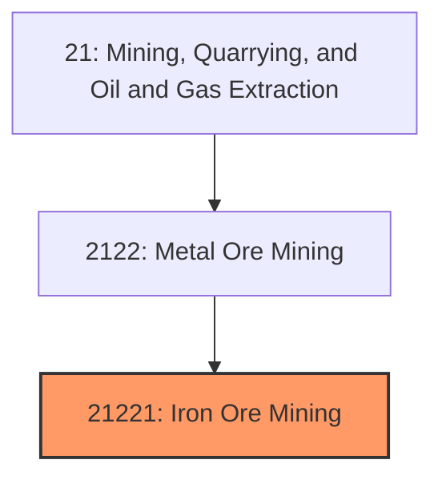

# Iron Ore Mining

> This industry comprises establishments primarily engaged in developing the mine site, mining iron ore, and/or beneficiating iron ore into iron ore pellets or sinter feed.

## Overview

Iron Ore Mining represents a foundational industry within the Metal Ore Mining subsector (NAICS 2122). Iron ore is the essential raw material for steel production, making it one of the most critical industrial commodities globally. The industry encompasses exploration, extraction, and beneficiation of iron-bearing minerals into products suitable for blast furnace or direct reduction steelmaking processes.

### Industry Scope

Iron ore mining operations produce diverse products for the steel industry:
- **Iron Ore Pellets**: Processed and agglomerated ore for blast furnaces and direct reduction
- **Iron Ore Fines**: Fine-grained ore for sintering before blast furnace use
- **Lump Ore**: Direct-shipping ore requiring minimal beneficiation
- **Concentrate**: Beneficiated high-grade product from low-grade ores

### Market Context

Global iron ore production exceeds 2.5 billion tonnes annually, with a market value of approximately $200 billion. Australia and Brazil dominate global supply with over 50% of production. The United States produces about 50 million tonnes annually, primarily from Minnesota and Michigan, almost entirely consumed domestically by integrated steel mills.

Key market dynamics include:
- **China Demand**: China consumes 70%+ of seaborne iron ore for steel production
- **Steel Decarbonization**: Transition to direct reduction requiring higher-grade pellets
- **Price Volatility**: Prices influenced by Chinese steel output and Brazil/Australia supply
- **Quality Premiums**: Growing premium for high-grade, low-impurity products
- **Sustainability Focus**: Carbon intensity becoming a competitive factor

## Industry Hierarchy

## Key Statistics

| Metric | Value |
|--------|-------|
| NAICS Code | 21221 |
| Level | Industry |
| Global Production | 2.5 billion tonnes/year |
| U.S. Production | 50 million tonnes/year |
| U.S. Employment | ~6,000 direct workers |
| Average Ore Grade | 25-65% Fe |
| Pellet Price (2024) | ~$130-150/tonne |
| Major U.S. States | Minnesota, Michigan |

## Related Occupations

| Occupation | Role | Employment |
|------------|------|------------|
| [Mining and Geological Engineers](/occupations/Architecture/MiningAndGeologicalEngineers) | Design mines and processing plants | 650 |
| [Excavating Machine Operators](/occupations/Construction/ExcavatingAndLoadingMachineAndDraglineOperators) | Operate shovels and loaders | 1,800 |
| [Crushing/Grinding Machine Operators](/occupations/Production/CrushingGrindingAndPolishingMachineSettersOperatorsAndTenders) | Operate concentrators and pellet plants | 1,200 |
| [First-Line Supervisors](/occupations/Production/FirstLineSupervisorsOfExtractionWorkers) | Supervise mining operations | 600 |
| [Industrial Truck Operators](/occupations/Transportation/IndustrialTruckAndTractorOperators) | Operate haul trucks | 850 |
| [Heavy Equipment Mechanics](/occupations/Installation/MobileHeavyEquipmentMechanics) | Maintain mining equipment | 550 |
| [Separating Machine Operators](/occupations/Production/SeparatingFilteringClarifyingPrecipitatingAndStillMachineSettersOperatorsAndTenders) | Operate magnetic separators | 480 |

## Core Business Processes

### Key Operating Processes

**Open-Pit Mining**
- Large-scale bench mining operations
- Drill and blast at 15-20m bench heights
- Electric rope shovels or hydraulic excavators
- 240-tonne class haul trucks
- In-pit crushing and conveying

**Beneficiation (Concentration)**
- Primary and secondary crushing
- Autogenous or semi-autogenous grinding
- Magnetic separation for magnetite ores
- Flotation for hematite and silica removal
- Thickening and filtration for dewatering

**Pelletizing**
- Concentrate mixing with binders (bentonite)
- Balling in drums or discs
- Induration in traveling grate or grate-kiln furnaces
- Pellet screening and quality testing
- Rail or ship loading for delivery

## Industry Value Chain

```mermaid
graph LR
    subgraph Inputs["Inputs & Resources"]
        I1["Iron Ore<br/>Reserves"]
        I2["Mining<br/>Equipment"]
        I3["Processing<br/>Plants"]
        I4["Energy<br/>(Natural Gas)"]
        I5["Rail &<br/>Port Access"]
    end

    subgraph Primary["Primary Activities"]
        A1["Exploration &<br/>Development"]
        A2["Ore<br/>Extraction"]
        A3["Beneficiation &<br/>Concentration"]
        A4["Pelletizing"]
    end

    subgraph Outputs["Products"]
        O1["DR-Grade<br/>Pellets"]
        O2["BF-Grade<br/>Pellets"]
        O3["Iron Ore<br/>Fines"]
        O4["Lump<br/>Ore"]
    end

    subgraph Customers["Markets"]
        C1["Integrated<br/>Steel Mills"]
        C2["DRI/HBI<br/>Plants"]
        C3["Mini<br/>Mills"]
        C4["Commodity<br/>Traders"]
    end

    Inputs --> Primary --> Outputs --> Customers
```

## Regulatory Environment

### Federal Regulations

| Agency | Regulation | Scope |
|--------|------------|-------|
| **MSHA** | Mine Safety and Health Act | Comprehensive mine safety standards |
| **EPA** | Clean Water Act | Tailings basin discharge, stormwater |
| **EPA** | Clean Air Act | Pellet plant emissions, dust control |
| **USACE** | Section 404 | Wetlands and waters permits |

### State Requirements
- Minnesota: MPCA permits, financial assurance, taconite production taxes
- Michigan: DEQ permits, reclamation requirements
- State mining permits and operating licenses
- Air quality permits for pellet plant operations

### Key Compliance Areas
- Tailings basin management and dam safety
- Air emissions from pellet induration
- Dust control at crushing and handling facilities
- Water quality and discharge monitoring
- Progressive and final reclamation

## Technology & Innovation

### Current Technologies

| Technology | Application | Benefits |
|------------|-------------|----------|
| **Autonomous Haulage** | Self-driving trucks | Productivity, safety improvement |
| **High-Pressure Grinding Rolls** | Energy-efficient grinding | 15-25% energy reduction |
| **Advanced Flotation** | Silica and phosphorus removal | Higher grade products |
| **Real-time Assaying** | Online analysis | Improved process control |
| **Dry Tailings Disposal** | Filtered tailings stacking | Reduced dam risk, water recovery |

### Emerging Innovations

- **Green Pellets**: Carbon-free pellet production using hydrogen or renewable energy
- **Electric Mining Fleet**: Battery-electric haul trucks and loaders
- **AI Process Optimization**: Machine learning for mill and concentrator control
- **Direct Reduction Focus**: Higher-grade pellets for low-carbon steelmaking
- **Biomass Induration**: Replacing natural gas with biogas or biomass
- **Underground Mining**: Accessing deeper ore bodies as open pits mature

## Market Size and Trends

### Global Iron Ore Production

| Region | Production | Share | Key Producers |
|--------|------------|-------|---------------|
| Australia | 900 Mt | 36% | Rio Tinto, BHP, Fortescue |
| Brazil | 400 Mt | 16% | Vale |
| China | 350 Mt | 14% | Domestic producers |
| India | 250 Mt | 10% | NMDC, Tata Steel |
| Russia | 100 Mt | 4% | Various |
| North America | 100 Mt | 4% | Cleveland-Cliffs |
| Other | 400 Mt | 16% | Various |

### U.S. Market Characteristics

| Metric | Value |
|--------|-------|
| Domestic Production | ~50 Mt pellets |
| Domestic Consumption | ~45 Mt |
| Net Exports | ~5 Mt |
| Major Producer | Cleveland-Cliffs (80%+ share) |
| Primary Markets | U.S. integrated steel mills |

### Industry Trends

1. **Decarbonization Premium**: Growing value for low-carbon and DR-grade pellets
2. **Quality Focus**: Higher-grade products commanding premium pricing
3. **Vertical Integration**: Steel companies acquiring iron ore production
4. **Technology Investment**: Automation and process efficiency improvements
5. **Tailings Innovation**: Shift toward dry stacking and dam-free storage
6. **Supply Concentration**: Increasing market share among top producers
7. **U.S. Reshoring**: Domestic steel production supporting iron ore demand

### Investment Outlook

The iron ore mining industry benefits from essential demand for steel production while transitioning to support decarbonization. Investment drivers include:
- Capacity for DR-grade pellets as green steel production grows
- Technology to reduce carbon intensity of mining and processing
- Modernization of aging North American facilities
- Tailings management improvements for risk reduction
- Energy efficiency and emissions reduction investments

The U.S. industry is expected to maintain stable production, with growth potential tied to domestic steel market expansion and green steel demand.

---

*Source: NAICS 21221 - Iron Ore Mining*
