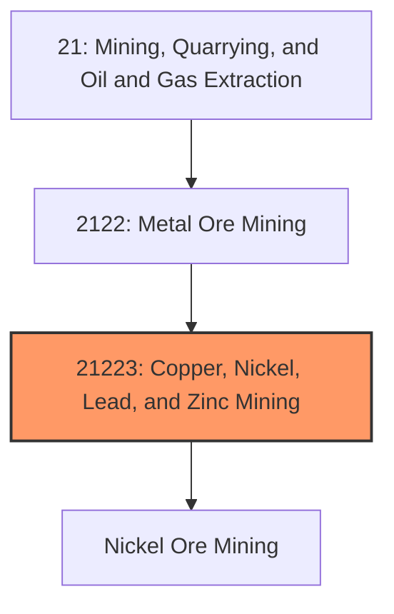
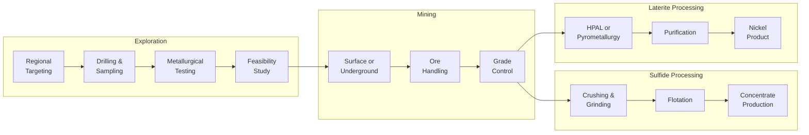

# Nickel Ore Mining

> This industry comprises establishments primarily engaged in developing the mine site, mining nickel ore, and/or beneficiating nickel ore into nickel concentrate or intermediate products.

## Overview

Nickel Ore Mining represents a strategically critical industry within the Metal Ore Mining subsector (NAICS 2122). Nickel is essential for stainless steel production and has become increasingly vital for electric vehicle batteries, making it one of the most important metals for the energy transition. The industry encompasses exploration, extraction, and processing of both sulfide and laterite nickel ores.

### Industry Scope

Nickel mining operations involve diverse deposit types and processing methods:
- **Sulfide Deposits**: Underground or open-pit mining, conventional flotation concentration
- **Laterite Deposits**: Surface mining, high-pressure acid leaching (HPAL) or pyrometallurgical processing
- **Class 1 Nickel**: Battery-grade nickel sulfate and metal (>99.8% purity)
- **Class 2 Nickel**: Ferronickel and nickel pig iron for stainless steel

### Market Context

Global nickel production is approximately 3.3 million tonnes annually, with a market value of approximately $55 billion. Indonesia has become the dominant producer with 50%+ of global supply following aggressive capacity expansion. The United States has minimal domestic nickel production, relying heavily on imports primarily from Canada, Australia, and Norway.

Key market dynamics include:
- **Battery Demand Surge**: EV batteries driving unprecedented demand for Class 1 nickel
- **Indonesian Dominance**: Rapid HPAL capacity additions reshaping global supply
- **Stainless Steel Base Load**: Traditional demand providing stable market foundation
- **Critical Mineral Status**: Nickel designated as critical for U.S. national security
- **ESG Differentiation**: Growing premium for responsibly-produced nickel

## Industry Hierarchy

## Key Statistics

| Metric | Value |
|--------|-------|
| NAICS Code | 21223 |
| Level | Industry |
| Global Production | 3.3 million tonnes/year |
| U.S. Domestic Production | <15,000 tonnes/year |
| U.S. Import Reliance | >95% |
| LME Nickel Price (2024) | ~$16,000-18,000/tonne |
| EV Battery Nickel Content | 30-80 kg per vehicle |
| Stainless Steel Share | ~70% of primary nickel demand |

## Related Occupations

| Occupation | Role | Employment |
|------------|------|------------|
| [Mining and Geological Engineers](/occupations/Architecture/MiningAndGeologicalEngineers) | Design mines and processing facilities | 450 |
| [Geological Technicians](/occupations/Science/GeologicalTechniciansExceptHydrologicTechnicians) | Conduct exploration and resource definition | 280 |
| [Chemical Engineers](/occupations/Architecture/ChemicalEngineers) | Design HPAL and hydrometallurgical plants | 180 |
| [Chemical Plant Operators](/occupations/Production/ChemicalPlantAndSystemOperators) | Operate leaching and refining circuits | 620 |
| [Crushing/Grinding Machine Operators](/occupations/Production/CrushingGrindingAndPolishingMachineSettersOperatorsAndTenders) | Operate concentrators | 380 |
| [First-Line Supervisors](/occupations/Production/FirstLineSupervisorsOfExtractionWorkers) | Supervise mining operations | 240 |

## Core Business Processes

### Key Operating Processes

**Sulfide Ore Processing**
- Underground or open-pit mining methods
- Crushing and ball mill grinding
- Selective flotation to separate nickel pentlandite
- Concentrate dewatering and shipping to smelter
- Byproduct copper and precious metals recovery

**Laterite Ore Processing (HPAL)**
- Surface mining of limonite and saprolite zones
- High-pressure acid leaching at 250C and 40 atm
- Impurity removal and neutralization
- Mixed hydroxide precipitate (MHP) or sulfate production
- Refining to battery-grade nickel sulfate

**Pyrometallurgical Processing**
- Drying and calcining of laterite ore
- Electric furnace smelting to produce ferronickel
- Refining for stainless steel feedstock
- Higher energy intensity but simpler chemistry

## Industry Value Chain

```mermaid
graph LR
    subgraph Inputs["Inputs"]
        I1["Nickel<br/>Deposits"]
        I2["Mining<br/>Equipment"]
        I3["Processing<br/>Technology"]
        I4["Chemicals &<br/>Energy"]
    end

    subgraph Primary["Primary Activities"]
        A1["Exploration"]
        A2["Mining"]
        A3["Processing"]
        A4["Refining"]
    end

    subgraph Outputs["Products"]
        O1["Nickel<br/>Concentrate"]
        O2["MHP/MSP"]
        O3["Nickel<br/>Sulfate"]
        O4["Ferronickel"]
    end

    subgraph Customers["Markets"]
        C1["Battery<br/>Cathode Mfg"]
        C2["Stainless<br/>Steel Mills"]
        C3["Alloy<br/>Producers"]
        C4["Plating &<br/>Chemicals"]
    end

    Inputs --> Primary --> Outputs --> Customers
```

## Regulatory Environment

### U.S. Regulations

| Agency | Regulation | Scope |
|--------|------------|-------|
| **MSHA** | Mine Safety and Health Act | Mine safety standards |
| **EPA** | Clean Water Act | Acid mine drainage, process water |
| **EPA** | Clean Air Act | Smelter and roaster emissions |
| **EPA** | RCRA | Hazardous waste from processing |

### Critical Mineral Considerations
- Defense Production Act: Potential for government support
- IRA Battery Requirements: Domestic sourcing incentives
- USGS Strategic Minerals: Supply chain monitoring
- International agreements: Critical mineral partnerships

### International Standards
- **LME Responsible Sourcing**: Traceability requirements
- **ResponsibleSteel**: Nickel supply chain standards
- **IRMA**: Initiative for Responsible Mining Assurance

## Technology & Innovation

### Current Technologies

| Technology | Application | Benefits |
|------------|-------------|----------|
| **HPAL** | Laterite processing | Battery-grade product, higher recovery |
| **Bioleaching** | Sulfide concentrate treatment | Lower energy, reduced emissions |
| **Selective Flotation** | Mineral separation | Higher grade concentrate |
| **Autoclave Technology** | Pressure oxidation | Refractory ore treatment |

### Emerging Innovations

- **Direct Nickel Extraction**: New leaching chemistry for laterites
- **Battery Recycling Integration**: Urban mining as nickel source
- **Low-Carbon Processing**: Renewable energy for HPAL operations
- **Nickel-Manganese-Cobalt Optimization**: Battery chemistry evolution
- **In-Situ Recovery**: Extracting nickel without conventional mining
- **Blockchain Traceability**: End-to-end supply chain verification

## Market Size and Trends

### Global Nickel Production by Source

| Region | Production | Share | Key Producers |
|--------|------------|-------|---------------|
| Indonesia | 1.8 Mt | 55% | HPAL, NPI producers |
| Philippines | 0.4 Mt | 12% | Laterite miners |
| Russia | 0.2 Mt | 6% | Nornickel |
| Canada | 0.15 Mt | 5% | Vale, Glencore |
| Australia | 0.15 Mt | 5% | BHP, IGO |
| Other | 0.6 Mt | 17% | Various |

### Nickel Demand by End Use

| Application | Demand | Share | Growth |
|-------------|--------|-------|--------|
| Stainless Steel | 2.3 Mt | 70% | 3-4% CAGR |
| EV Batteries | 0.5 Mt | 15% | 25-30% CAGR |
| Alloys/Superalloys | 0.3 Mt | 9% | 2-3% CAGR |
| Plating/Other | 0.2 Mt | 6% | 1-2% CAGR |

### Industry Trends

1. **Battery Demand Explosion**: EV growth driving Class 1 nickel demand
2. **Indonesian Expansion**: Massive HPAL capacity additions
3. **Supply Chain Security**: Western nations seeking diversified supply
4. **Technology Competition**: HPAL vs. pyrometallurgical routes
5. **ESG Requirements**: Growing demand for responsibly-sourced nickel
6. **Price Volatility**: LME nickel market disruption and recovery
7. **Recycling Growth**: Battery recycling as secondary nickel source

### Investment Outlook

The nickel industry faces unprecedented demand growth from EV batteries while navigating supply concentration risks. Investment priorities include:
- Developing non-Indonesian supply sources for security
- Technology for lower-carbon nickel production
- Battery recycling capacity integration
- Exploration for high-grade sulfide deposits
- Processing innovation for lower-cost HPAL
- Supply chain traceability for ESG compliance

Global nickel demand is expected to grow 5-7% annually through 2030, with battery demand growing 25%+ annually.

---

*Source: NAICS 21223 - Copper, Nickel, Lead, and Zinc Mining*
