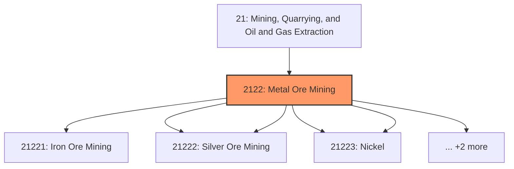
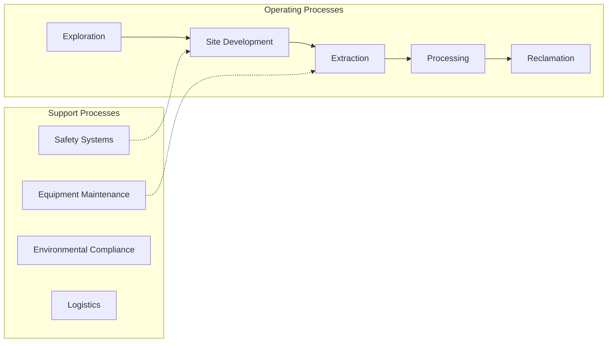

# Metal Ore Mining

> This industry group comprises establishments primarily engaged in developing mine sites or mining metallic minerals, and establishments primarily engaged in ore dressing and beneficiating (i.

## Overview

Metal Ore Mining represents an important category within the Mining, Quarrying, and Oil and Gas Extraction sector (NAICS 21).

This industry group comprises establishments primarily engaged in developing mine sites or mining metallic minerals, and establishments primarily engaged in ore dressing and beneficiating (i.e., preparing) operations, such as crushing, grinding, washing, drying, sintering, concentrating, calcining, and leaching. Beneficiating may be performed at mills operated in conjunction with the mines served or at mills, such as custom mills, operated separately.

## Industry Hierarchy

## Key Statistics

| Metric | Value |
|--------|-------|
| NAICS Code | 2122 |
| Level | Industry Group |
| Child Industries | 7 |

## Sub-Industries

| Industry | Code | Description |
|----------|------|-------------|
| [Iron Ore Mining](./IronOreMining/) | 21221 | See industry description for 212210 |
| [Gold Ore](./GoldOre/) | 21222 | See industry description for 212220 |
| [Silver Ore Mining](./SilverOreMining/) | 21222 | See industry description for 212220 |
| [Copper](./Copper/) | 21223 | See industry description for 212230 |
| [Nickel](./Nickel/) | 21223 | See industry description for 212230 |
| [Lead](./Lead/) | 21223 | See industry description for 212230 |
| [Zinc Mining](./ZincMining/) | 21223 | See industry description for 212230 |

## Related Occupations

See the [occupations directory](/occupations) for roles commonly found in this industry.

## Core Business Processes

## Industry Value Chain

```mermaid
graph LR
    subgraph Inputs["Inputs"]
        I1["Equipment"]
        I2["Energy"]
        I3["Labor"]
        I4["Permits"]
    end

    subgraph Primary["Primary Activities"]
        A1["Inbound Logistics"]
        A2["Core Operations"]
        A3["Quality Assurance"]
        A4["Outbound/Delivery"]
    end

    subgraph Outputs["Products/Services"]
        O1["Minerals"]
        O2["Oil/Gas"]
        O3["Raw Materials"]
    end

    subgraph Customers["Markets"]
        C1["Refineries"]
        C2["Manufacturers"]
        C3["Utilities"]
        C4["Export Markets"]
    end

    Inputs --> Primary --> Outputs --> Customers
```

---

*Source: NAICS 2122 - Metal Ore Mining*
