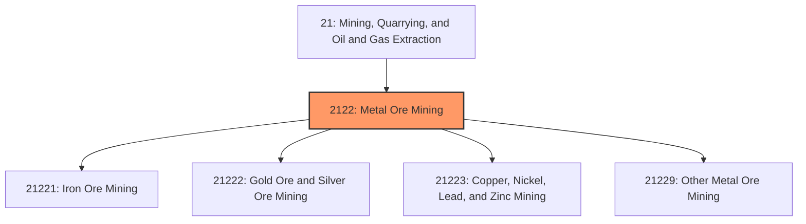

# Metal Ore Mining

> This industry group comprises establishments primarily engaged in developing mine sites or mining metallic minerals, and establishments primarily engaged in ore dressing and beneficiating operations.

## Overview

Metal Ore Mining represents a foundational industry within the Mining, Quarrying, and Oil and Gas Extraction sector (NAICS 21). This industry group encompasses the complete lifecycle of metallic mineral extraction, from initial exploration and mine development through extraction, beneficiation, and preparation for downstream processing.

Establishments in this sector are engaged in ore dressing and beneficiating operations including crushing, grinding, washing, drying, sintering, concentrating, calcining, and leaching. Beneficiating may be performed at mills operated in conjunction with the mines served or at custom mills operated separately.

### Market Context

The global metal ore mining industry generates approximately $700 billion annually and employs over 3 million workers worldwide. Demand is driven by construction, automotive, electronics, renewable energy infrastructure, and industrial manufacturing sectors. The industry is experiencing significant transformation due to the energy transition, with critical minerals such as copper, nickel, and lithium seeing unprecedented demand growth for electric vehicle batteries and renewable energy systems.

Key market dynamics include:
- **Electrification Demand**: Growing need for copper (wiring, motors), nickel (batteries), and rare earth elements
- **Supply Chain Security**: Governments prioritizing domestic mineral sourcing and strategic reserves
- **Grade Decline**: Average ore grades declining at existing mines, requiring more sophisticated extraction methods
- **ESG Pressures**: Increasing stakeholder expectations for environmental and social performance

## Industry Hierarchy

## Key Statistics

| Metric | Value |
|--------|-------|
| NAICS Code | 2122 |
| Level | Industry Group |
| Global Market Size | ~$700 billion |
| U.S. Employment | ~45,000 workers |
| Child Industries | 7 |
| Average Mine Lifespan | 15-30 years |

## Sub-Industries

| Industry | Code | Description |
|----------|------|-------------|
| [Iron Ore Mining](./IronOreMining/) | 21221 | Mining and beneficiating iron ores including hematite and magnetite |
| [Gold Ore](./GoldOre/) | 21222 | Mining and milling gold-bearing ores |
| [Silver Ore Mining](./SilverOreMining/) | 21222 | Mining and milling silver-bearing ores |
| [Copper](./Copper/) | 21223 | Mining and concentrating copper ores |
| [Nickel](./Nickel/) | 21223 | Mining and concentrating nickel ores |
| [Lead](./Lead/) | 21223 | Mining and concentrating lead ores |
| [Zinc Mining](./ZincMining/) | 21223 | Mining and concentrating zinc ores |

## Related Occupations

| Occupation | Role | Employment |
|------------|------|------------|
| [Mining and Geological Engineers](/occupations/Architecture/MiningAndGeologicalEngineers) | Design mines and develop extraction methods | 6,800 |
| [Geological Technicians](/occupations/Science/GeologicalTechniciansExceptHydrologicTechnicians) | Assist geologists in exploration activities | 12,500 |
| [Continuous Mining Machine Operators](/occupations/Construction/ContinuousMiningMachineOperators) | Operate underground extraction equipment | 5,200 |
| [Mine Shuttle Car Operators](/occupations/Construction/MineShuttleCarOperators) | Transport ore within mine sites | 2,100 |
| [Explosives Workers and Blasters](/occupations/Construction/ExplosivesWorkersOrdnanceHandlingExpertsAndBlasters) | Conduct controlled blasting operations | 4,300 |
| [First-Line Supervisors of Mining Workers](/occupations/Production/FirstLineSupervisorsOfExtractionWorkers) | Supervise extraction crews | 8,900 |
| [Industrial Production Managers](/occupations/Management/IndustrialProductionManagers) | Manage mine production operations | 3,200 |
| [Environmental Scientists](/occupations/Science/EnvironmentalScientistsAndSpecialists) | Monitor environmental compliance | 2,800 |
| [Occupational Health and Safety Specialists](/occupations/Healthcare/OccupationalHealthAndSafetySpecialists) | Ensure mine safety compliance | 1,900 |

## Core Business Processes

```mermaid
flowchart LR
    subgraph Exploration["Exploration Phase"]
        E1["Geological<br/>Surveying"]
        E2["Core Drilling<br/>& Sampling"]
        E3["Resource<br/>Estimation"]
        E4["Feasibility<br/>Studies"]
    end

    subgraph Development["Development Phase"]
        D1["Permitting &<br/>Approvals"]
        D2["Site<br/>Preparation"]
        D3["Infrastructure<br/>Construction"]
        D4["Equipment<br/>Installation"]
    end

    subgraph Operations["Operating Phase"]
        O1["Drilling &<br/>Blasting"]
        O2["Loading &<br/>Hauling"]
        O3["Crushing &<br/>Grinding"]
        O4["Beneficiation<br/>& Concentration"]
    end

    subgraph Closure["Closure Phase"]
        C1["Production<br/>Wind-Down"]
        C2["Asset<br/>Decommissioning"]
        C3["Site<br/>Reclamation"]
        C4["Long-term<br/>Monitoring"]
    end

    E1 --> E2 --> E3 --> E4
    E4 --> D1 --> D2 --> D3 --> D4
    D4 --> O1 --> O2 --> O3 --> O4
    O4 -.-> C1 --> C2 --> C3 --> C4
```

### Key Operating Processes

**Exploration and Resource Development**
- Geological mapping and remote sensing analysis
- Diamond core drilling and geochemical sampling
- 3D orebody modeling and resource estimation
- Pre-feasibility and bankable feasibility studies

**Extraction Operations**
- Open-pit mining: Drilling, blasting, loading, and hauling
- Underground mining: Shaft sinking, drift development, stoping methods
- Material handling and ore/waste segregation
- Grade control and selective mining practices

**Mineral Processing (Beneficiation)**
- Primary crushing and secondary/tertiary grinding
- Physical separation: gravity, magnetic, flotation
- Chemical processing: leaching, solvent extraction
- Concentrate dewatering and storage

## Industry Value Chain

```mermaid
graph LR
    subgraph Inputs["Inputs & Resources"]
        I1["Land Rights &<br/>Mineral Leases"]
        I2["Heavy Equipment<br/>& Machinery"]
        I3["Skilled Labor<br/>& Engineering"]
        I4["Energy &<br/>Water Supply"]
        I5["Explosives &<br/>Consumables"]
    end

    subgraph Primary["Primary Activities"]
        A1["Exploration &<br/>Feasibility"]
        A2["Mine Development<br/>& Construction"]
        A3["Ore Extraction<br/>& Handling"]
        A4["Processing &<br/>Beneficiation"]
    end

    subgraph Outputs["Products"]
        O1["Iron Ore<br/>Concentrate/Pellets"]
        O2["Copper/Nickel<br/>Concentrate"]
        O3["Gold/Silver<br/>Dore Bars"]
        O4["Lead/Zinc<br/>Concentrate"]
    end

    subgraph Customers["Downstream Markets"]
        C1["Steel Mills<br/>& Smelters"]
        C2["Refineries &<br/>Processors"]
        C3["Commodity<br/>Traders"]
        C4["Manufacturing<br/>Industries"]
    end

    Inputs --> Primary --> Outputs --> Customers
```

## Regulatory Environment

### Federal Regulations (United States)

| Agency | Regulation | Scope |
|--------|------------|-------|
| **MSHA** | Mine Safety and Health Act | Comprehensive mine safety standards, inspections, and enforcement |
| **EPA** | Clean Water Act | Surface water discharge permits (NPDES) and water quality standards |
| **EPA** | Clean Air Act | Emissions controls for dust, particulates, and processing emissions |
| **EPA** | RCRA | Hazardous waste management and disposal requirements |
| **BLM** | Mining Law of 1872 | Mineral claims and patents on federal lands |
| **OSMRE** | SMCRA | Surface mining control and reclamation requirements |
| **USFWS** | Endangered Species Act | Wildlife and habitat protection requirements |

### State and Local Requirements
- State mining permits and operating licenses
- Local land use and zoning approvals
- Water rights and appropriation permits
- Reclamation bonding requirements
- Community benefit agreements

### International Standards
- **IFC Performance Standards**: Environmental and social sustainability requirements for project financing
- **ICMM Principles**: Mining industry commitments on sustainable development
- **ISO 14001**: Environmental management system certification
- **ISO 45001**: Occupational health and safety management

## Technology & Innovation

### Current Technologies

| Technology | Application | Benefits |
|------------|-------------|----------|
| **Autonomous Haulage** | Self-driving haul trucks | 15-20% productivity improvement, enhanced safety |
| **Remote Operations** | Centralized control of distributed equipment | Reduced workforce in hazardous areas |
| **Drone Surveying** | Volumetric surveys and pit inspections | Faster, safer, more frequent surveys |
| **IoT Sensors** | Real-time equipment and process monitoring | Predictive maintenance, process optimization |
| **3D Geological Modeling** | Orebody characterization and mine planning | Improved resource utilization |
| **Automated Drilling** | Precision blast hole drilling | Consistent fragmentation, reduced consumables |

### Emerging Innovations

- **Artificial Intelligence**: Machine learning for exploration targeting, grade prediction, and process optimization
- **Electrification**: Battery-electric vehicles and equipment for underground operations
- **Hydrogen Fuel Cells**: Zero-emission power for heavy mobile equipment
- **In-situ Recovery**: Extracting metals without conventional mining through leaching
- **Biomining**: Using microorganisms to extract metals from low-grade ores
- **Digital Twins**: Virtual mine models for planning, simulation, and optimization

## Market Size and Trends

### Global Market Overview

| Commodity | 2024 Production | 2030 Projected | CAGR |
|-----------|-----------------|----------------|------|
| Iron Ore | 2.5 billion tonnes | 2.8 billion tonnes | 1.8% |
| Copper | 22 million tonnes | 28 million tonnes | 4.2% |
| Gold | 3,000 tonnes | 3,200 tonnes | 1.1% |
| Nickel | 3.3 million tonnes | 4.5 million tonnes | 5.3% |
| Zinc | 13 million tonnes | 14.5 million tonnes | 1.8% |

### Key Industry Trends

1. **Energy Transition Minerals**: Copper, nickel, lithium, and cobalt demand accelerating due to EV and renewable energy growth
2. **Decarbonization**: Mining companies setting net-zero targets and investing in emissions reduction
3. **Automation Acceleration**: COVID-19 accelerated adoption of remote and autonomous operations
4. **Supply Chain Localization**: Western governments incentivizing domestic critical mineral production
5. **Water Stewardship**: Increasing focus on water recycling and dry processing technologies
6. **Tailings Management**: Enhanced standards following dam failures, shift to dry stacking
7. **Circular Economy**: Growing emphasis on recycling and secondary metal recovery

### Investment Outlook

The metal ore mining sector requires sustained capital investment to meet projected demand. Exploration spending has increased 30% since 2020, with particular focus on battery metals. Major mining companies are allocating 20-30% of capital budgets to sustainability initiatives including emissions reduction, tailings management, and community programs.

---

*Source: NAICS 2122 - Metal Ore Mining*
