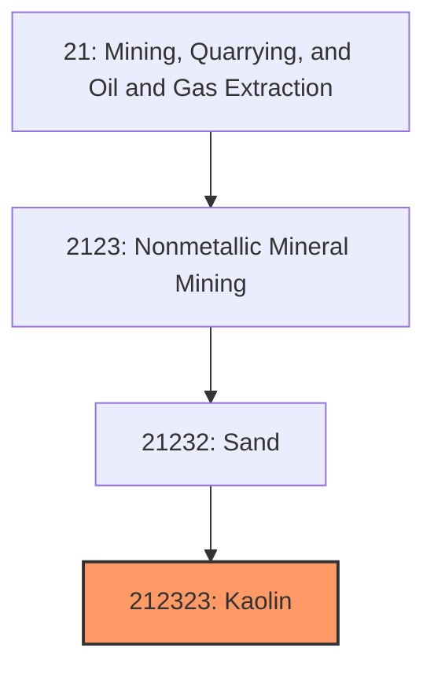
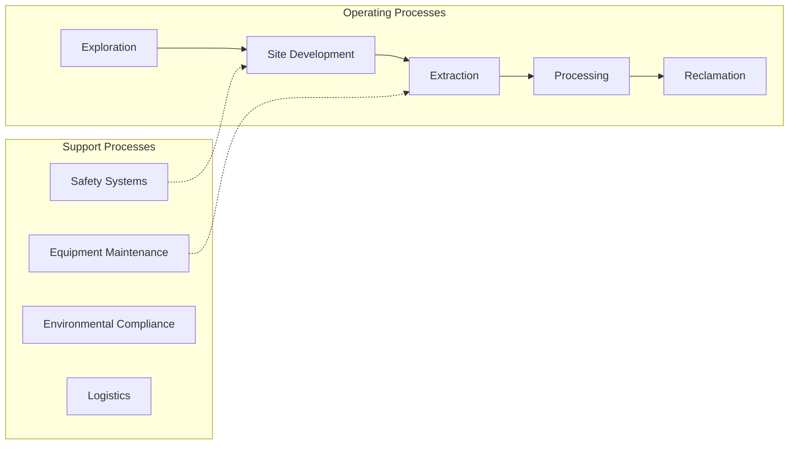

# Kaolin

> This U.

## Overview

Kaolin represents a specialized segment within the Mining, Quarrying, and Oil and Gas Extraction sector (NAICS 21).

This U.S. industry comprises (1) establishments primarily engaged in developing the mine site and/or mining clay (e.g., china clay, paper clay and slip clay) or ceramic and refractory minerals and (2) establishments primarily engaged in beneficiating (i.e., preparing) clay or ceramic and refractory minerals. Illustrative Examples: Bentonite mining and/or beneficiating Fuller's earth mining and/or beneficiating Common clay mining and/or beneficiating Kaolin mining and/or beneficiating Feldspar mining and/or beneficiating Ball clay mining and/or beneficiating Fire clay mining and/or beneficiating Shale (except oil shale) mining and/or beneficiating Cross-References. Establishments primarily engaged in--

## Industry Hierarchy

## Key Statistics

| Metric | Value |
|--------|-------|
| NAICS Code | 212323 |
| Level | National Industry |
| Parent | [Sand](../) |
| Child Industries | 0 |

## Related Occupations

See the [occupations directory](/occupations) for roles commonly found in this industry.

## Core Business Processes

## Industry Value Chain

```mermaid
graph LR
    subgraph Inputs["Inputs"]
        I1["Equipment"]
        I2["Energy"]
        I3["Labor"]
        I4["Permits"]
    end

    subgraph Primary["Primary Activities"]
        A1["Inbound Logistics"]
        A2["Core Operations"]
        A3["Quality Assurance"]
        A4["Outbound/Delivery"]
    end

    subgraph Outputs["Products/Services"]
        O1["Minerals"]
        O2["Oil/Gas"]
        O3["Raw Materials"]
    end

    subgraph Customers["Markets"]
        C1["Refineries"]
        C2["Manufacturers"]
        C3["Utilities"]
        C4["Export Markets"]
    end

    Inputs --> Primary --> Outputs --> Customers
```

---

*Source: NAICS 212323 - Kaolin*
