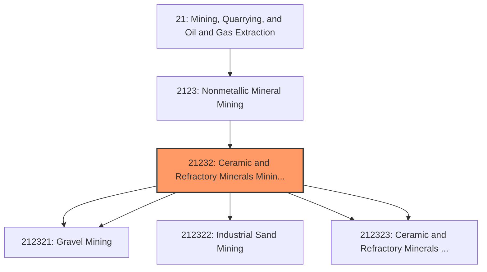
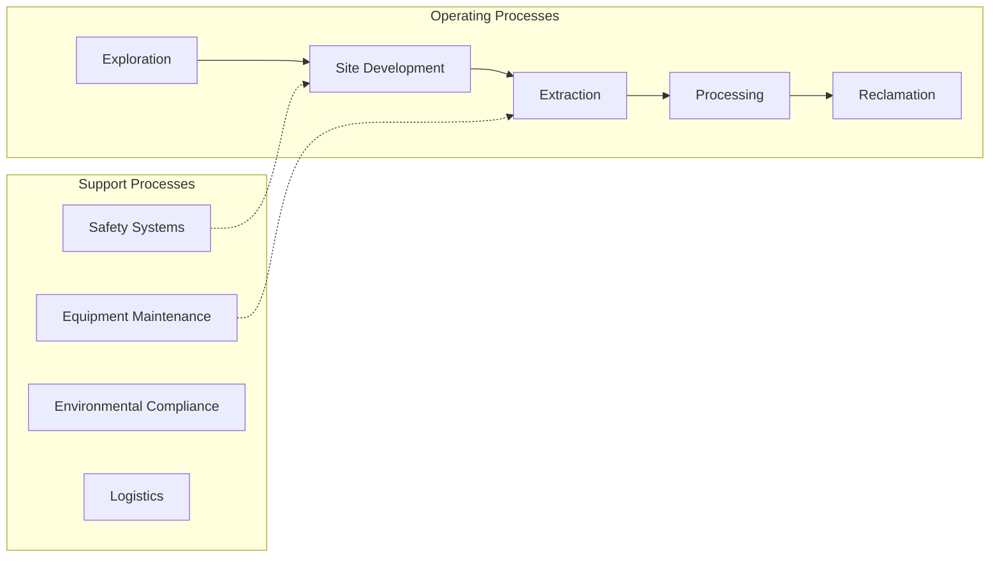

# Ceramic and Refractory Minerals Mining and Quarrying

> This industry comprises (1) establishments primarily engaged in developing the mine site and/or mining, quarrying, dredging for sand and gravel, or mining clay (e.

## Overview

Ceramic and Refractory Minerals Mining and Quarrying represents an important category within the Mining, Quarrying, and Oil and Gas Extraction sector (NAICS 21).

This industry comprises (1) establishments primarily engaged in developing the mine site and/or mining, quarrying, dredging for sand and gravel, or mining clay (e.g., china clay, paper clay and slip clay) or ceramic and refractory minerals and (2) preparation plants primarily engaged in beneficiating (e.g., washing, screening, and grinding) sand and gravel, clay, and ceramic and refractory minerals. Cross-References. Establishments primarily engaged in--

## Industry Hierarchy

## Key Statistics

| Metric | Value |
|--------|-------|
| NAICS Code | 21232 |
| Level | Industry |
| Parent | [Nonmetallic Mineral Mining](../) |
| Child Industries | 5 |

## Sub-Industries

| Industry | Code | Description |
|----------|------|-------------|
| [Construction Sand](./ConstructionSand.mdx) | 212321 | This U |
| [Gravel Mining](./GravelMining.mdx) | 212321 | This U |
| [Industrial Sand Mining](./IndustrialSandMining.mdx) | 212322 | This U |
| [Kaolin](./Kaolin.mdx) | 212323 | This U |
| [Ceramic and Refractory Minerals Mining](./CeramicAndRefractoryMineralsMining.mdx) | 212323 | This U |

## Related Occupations

See the [occupations directory](/occupations) for roles commonly found in this industry.

## Core Business Processes

## Industry Value Chain

```mermaid
graph LR
    subgraph Inputs["Inputs"]
        I1["Equipment"]
        I2["Energy"]
        I3["Labor"]
        I4["Permits"]
    end

    subgraph Primary["Primary Activities"]
        A1["Inbound Logistics"]
        A2["Core Operations"]
        A3["Quality Assurance"]
        A4["Outbound/Delivery"]
    end

    subgraph Outputs["Products/Services"]
        O1["Minerals"]
        O2["Oil/Gas"]
        O3["Raw Materials"]
    end

    subgraph Customers["Markets"]
        C1["Refineries"]
        C2["Manufacturers"]
        C3["Utilities"]
        C4["Export Markets"]
    end

    Inputs --> Primary --> Outputs --> Customers
```

---

*Source: NAICS 21232 - Ceramic and Refractory Minerals Mining and Quarrying*
