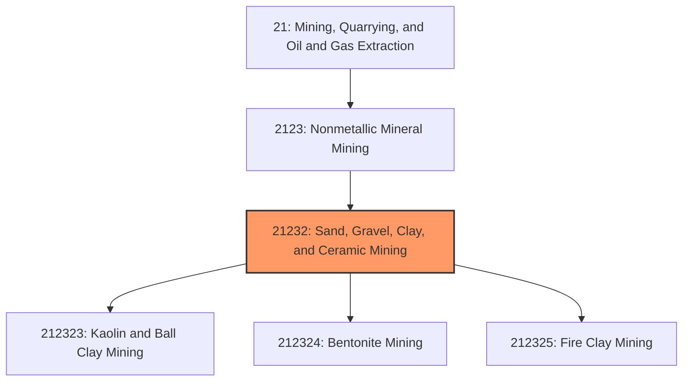

# Clay and Ceramic Minerals Mining

> This industry comprises establishments primarily engaged in mining and beneficiating clay, kaolin, ball clay, bentonite, and ceramic and refractory minerals.

## Overview

Clay and Ceramic Minerals Mining represents a specialized industry within the Nonmetallic Mineral Mining and Quarrying subsector (NAICS 2123). This industry encompasses establishments engaged in developing mine sites, extracting clay minerals, and beneficiating these materials through washing, drying, milling, and air classification for diverse industrial applications.

### Industry Scope

Clay mining operations produce materials essential for ceramics, construction, and industrial processes:
- **Kaolin (China Clay)**: Paper coating, ceramics, paint extenders, rubber filler
- **Ball Clay**: Ceramics, sanitaryware, floor/wall tiles
- **Bentonite**: Drilling mud, foundry sand binders, cat litter, environmental remediation
- **Fire Clay**: Refractory bricks, kiln linings
- **Common Clay**: Brick, tile, cement production

### Market Context

The U.S. clay mining industry produces approximately 30 million metric tons annually, valued at over $2 billion. Georgia dominates kaolin production, while Wyoming leads in bentonite. Demand is driven by paper manufacturing, construction materials, drilling activity, and specialty industrial applications.

Key market dynamics include:
- **Paper Industry Shifts**: Declining printing paper offset by packaging and specialty grades
- **Drilling Demand**: Bentonite for oil/gas drilling mud and horizontal drilling fluids
- **Construction Growth**: Common clay and fire clay tied to building activity
- **Environmental Applications**: Bentonite for landfill liners and groundwater barriers
- **Advanced Ceramics**: High-purity kaolin for technical ceramics and electronics

## Industry Hierarchy

## Key Statistics

| Metric | Value |
|--------|-------|
| NAICS Code | 21232 |
| Level | Industry |
| U.S. Kaolin Production | 5.5 million metric tons/year |
| U.S. Bentonite Production | 4.8 million metric tons/year |
| U.S. Ball Clay Production | 1.0 million metric tons/year |
| Market Value | ~$2.5 billion |
| U.S. Employment | ~8,000 workers |
| Major States | Georgia, Wyoming, Kentucky, Texas |

## Sub-Industries

| Industry | Code | Description |
|----------|------|-------------|
| [Kaolin Mining](../CeramicAndRefractoryMineralsMiningAndQuarrying/Kaolin.mdx) | 212323 | Mining and processing kaolin (china clay) for paper, ceramics, paint |
| [Ceramic and Refractory Minerals Mining](../CeramicAndRefractoryMineralsMiningAndQuarrying/CeramicAndRefractoryMineralsMining.mdx) | 212323 | Mining ball clay, fire clay, and refractory minerals |

## Related Occupations

| Occupation | Role | Employment |
|------------|------|------------|
| [Mining and Geological Engineers](/occupations/Architecture/MiningAndGeologicalEngineers) | Design mine plans and processing facilities | 450 |
| [Excavating Machine Operators](/occupations/Construction/ExcavatingAndLoadingMachineAndDraglineOperators) | Operate surface mining equipment | 2,400 |
| [First-Line Supervisors](/occupations/Production/FirstLineSupervisorsOfExtractionWorkers) | Supervise mining and processing operations | 800 |
| [Crushing/Grinding Machine Operators](/occupations/Production/CrushingGrindingAndPolishingMachineSettersOperatorsAndTenders) | Operate milling and classification equipment | 1,600 |
| [Industrial Machinery Mechanics](/occupations/Installation/IndustrialMachineryMechanics) | Maintain processing equipment | 900 |
| [Quality Control Inspectors](/occupations/Production/InspectorsTestersAndSamplers) | Test clay properties and specifications | 650 |
| [Chemical Plant Operators](/occupations/Production/ChemicalPlantAndSystemOperators) | Operate clay calcining and chemical treatment | 480 |

## Core Business Processes

```mermaid
flowchart LR
    subgraph Exploration["Exploration & Planning"]
        E1["Deposit<br/>Assessment"]
        E2["Core Drilling<br/>& Sampling"]
        E3["Mineralogical<br/>Testing"]
        E4["Mine<br/>Planning"]
    end

    subgraph Mining["Mining Operations"]
        M1["Overburden<br/>Removal"]
        M2["Clay<br/>Extraction"]
        M3["Crude Clay<br/>Transport"]
        M4["Stockpiling<br/>& Blending"]
    end

    subgraph Processing["Processing Operations"]
        P1["Blunging &<br/>Dispersion"]
        P2["Classification<br/>& Degritting"]
        P3["Filtration &<br/>Drying"]
        P4["Calcining<br/>(if needed)"]
        P5["Milling &<br/>Packaging"]
    end

    E1 --> E2 --> E3 --> E4
    E4 --> M1 --> M2 --> M3 --> M4
    M4 --> P1 --> P2 --> P3 --> P4 --> P5
```

### Key Operating Processes

**Mining Operations**
- Surface mining with scrapers, dozers, and front-end loaders
- Selective mining based on clay grade and properties
- Overburden management and progressive reclamation
- Crude clay stockpiling for blending
- Groundwater management and pit dewatering

**Wet Processing (Kaolin)**
- Blunging: dispersing crude clay in water
- Classification: removing sand and coarse particles
- Magnetic separation for iron removal
- Filtration and spray drying
- Air classification for particle size control

**Dry Processing (Bentonite)**
- Primary crushing and drying
- Grinding in roller mills
- Air classification and separation
- Sodium activation (for calcium bentonite)
- Bagging and bulk loading

**Calcination (Specialty Products)**
- High-temperature calcining for metakaolin
- Controlled atmosphere processing
- Surface treatment and modification
- Quality testing and certification

## Industry Value Chain

```mermaid
graph LR
    subgraph Inputs["Inputs & Resources"]
        I1["Clay Deposits<br/>& Reserves"]
        I2["Mining<br/>Equipment"]
        I3["Processing<br/>Plants"]
        I4["Water &<br/>Energy"]
        I5["Chemical<br/>Additives"]
    end

    subgraph Primary["Primary Activities"]
        A1["Exploration &<br/>Reserve Development"]
        A2["Mining &<br/>Extraction"]
        A3["Beneficiation<br/>& Processing"]
        A4["Quality Control<br/>& Distribution"]
    end

    subgraph Outputs["Products"]
        O1["Kaolin<br/>(Various Grades)"]
        O2["Ball Clay"]
        O3["Bentonite<br/>Products"]
        O4["Fire Clay &<br/>Refractories"]
    end

    subgraph Customers["Markets"]
        C1["Paper<br/>Industry"]
        C2["Ceramics<br/>Manufacturers"]
        C3["Oil & Gas<br/>Drilling"]
        C4["Construction<br/>Materials"]
        C5["Chemical &<br/>Industrial"]
    end

    Inputs --> Primary --> Outputs --> Customers
```

## Regulatory Environment

### Federal Regulations

| Agency | Regulation | Scope |
|--------|------------|-------|
| **MSHA** | Mine Safety and Health Act | Surface mine safety standards and inspections |
| **EPA** | Clean Water Act | Discharge permits, settling pond management |
| **EPA** | Clean Air Act | Dust and calciner emissions control |
| **OSMRE** | SMCRA | Reclamation requirements for surface mining |

### State Requirements
- State mining permits and operating licenses
- Reclamation bonding and land restoration plans
- Water quality monitoring and discharge limits
- Air quality permits for processing operations
- Zoning and land use approvals

### Quality Standards
- **ISO 9001**: Quality management certification
- **TAPPI Standards**: Paper coating kaolin specifications
- **API 13A**: Drilling fluid bentonite specifications
- **ASTM C67**: Ball clay for ceramics

## Technology & Innovation

### Current Technologies

| Technology | Application | Benefits |
|------------|-------------|----------|
| **Centrifugal Classification** | Particle size separation | Precise size distribution control |
| **Magnetic Separation** | Iron mineral removal | Higher brightness products |
| **Spray Drying** | Moisture removal and product formation | Consistent particle size, flowability |
| **X-Ray Fluorescence** | Real-time chemical analysis | Rapid quality control |
| **GPS-Guided Mining** | Selective extraction | Improved grade control |
| **Flotation** | Impurity removal | Higher purity products |

### Emerging Innovations

- **Nanoclay Technology**: Engineered clay particles for polymer composites
- **Metakaolin Advancement**: High-reactivity pozzolan for concrete
- **Sustainable Packaging**: Clay-coated packaging replacing plastics
- **Battery Applications**: Clay materials for lithium-ion battery separators
- **Carbon Capture**: Engineered bentonite for CO2 sequestration
- **Water Treatment**: Advanced clay products for water purification

## Market Size and Trends

### U.S. Clay Production by Type

| Clay Type | Production | Value | Primary Uses |
|-----------|------------|-------|--------------|
| Kaolin | 5.5 Mt | $1.2 billion | Paper, ceramics, paint, rubber |
| Bentonite | 4.8 Mt | $600 million | Drilling mud, foundry, cat litter |
| Ball Clay | 1.0 Mt | $150 million | Ceramics, tile, sanitaryware |
| Fire Clay | 0.6 Mt | $80 million | Refractories, cement, brick |
| Common Clay | 18 Mt | $400 million | Brick, tile, cement |

### End Market Distribution

| Market | Share | Trend |
|--------|-------|-------|
| Paper and Packaging | 35% | Declining print, growing packaging |
| Ceramics and Tile | 20% | Stable construction demand |
| Drilling Fluids | 15% | Cyclical with oil/gas activity |
| Construction Materials | 15% | Growing infrastructure investment |
| Other Industrial | 15% | Specialty applications growing |

### Industry Trends

1. **Paper Market Evolution**: Shift from printing grades to packaging and specialty papers
2. **Drilling Technology**: Bentonite for advanced horizontal drilling and completion fluids
3. **Advanced Ceramics**: High-purity kaolin for electronics and technical applications
4. **Green Building**: Fire clay for sustainable construction materials
5. **Environmental Remediation**: Bentonite for landfill liners and groundwater barriers
6. **Product Innovation**: Engineered clays for composites and advanced materials
7. **Consolidation**: Major producers acquiring regional operations

### Investment Outlook

The clay and ceramic minerals industry serves diverse end markets with varying growth profiles. Investment is focused on:
- Processing technology for higher-value specialty products
- Product development for growth applications (packaging, drilling, ceramics)
- Sustainability improvements in energy and water use
- Capacity expansion in growing end markets
- Reserve replacement and acquisition of quality deposits

The industry is expected to grow 1-3% annually overall, with specialty product segments seeing stronger growth.

---

*Source: NAICS 21232 - Sand, Gravel, Clay, and Ceramic Minerals Mining*
