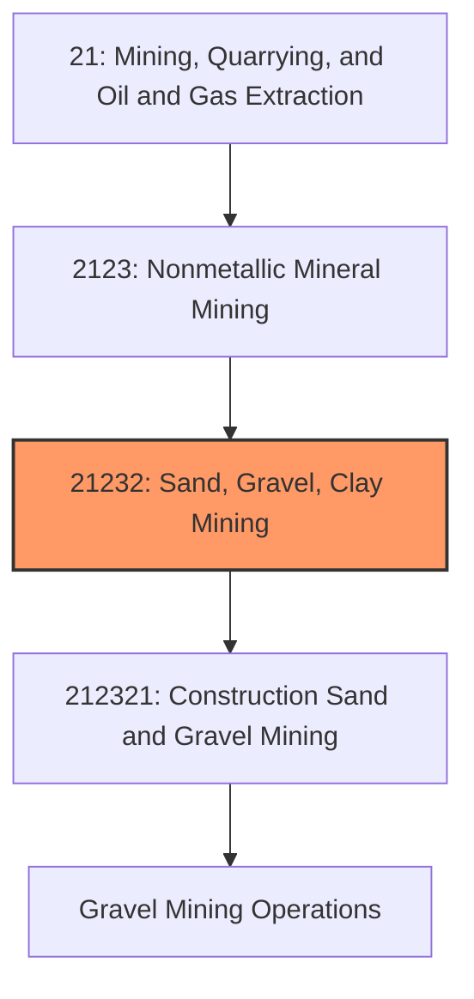
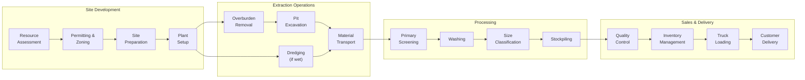

# Gravel Mining

> This industry comprises establishments primarily engaged in mining, quarrying, or dredging for gravel and beneficiating gravel through washing, screening, and sizing operations.

## Overview

Gravel Mining represents an essential segment of the construction materials industry within the Nonmetallic Mineral Mining and Quarrying subsector (NAICS 2123). Gravel is a fundamental aggregate material used extensively in concrete production, road construction, drainage systems, and numerous civil engineering applications. Operations include both pit mining and dredging of alluvial deposits.

### Industry Scope

Gravel mining operations produce materials for diverse construction applications:
- **Coarse Aggregate**: Material larger than 4.75mm for concrete and asphalt
- **Base and Subbase**: Road foundation and fill material
- **Drainage Gravel**: Permeable material for water management systems
- **Landscaping Stone**: Decorative and functional applications
- **Railroad Ballast**: Support material for railway tracks

### Market Context

The U.S. gravel mining industry, combined with sand, produces over 1 billion metric tons annually with a value exceeding $12 billion. Gravel is the second most consumed raw material globally after water. Demand is directly tied to construction activity and infrastructure investment, making the industry sensitive to economic cycles and government spending on roads and public works.

Key market dynamics include:
- **Infrastructure Investment**: Federal infrastructure bill driving multi-year demand growth
- **Local Market Focus**: Heavy material with high transportation costs limiting shipping distances
- **Permitting Challenges**: Increasing difficulty obtaining new operation permits near urban areas
- **Sustainability Pressure**: Growing emphasis on recycled aggregates and reclamation
- **Consolidation Trend**: Large aggregate companies acquiring local pit operations

## Industry Hierarchy

## Key Statistics

| Metric | Value |
|--------|-------|
| NAICS Code | 212321 |
| Level | Industry |
| U.S. Production | ~1 billion metric tons/year (sand + gravel) |
| Gravel Share | ~40% of total sand/gravel |
| Market Value | ~$5 billion (gravel portion) |
| Active Operations | ~4,000 |
| Average Pit Lifespan | 15-30 years |
| Haul Distance Economics | <50 miles typical |

## Related Occupations

| Occupation | Role | Employment |
|------------|------|------------|
| [Excavating Machine Operators](/occupations/Construction/ExcavatingAndLoadingMachineAndDraglineOperators) | Operate loaders, excavators, dredges | 12,000 |
| [First-Line Supervisors](/occupations/Production/FirstLineSupervisorsOfExtractionWorkers) | Supervise pit operations | 3,800 |
| [Industrial Truck Operators](/occupations/Transportation/IndustrialTruckAndTractorOperators) | Operate haul trucks and loaders | 8,200 |
| [Crushing/Grinding Machine Operators](/occupations/Production/CrushingGrindingAndPolishingMachineSettersOperatorsAndTenders) | Operate screening and washing equipment | 4,500 |
| [Heavy Equipment Mechanics](/occupations/Installation/MobileHeavyEquipmentMechanics) | Maintain mining equipment | 3,200 |
| [Weighers and Measurers](/occupations/Production/WeighersMeasurersCheckersAndSamplers) | Scale operations | 1,800 |

## Core Business Processes

### Key Operating Processes

**Pit Mining (Dry Operations)**
- Topsoil stripping and stockpiling
- Overburden removal
- Front-end loader or excavator extraction
- Haul truck transport to processing plant
- Progressive reclamation during operations

**Dredge Mining (Wet Operations)**
- Hydraulic or cutter suction dredging
- Clamshell or dragline extraction
- Pipeline slurry transport
- Pond management and water recycling
- Dewatering and settling operations

**Processing**
- Scalping screens for oversize removal
- Log washers for clay and silt removal
- Vibrating screens for size classification
- Cyclone separators for fine material
- Conveyor systems and radial stackers

**Quality Assurance**
- Sieve analysis for gradation compliance
- LA abrasion testing
- Specific gravity and absorption
- Deleterious material content
- AASHTO and ASTM specification compliance

## Industry Value Chain

```mermaid
graph LR
    subgraph Inputs["Inputs"]
        I1["Land &<br/>Mineral Rights"]
        I2["Excavation<br/>Equipment"]
        I3["Processing<br/>Plant"]
        I4["Water<br/>Supply"]
        I5["Transport<br/>Fleet"]
    end

    subgraph Primary["Primary Activities"]
        A1["Site<br/>Development"]
        A2["Extraction"]
        A3["Processing"]
        A4["Quality &<br/>Sales"]
    end

    subgraph Outputs["Products"]
        O1["Coarse<br/>Aggregate"]
        O2["Base<br/>Material"]
        O3["Drainage<br/>Gravel"]
        O4["Specialty<br/>Products"]
    end

    subgraph Customers["Markets"]
        C1["Ready-Mix<br/>Concrete"]
        C2["Asphalt<br/>Plants"]
        C3["Road<br/>Contractors"]
        C4["Municipalities"]
        C5["Landscaping"]
    end

    Inputs --> Primary --> Outputs --> Customers
```

## Regulatory Environment

### Federal Regulations

| Agency | Regulation | Scope |
|--------|------------|-------|
| **MSHA** | Mine Safety and Health Act | Pit and plant safety standards |
| **EPA** | Clean Water Act | NPDES permits, Section 404 wetlands |
| **USACE** | Rivers and Harbors Act | Dredging permits in navigable waters |
| **EPA** | Clean Air Act | Dust control requirements |
| **OSMRE** | SMCRA | Surface mining reclamation (some states) |

### State and Local Requirements
- State mining permits and reclamation bonding
- County conditional use permits and zoning approvals
- Groundwater monitoring and protection
- Truck route restrictions and weight limits
- Operating hours and noise ordinances
- Property line setbacks and buffer zones

### Industry Standards
- **ASTM C33**: Standard Specification for Concrete Aggregates
- **AASHTO M 43**: Sizes of Aggregate for Road Construction
- **State DOT Specifications**: Highway and road construction requirements

## Technology & Innovation

### Current Technologies

| Technology | Application | Benefits |
|------------|-------------|----------|
| **GPS Fleet Management** | Equipment tracking and optimization | 10-15% productivity gains |
| **Automated Screening** | PLC-controlled processing | Consistent product quality |
| **Water Recycling** | Closed-loop water systems | 90%+ water reuse |
| **Drone Surveying** | Volumetric measurements | Faster, safer surveys |
| **Load-Out Automation** | Truck loading systems | Reduced wait times |
| **Online Gradation** | Real-time particle analysis | Instant quality feedback |

### Emerging Innovations

- **Electric Equipment**: Battery-powered loaders for emissions reduction
- **Autonomous Haul Trucks**: Self-driving vehicles in pit environments
- **Predictive Maintenance**: IoT sensors for equipment monitoring
- **Recycled Aggregate Processing**: Integration of construction debris recycling
- **Digital Inventory**: Real-time stockpile tracking and customer ordering
- **Carbon-Neutral Operations**: Renewable energy and offset programs

## Market Size and Trends

### U.S. Gravel Production by Use

| End Use | Share | Trend |
|---------|-------|-------|
| Road Base and Subbase | 35% | Growing with infrastructure |
| Concrete Aggregate | 30% | Tied to construction activity |
| Asphalt Aggregate | 15% | Highway maintenance demand |
| Fill and Drainage | 12% | Site development related |
| Other (landscaping, etc.) | 8% | Specialty applications |

### Regional Market Characteristics

| Region | Notes |
|--------|-------|
| **Great Lakes** | Abundant glacial deposits, stable demand |
| **Southeast** | High growth, limited quality deposits |
| **Pacific Northwest** | River gravel, environmental constraints |
| **Southwest** | Desert washes, water scarcity issues |
| **Midwest** | Agricultural land competition |

### Industry Trends

1. **Infrastructure Demand**: Federal investment driving multi-year growth
2. **Supply Constraints**: Urban-proximate deposits facing depletion
3. **Vertical Integration**: Concrete and asphalt producers acquiring pits
4. **Recycled Aggregates**: Growing acceptance of recycled materials
5. **Environmental Focus**: Water recycling and dust control improvements
6. **Technology Adoption**: Automation addressing labor challenges
7. **Reclamation Innovation**: Creating valuable post-mining land uses

### Investment Outlook

The gravel mining industry benefits from essential material status and infrastructure investment cycles. Investment priorities include:
- Acquisition of permitted reserves near growing markets
- Processing equipment upgrades for efficiency and quality
- Water management and recycling systems
- Reclamation planning for post-mining value creation
- Fleet electrification for emissions compliance
- Technology integration for productivity improvement

The industry is expected to grow 2-4% annually through 2030, driven by infrastructure spending.

---

*Source: NAICS 212321 - Construction Sand and Gravel Mining*
