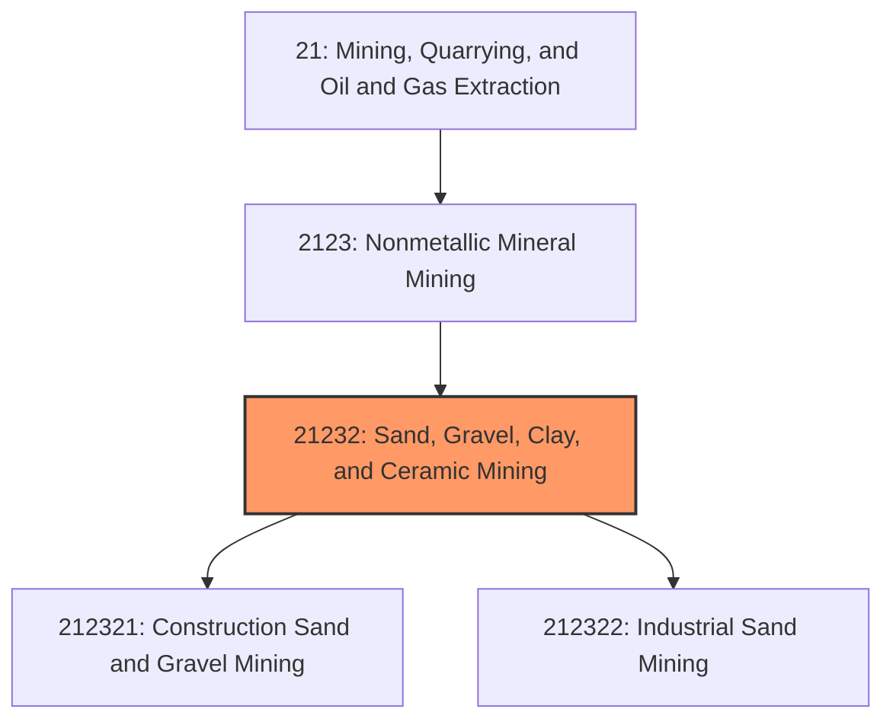
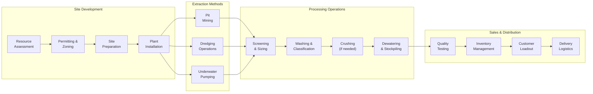

# Sand and Gravel Mining

> This industry comprises establishments primarily engaged in mining, quarrying, or dredging for construction sand, industrial sand, and gravel for aggregate and specialty applications.

## Overview

Sand and Gravel Mining represents a foundational industry within the Nonmetallic Mineral Mining and Quarrying subsector (NAICS 2123). This industry encompasses establishments engaged in developing mine sites, operating quarries, or dredging operations to extract sand and gravel, as well as preparation plants that beneficiate these materials through washing, screening, sizing, and blending.

### Industry Scope

Sand and gravel operations produce materials essential for construction and industrial applications:
- **Construction Sand and Gravel**: Aggregate for concrete, asphalt, road base, and fill
- **Industrial Sand (Frac Sand)**: High-purity silica sand for hydraulic fracturing, glass, foundry, and filtration
- **Specialty Sands**: Materials for sports turf, golf courses, and landscaping

### Market Context

The U.S. sand and gravel industry produces approximately 1 billion metric tons annually, valued at over $12 billion. Industrial sand adds another 100+ million tons with a value exceeding $5 billion. Demand is driven by construction activity, infrastructure investment, and oil/gas drilling activity for frac sand.

Key market dynamics include:
- **Infrastructure Investment**: Federal infrastructure bill driving sustained demand for construction aggregates
- **Energy Sector Volatility**: Frac sand demand tied to oil and gas drilling activity cycles
- **Transportation Economics**: Sand is heavy and low-value, making local supply critical
- **Resource Depletion**: Urban-area deposits facing depletion and encroachment
- **Environmental Scrutiny**: Groundwater, dust, and truck traffic concerns in populated areas

## Industry Hierarchy

## Key Statistics

| Metric | Value |
|--------|-------|
| NAICS Code | 21232 |
| Level | Industry |
| U.S. Construction Sand/Gravel | 1.0 billion metric tons/year |
| U.S. Industrial Sand | 110 million metric tons/year |
| Market Value | ~$17 billion combined |
| Active Operations | ~6,500 |
| U.S. Employment | ~45,000 workers |

## Sub-Industries

| Industry | Code | Description |
|----------|------|-------------|
| [Construction Sand and Gravel](../CeramicAndRefractoryMineralsMiningAndQuarrying/ConstructionSand.mdx) | 212321 | Mining and dredging for construction aggregate |
| [Gravel Mining](../CeramicAndRefractoryMineralsMiningAndQuarrying/GravelMining.mdx) | 212321 | Gravel pit operations for construction aggregate |
| [Industrial Sand Mining](../CeramicAndRefractoryMineralsMiningAndQuarrying/IndustrialSandMining.mdx) | 212322 | High-purity silica sand for industrial uses |

## Related Occupations

| Occupation | Role | Employment |
|------------|------|------------|
| [Excavating Machine Operators](/occupations/Construction/ExcavatingAndLoadingMachineAndDraglineOperators) | Operate dredges, excavators, loaders | 14,200 |
| [First-Line Supervisors](/occupations/Production/FirstLineSupervisorsOfExtractionWorkers) | Supervise pit and plant operations | 4,800 |
| [Crushing/Grinding Machine Operators](/occupations/Production/CrushingGrindingAndPolishingMachineSettersOperatorsAndTenders) | Operate washing and screening equipment | 6,100 |
| [Industrial Truck Operators](/occupations/Transportation/IndustrialTruckAndTractorOperators) | Transport material within operations | 8,500 |
| [Heavy Equipment Mechanics](/occupations/Installation/MobileHeavyEquipmentMechanics) | Maintain mining and processing equipment | 4,200 |
| [Quality Control Inspectors](/occupations/Production/InspectorsTestersAndSamplers) | Test gradation and quality specifications | 1,800 |
| [Weighers and Measurers](/occupations/Production/WeighersMeasurersCheckersAndSamplers) | Scale operations and inventory control | 2,400 |

## Core Business Processes

### Key Operating Processes

**Pit Mining (Dry Operations)**
- Overburden removal and topsoil stockpiling
- Front-end loader and excavator extraction
- In-pit crushing and conveying (for harder materials)
- Haul truck transport to processing plant
- Progressive pit reclamation

**Dredging Operations (Wet Operations)**
- Hydraulic dredge or clamshell dredge extraction
- Slurry pipeline transport to wash plant
- Classification and dewatering
- Pond management and water recycling
- Continuous reclamation and revegetation

**Processing and Beneficiation**
- Scalping and primary screening for oversized material
- Log washers and sand classifiers for cleaning
- Spiral classifiers for fine sand recovery
- Cyclone separators for dewatering
- Radial stackers for product stockpiling

**Quality Control**
- Sieve analysis for gradation compliance
- Specific gravity and absorption testing
- Deleterious material testing (organics, clay)
- Frac sand: crush resistance, roundness, sphericity
- Certification to ASTM and customer specifications

## Industry Value Chain

```mermaid
graph LR
    subgraph Inputs["Inputs & Resources"]
        I1["Land &<br/>Mineral Rights"]
        I2["Extraction<br/>Equipment"]
        I3["Wash Plants<br/>& Screens"]
        I4["Water<br/>Supply"]
        I5["Trucking<br/>Fleet"]
    end

    subgraph Primary["Primary Activities"]
        A1["Permitting &<br/>Development"]
        A2["Extraction<br/>Operations"]
        A3["Processing &<br/>Classification"]
        A4["Quality Control<br/>& Sales"]
    end

    subgraph Outputs["Products"]
        O1["Construction<br/>Aggregate"]
        O2["Concrete<br/>Sand"]
        O3["Mason/Asphalt<br/>Sand"]
        O4["Frac Sand<br/>(Industrial)"]
        O5["Specialty<br/>Products"]
    end

    subgraph Customers["Markets"]
        C1["Ready-Mix<br/>Concrete"]
        C2["Asphalt<br/>Plants"]
        C3["Construction<br/>Contractors"]
        C4["Oil & Gas<br/>Operators"]
        C5["Manufacturing<br/>& Industrial"]
    end

    Inputs --> Primary --> Outputs --> Customers
```

## Regulatory Environment

### Federal Regulations

| Agency | Regulation | Scope |
|--------|------------|-------|
| **MSHA** | Mine Safety and Health Act | Safety standards for all mining operations |
| **EPA** | Clean Water Act | Dredge and fill permits (Section 404), NPDES discharge |
| **USACE** | Rivers and Harbors Act | Permits for operations in navigable waters |
| **EPA** | Clean Air Act | Fugitive dust and processing emissions |
| **OSMRE** | SMCRA | Surface mining reclamation (some states) |

### State and Local Requirements
- State mining permits and reclamation bonding
- County/municipal conditional use permits
- Groundwater monitoring and protection
- Truck route and weight restrictions
- Hours of operation and noise limits
- Setback requirements from property lines
- Financial assurance for reclamation

### Industry Standards
- **ASTM C33**: Standard Specification for Concrete Aggregates
- **ASTM C144**: Standard Specification for Aggregate for Masonry Mortar
- **API RP 19D**: Recommended Practice for Proppant Testing (Frac Sand)
- **DOT State Specifications**: Gradation requirements for road construction

## Technology & Innovation

### Current Technologies

| Technology | Application | Benefits |
|------------|-------------|----------|
| **GPS-Guided Dredging** | Precise underwater extraction | Accurate grade control, efficiency |
| **Automated Wash Plants** | PLC-controlled processing | Consistent quality, reduced labor |
| **Water Recycling Systems** | Closed-loop water management | 90%+ water reuse, regulatory compliance |
| **Conveyor Systems** | Material transport | Lower costs than truck haulage |
| **Online Particle Sizing** | Real-time gradation monitoring | Instant quality feedback |
| **Load-Out Automation** | Truck loading and ticketing | Reduced wait times, accuracy |

### Emerging Innovations

- **Manufactured Sand**: Producing fine aggregate from crusite
- **Electric Equipment**: Battery-powered loaders and trucks for reduced emissions
- **Drone Surveying**: Volumetric measurements and site monitoring
- **AI Quality Control**: Machine learning for gradation prediction and optimization
- **Sustainable Practices**: Habitat creation, wetlands mitigation banking
- **Alternative Materials**: Recycled concrete and glass as aggregate substitutes

## Market Size and Trends

### U.S. Sand and Gravel Production

| Product | Production | Value | Primary Markets |
|---------|------------|-------|-----------------|
| Construction Sand/Gravel | 1,000 Mt | $12.5 billion | Concrete, asphalt, road base |
| Industrial Sand (Frac) | 85 Mt | $4.0 billion | Oil/gas, glass, foundry |
| Industrial Sand (Other) | 25 Mt | $1.2 billion | Glass, filtration, sports |

### Regional Market Dynamics

| Region | Characteristics | Key Drivers |
|--------|-----------------|-------------|
| **Great Lakes** | Abundant glacial deposits | Industrial/construction base |
| **Gulf Coast** | River sand, frac sand demand | Oil/gas drilling activity |
| **Southeast** | Growing demand, limited supply | Population growth, infrastructure |
| **Texas** | Large frac sand production | Permian Basin drilling |
| **Pacific Coast** | Constrained supply, imports | Urban development, permitting limits |

### Industry Trends

1. **Infrastructure Demand**: Sustained construction aggregate demand through 2030
2. **Frac Sand Evolution**: In-basin sand displacing Northern White in some applications
3. **Urban Scarcity**: Difficulty permitting new operations near population centers
4. **Vertical Integration**: Ready-mix companies acquiring sand and gravel sources
5. **Water Management**: Increased focus on recycling and groundwater protection
6. **Reclamation Innovation**: Post-mining uses including lakes, parks, and development
7. **Sustainability Reporting**: ESG requirements from large customers

### Investment Outlook

The sand and gravel industry benefits from strong construction demand and essential material status. Investment opportunities include:
- Acquisition of permitted reserves near growing markets
- Processing technology upgrades for efficiency and quality
- Frac sand capacity aligned with oil/gas market conditions
- Water treatment and recycling systems for compliance
- Reclamation planning for post-mining value creation
- Fleet electrification for emissions reduction

The industry is expected to grow 2-3% annually for construction aggregates, with industrial sand following oil/gas drilling cycles.

---

*Source: NAICS 21232 - Sand, Gravel, Clay, and Ceramic Minerals Mining*
