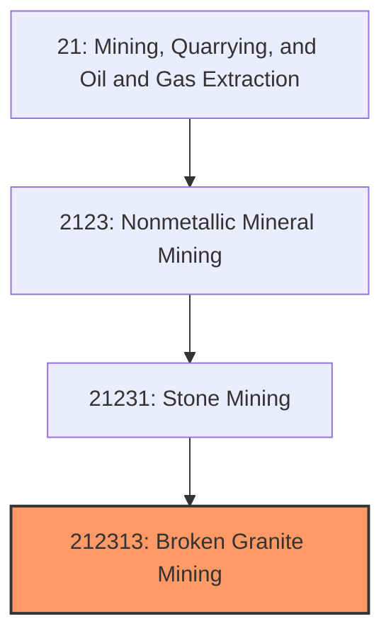
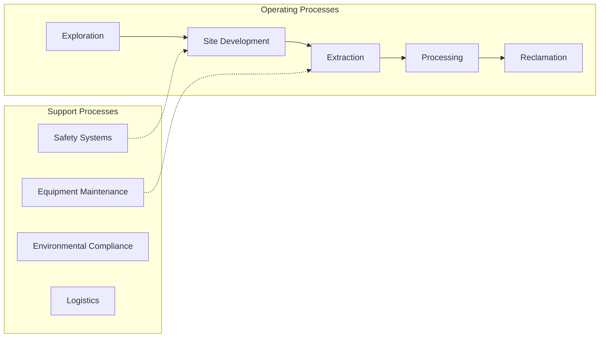

# Broken Granite Mining

> This U.

## Overview

Broken Granite Mining represents a specialized segment within the Mining, Quarrying, and Oil and Gas Extraction sector (NAICS 21).

This U.S. industry comprises (1) establishments primarily engaged in developing the mine site, and/or mining or quarrying crushed and broken granite (including related rocks, such as gneiss, syenite (except nepheline), and diorite) and (2) preparation plants primarily engaged in beneficiating granite (e.g., grinding or pulverizing).

## Industry Hierarchy

## Key Statistics

| Metric | Value |
|--------|-------|
| NAICS Code | 212313 |
| Level | National Industry |
| Parent | [Stone Mining](../) |
| Child Industries | 0 |

## Related Occupations

- [Mining and Geological Engineers](/occupations/Architecture/MiningAndGeologicalEngineers) - Design mines and extraction systems
- [Geological Technicians](/occupations/Science/GeologicalTechniciansExceptHydrologicTechnicians) - Assist geologists in exploration
- [Continuous Mining Machine Operators](/occupations/Construction/ContinuousMiningMachineOperators) - Operate mining machinery
- [Rotary Drill Operators, Oil and Gas](/occupations/Construction/RotaryDrillOperatorsOilAndGas) - Operate drilling equipment

## Core Business Processes

## Industry Value Chain

```mermaid
graph LR
    subgraph Inputs["Inputs"]
        I1["Equipment"]
        I2["Energy"]
        I3["Labor"]
        I4["Permits"]
    end

    subgraph Primary["Primary Activities"]
        A1["Inbound Logistics"]
        A2["Core Operations"]
        A3["Quality Assurance"]
        A4["Outbound/Delivery"]
    end

    subgraph Outputs["Products/Services"]
        O1["Minerals"]
        O2["Oil/Gas"]
        O3["Raw Materials"]
    end

    subgraph Customers["Markets"]
        C1["Refineries"]
        C2["Manufacturers"]
        C3["Utilities"]
        C4["Export Markets"]
    end

    Inputs --> Primary --> Outputs --> Customers
```

## Regulatory Environment

- **MSHA** (Mine Safety and Health Administration) - Enforces safety and health standards in mines
- **EPA** (Environmental Protection Agency) - Regulates environmental impact of extraction operations
- **Bureau of Land Management** - Manages mineral rights on federal lands
- **State Mining Commissions** - Oversee permitting and reclamation requirements

## Technology & Innovation

- **Autonomous Mining** - Self-driving haul trucks, automated drilling, and remote-operated equipment
- **Advanced Exploration** - 3D seismic imaging, AI-powered geological modeling, and satellite surveying
- **Environmental Technologies** - Carbon capture, mine water treatment, and land reclamation innovations
- **Digital Twins** - Virtual mine modeling for operational optimization and safety planning

## Industry Outlook

The mining and extraction sector faces a dual transition: meeting ongoing demand for traditional minerals while rapidly scaling production of critical minerals needed for clean energy technologies. Automation and remote operations are reshaping the workforce, and environmental stewardship is increasingly central to obtaining social license to operate. Long-term demand for lithium, cobalt, and rare earth elements continues to drive exploration investment.

---

*Source: NAICS 212313 - Broken Granite Mining*
