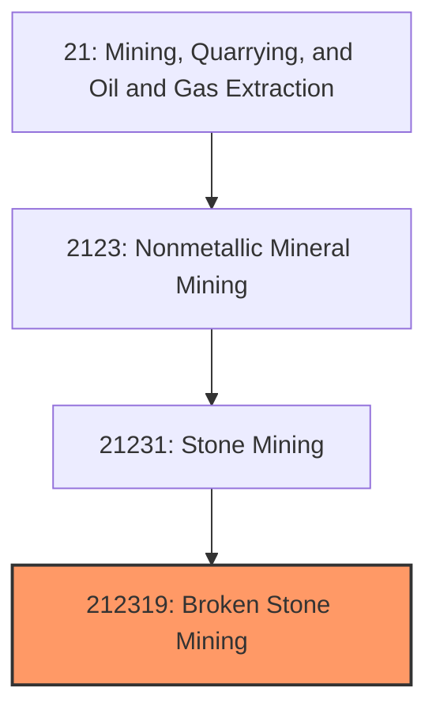
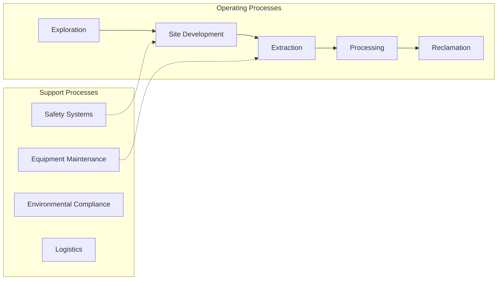

# Broken Stone Mining

> This U.

## Overview

Broken Stone Mining represents a specialized segment within the Mining, Quarrying, and Oil and Gas Extraction sector (NAICS 21).

This U.S. industry comprises: (1) establishments primarily engaged in developing the mine site and/or mining or quarrying crushed and broken stone (except limestone and granite); (2) preparation plants primarily engaged in beneficiating (e.g., grinding and pulverizing) stone (except limestone and granite); and (3) establishments primarily engaged in mining or quarrying bituminous limestone and bituminous sandstone. Illustrative Examples: Bituminous limestone mining and/or beneficiating Marble crushed and broken stone mining and/or beneficiating Bituminous sandstone mining and/or beneficiating Sandstone crushed and broken stone mining and/or beneficiating Cross-References. Establishments primarily engaged in--

## Industry Hierarchy

## Key Statistics

| Metric | Value |
|--------|-------|
| NAICS Code | 212319 |
| Level | National Industry |
| Parent | [Stone Mining](../) |
| Child Industries | 0 |

## Related Occupations

See the [occupations directory](/occupations) for roles commonly found in this industry.

## Core Business Processes

## Industry Value Chain

```mermaid
graph LR
    subgraph Inputs["Inputs"]
        I1["Equipment"]
        I2["Energy"]
        I3["Labor"]
        I4["Permits"]
    end

    subgraph Primary["Primary Activities"]
        A1["Inbound Logistics"]
        A2["Core Operations"]
        A3["Quality Assurance"]
        A4["Outbound/Delivery"]
    end

    subgraph Outputs["Products/Services"]
        O1["Minerals"]
        O2["Oil/Gas"]
        O3["Raw Materials"]
    end

    subgraph Customers["Markets"]
        C1["Refineries"]
        C2["Manufacturers"]
        C3["Utilities"]
        C4["Export Markets"]
    end

    Inputs --> Primary --> Outputs --> Customers
```

---

*Source: NAICS 212319 - Broken Stone Mining*
